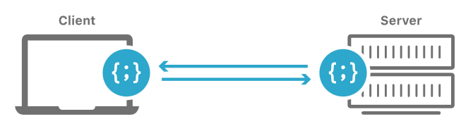
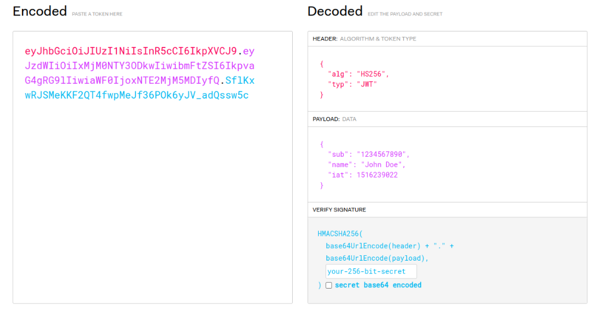
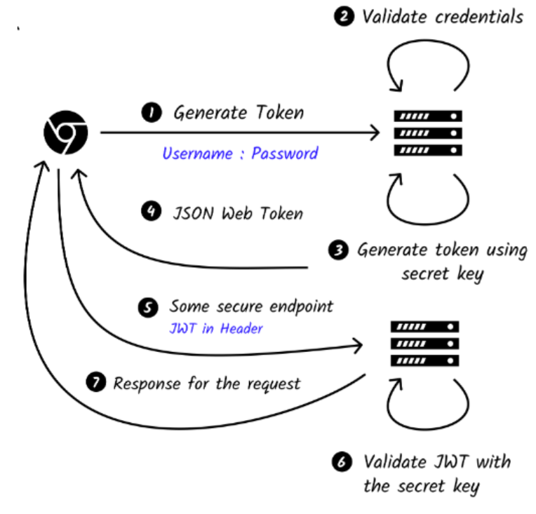

# API

## Sumário Interativo
- [Application Programming Interface](#application-programming-interface)
  - [Modelo Cliente-Servidor](#modelo-cliente-servidor)
  - [Arquiteturas](#arquiteturas)
    - [REST](#rest)
    - [Seis Restrições REST](#seis-restrições-rest)
    - [RESTful](#restful)
    - [Idempotência](#idempotência)
  - [Parâmetros de Caminho e de Consulta](#parâmetros-de-caminho-e-de-consulta)
  - [JSON API](#json-api)
  - [GraphQL](#graphql)
  - [WebSocket](#websocket)
  - [cURL](#curl)
  - [CORS](#cors)
  - [Autenticação de API](#autenticação-de-api)
    - [JWT](#jwt-json-web-token)
  - [Padrões de Integração](#padrões-de-integração)
    - [Polling](#polling)
    - [Webhooks (Pushing)](#webhooks-pushing)

---

# Application Programming Interface

Uma API é um conjunto de regras que define como diferentes sistemas podem conversar entre si. Essas regras indicam como trocar dados de forma precisa e segura.

## Modelo Cliente-Servidor

- **Cliente:** sistema que faz a solicitação (ex.: navegador).  
- **Servidor:** sistema que recebe a solicitação e devolve dados (ex.: vídeos do YouTube).


*Fonte: [https://www.cloudflare.com/learning/serverless/glossary/client-side-vs-server-side/](https://www.cloudflare.com/learning/serverless/glossary/client-side-vs-server-side/)*

Exemplo de fluxo:
1. Cliente solicita um vídeo ao servidor do YouTube.  
2. Servidor processa e envia o vídeo.  
3. Cliente exibe o vídeo ao usuário.


---

## Arquiteturas

Consumidores utilizam APIs como clientes, mas é importante entender seu funcionamento e desenvolvimento. As arquiteturas mais relevantes são **REST** e **RESTful**.

### REST

- **REST (Representational State Transfer)** é um estilo arquitetural para sistemas distribuídos.  
- Utiliza HTTP e métodos **GET, POST, PUT, DELETE**.  
- Cada recurso é acessado por um **endpoint** (URL).  
- **Stateless:** cada requisição contém todas as informações necessárias.  
- Códigos de status: `200` (OK), `404` (Not Found), `500` (Server Error).  
- Dados, em geral, em **JSON** (ou XML).

#### Seis Restrições REST

| Restrição | Descrição |
|-----------|-----------|
| Interface uniforme | Facilita comunicação e desacoplamento. |
| Stateless | Servidor não mantém estado entre requisições. |
| Cacheável | Respostas indicam se podem ser armazenadas. |
| Cliente-Servidor | Separação de responsabilidades. |
| Sistema em camadas | Possibilidade de intermediários transparentes. |
| Código sob demanda | Opcional – servidor envia código executável. |

### RESTful

APIs **RESTful** seguem todas as restrições REST, resultando em serviços simples, escaláveis e padronizados.

### Idempotência

- **PUT:** Substitui ou cria recurso; múltiplas execuções mantêm mesmo estado final.  
- **DELETE:** Remove recurso; chamadas subsequentes retornam `404`.

---

## Parâmetros de Caminho e de Consulta

### 1. Path Parameters

- Parte fixa da URL.  
- Identificam recurso único.  
- `GET /usuarios/{usuarioId}` → `/usuarios/123`.

### 2. Query Parameters

- Após `?`, separados por `&`.  
- Usados para filtros, ordenação, paginação.  
- `GET /usuarios?status=ativo&idade=30`.

**Diferenças:** path é obrigatório; query é opcional.

Outros parâmetros: **Header** (ex.: autenticação) e **Cookie** (sessão).

---

## JSON API

Formato leve de troca de dados baseado em pares chave-valor.

```json
{
  "nome": "Diego",
  "idade": 27,
  "cidades": ["São Paulo", "Rio de Janeiro"],
  "ativo": true
}
````

### Exemplo de criação de usuário

```http
POST /api/usuarios
Content-Type: application/json

{
  "nome": "João Silva",
  "email": "joao.silva@example.com",
  "idade": 30,
  "cidade": "São Paulo"
}
```

---

## GraphQL

* Criado pelo Facebook.
* Cliente especifica exatamente quais dados precisa, evitando sobrecarga.
* Útil para consultas dinâmicas e flexíveis.

## WebSocket

* Comunicação bidirecional e em tempo real.
* Usado em chats, jogos on-line e notificações instantâneas.

---

## cURL

Ferramenta de linha de comando para consumir APIs HTTP.

| Método                 | Exemplo                                                                                                                                   |
| ---------------------- | ----------------------------------------------------------------------------------------------------------------------------------------- |
| **GET**                | `curl https://api.github.com/users/username/repos`                                                                                        |
| **POST (form)**        | `curl -X POST -d "userId=5&title=PostTitle" https://jsonplaceholder.typicode.com/posts`                                                   |
| **POST (JSON + Auth)** | `curl -X POST https://some-url/api/users -H "Authorization: Bearer TOKEN" -H "Content-Type: application/json" -d '{"username":"myuser"}'` |
| **PUT**                | `curl -X PUT -H "Content-Type: application/json" -d '{"title":"New"}' https://jsonplaceholder.typicode.com/posts/5`                       |
| **PATCH**              | `curl -X PATCH -H "Content-Type: application/json" -d '{"title":"Updated"}' https://jsonplaceholder.typicode.com/posts/5`                 |
| **DELETE**             | `curl -X DELETE https://jsonplaceholder.typicode.com/posts/5`                                                                             |

---

## CORS

**CORS (Cross-Origin Resource Sharing)** controla acesso entre origens diferentes.

* Navegadores bloqueiam requisições cross-origin por padrão.
* Servidor deve liberar com cabeçalhos `Access-Control-Allow-*`.
* Requisições complexas disparam pré-requisição `OPTIONS`.

---

## Autenticação de API

### Métodos Comuns

| Método              | Descrição                                    |
| ------------------- | -------------------------------------------- |
| Chave de API        | Token simples, porém menos seguro.           |
| OAuth 2.0           | Padrão robusto de autenticação/ autorização. |
| JWT                 | Token assinado; autenticação stateless.      |
| Autenticação Básica | Usuário e senha em Base64 + HTTPS.           |
| OpenID Connect      | Extensão do OAuth 2.0 para login federado.   |

### JWT (JSON Web Token)


*Fonte: [https://jwt.io/](https://jwt.io/)*

* Três partes: header · payload · signature.
* Enviado em `Authorization: Bearer <token>`.
* Assinado digitalmente; tokens expiram.

Fluxo básico:


*Fonte: [https://roadmap.sh/guides/jwt-authentication](https://roadmap.sh/guides/jwt-authentication)*

---

## Padrões de Integração


*Fonte: [https://x.com/LevelUpCoding\_/status/1809118819966988592](https://x.com/LevelUpCoding_/status/1809118819966988592)*


---