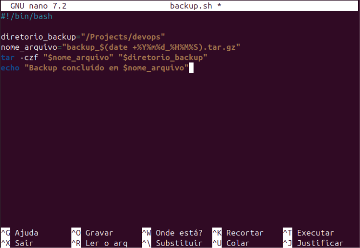

# Comandos Linux

## 1. Navegação entre Diretórios

- **pwd**: Exibe o diretório atual.

```bash
$ pwd
/home/usuario
````

* **ls**: Lista arquivos e pastas do diretório atual.

```bash
$ ls
documento.txt  imagens/  projeto/
```

* **cd**: Acessa um diretório.

```bash
$ cd Downloads  # Entra no diretório Downloads
$ cd ..         # Retorna ao diretório anterior
```

* **find**: Busca arquivos e diretórios.

```bash
$ find /caminho -name "arquivo.txt"  # Busca por nome
$ find /caminho -type f -size +1M     # Busca arquivos maiores que 1MB
$ find /caminho -type f -atime +7     # Arquivos não acessados nos últimos 7 dias
$ find /caminho -type f -iname "ARQUIVO.txt"  # Busca insensível a maiúsculas
```

---

## 2. Criação e Gestão de Arquivos e Diretórios

* **mkdir**: Cria um novo diretório.

```bash
$ mkdir nova_pasta
```

* **rmdir**: Remove diretórios vazios.

```bash
$ rmdir pasta_vazia
```

* **rm**: Remove arquivos ou diretórios (use com cuidado).

```bash
$ rm arquivo.txt                 # Remove um arquivo
$ rm -r pasta_com_conteudo       # Remove um diretório com conteúdo
```

* **touch**: Cria arquivos vazios.

```bash
$ touch arquivo1.txt arquivo2.txt
```

* **cat**: Exibe ou cria arquivos.

```bash
$ cat arquivo.txt                # Exibe o conteúdo de um arquivo
$ cat > novo_arquivo.txt         # Cria um arquivo e escreve conteúdo
```

* **chmod**: Altera permissões de arquivos.

```bash
$ chmod 755 script.sh            # Permissão para leitura, gravação e execução pelo dono, leitura/execução para grupo e outros
```

* **chown**: Altera o dono e grupo de um arquivo.

```bash
$ chown usuario:grupo arquivo.txt
```

---

## 3. Controle e Acesso ao Sistema

* **exit**: Termina a sessão no terminal.

```bash
$ exit
```

* **logout**: Desloga do usuário atual no sistema.

```bash
$ logout
```

* **passwd**: Altera a senha do usuário.

```bash
$ passwd
```

* **ssh**: Conecta a um servidor remoto.

```bash
$ ssh usuario@servidor.com
```

---

## 4. Controle de Processos

* **top**: Monitora processos em tempo real (Ctrl + C para sair).

```bash
$ top
```

* **ps**: Lista processos em execução.

```bash
$ ps aux
```

* **kill**: Envia um sinal para terminar um processo.

```bash
$ kill 1234        # Finaliza o processo com PID 1234
$ kill -9 1234     # Força a finalização do processo
```

* **jobs**: Lista processos em segundo plano.

```bash
$ jobs
```

* **bg** e **fg**: Gerenciam processos em segundo e primeiro plano.

```bash
$ bg %1           # Coloca o trabalho 1 em segundo plano
$ fg %1           # Traz o trabalho 1 para o primeiro plano
```

* **pstree**: Exibe a árvore de processos.

```bash
$ pstree
```

---

## 5. Trabalhando com Textos

* **cat**: Exibe o conteúdo de um arquivo.

```bash
$ cat arquivo.txt
```

* **cut**: Extrai campos de um arquivo.

```bash
$ cut -d "," -f 1 arquivo.csv  # Extrai a primeira coluna de um CSV
```

* **head** e **tail**: Exibem linhas do início ou fim de um arquivo.

```bash
$ head -n 5 arquivo.txt   # Exibe as 5 primeiras linhas
$ tail -n 10 arquivo.txt  # Exibe as 10 últimas linhas
```

* **more** e **less**: Exibem o conteúdo de arquivos de forma paginada.

```bash
$ more arquivo.txt
$ less arquivo.txt
```

* **grep**: Pesquisa por padrões em arquivos.

```bash
$ grep "padrão" arquivo.txt        # Encontra linhas que contêm "padrão"
$ grep -r "padrão" diretorio/     # Pesquisa recursivamente em um diretório
```

---

## 6. Manipulação de Compactação

* **tar**: Cria ou extrai arquivos compactados.

```bash
$ tar -czvf arquivo.tar.gz pasta/    # Compacta com gzip
$ tar -xzvf arquivo.tar.gz           # Extrai arquivo compactado
```

* **gzip/bzip2**: Compacta arquivos individualmente.

```bash
$ gzip arquivo.txt       # Compacta o arquivo para arquivo.txt.gz
$ bzip2 arquivo.txt      # Compacta o arquivo para arquivo.txt.bz2
```

* **zip/unzip**: Compacta e descompacta arquivos ZIP.

```bash
$ zip arquivos.zip arquivo1 arquivo2
$ unzip arquivos.zip
```

---

## 7. Scripts e Automação

### Criação de Script Bash

```bash
echo "Olá, mundo!"
```

Para executar, torne o script executável e rode:

```bash
$ chmod +x script.sh
$ ./script.sh
```

### Backup com Script

Exemplo de script para backup:

```bash
#!/bin/bash
DATA=$(date +"%Y-%m-%d")
DESTINO="/backup/$DATA"
mkdir -p $DESTINO
cp -r /pasta/origem/* $DESTINO
echo "Backup concluído com sucesso!"
```

### Permissões de Execução

```bash
$ chmod +x script.sh
```

---

## 8. Comandos Úteis Adicionais

* **clear**: Limpa o terminal.

```bash
$ clear
```

* **df -h**: Exibe o uso do sistema de arquivos.

```bash
$ df -h
```

* **free -h**: Exibe informações sobre o uso de memória.

```bash
$ free -h
```

* **sudo apt-get update && sudo apt-get upgrade**: Atualiza o sistema.

```bash
$ sudo apt-get update && sudo apt-get upgrade
```

* **updatedb/locate**: Atualiza o banco de dados e busca arquivos.

```bash
$ sudo updatedb
$ locate arquivo.txt
```

* **which**: Localiza o caminho de um executável.

```bash
$ which ls
```

---

## 9. Gerenciamento de Usuários e Permissões

* **adduser**: Adiciona um novo usuário.

```bash
$ sudo adduser novo_usuario
```

* **usermod**: Modifica informações de um usuário.

```bash
$ sudo usermod -aG grupo usuario   # Adiciona o usuário a um grupo
```

* **chown**: Altera o dono e grupo de um arquivo.

```bash
$ sudo chown usuario:grupo arquivo.txt
```

* **chmod**: Modifica permissões de arquivos.

```bash
$ chmod 755 arquivo.txt
```

---

## 10. Protocolos de Rede e Memória

* **ping**: Testa a conectividade com um host.

```bash
$ ping google.com
```

* **ip addr**: Exibe informações de rede.

```bash
$ ip addr
```

* **ip route**: Exibe a tabela de roteamento.

```bash
$ ip route
```

---

## 11. Gerenciamento de Pacotes e Serviços

* **apt-get**: Instala e gerencia pacotes no sistema.

```bash
$ sudo apt-get install pacote   # Instala um pacote
$ sudo apt-get remove pacote    # Remove um pacote
```

* **service/systemctl**: Gerencia serviços do sistema.

```bash
$ sudo service apache2 start    # Inicia um serviço
$ sudo systemctl restart apache2
```


---
---
---

# GNU Nano

O **GNU Nano** é um editor de texto simples e poderoso que vem pré-instalado em muitas distribuições Linux. Ele é usado diretamente no terminal e foi projetado para ser fácil de usar, mesmo para iniciantes. Nano é particularmente útil para editar arquivos de configuração ou criar scripts rapidamente, sem a necessidade de interfaces gráficas.

## Principais Características do GNU Nano

- **Simplicidade**: Ele é amigável, com comandos básicos exibidos na parte inferior da tela.
- **Baseado em Terminal**: Você pode usá-lo em servidores remotos ou sistemas sem interface gráfica.
- **Compatível com Vários Arquivos**: Permite abrir e editar múltiplos arquivos ao mesmo tempo.
- **Pesquisa e Substituição**: Inclui ferramentas de busca e substituição simples.
- **Open Source**: Faz parte do projeto GNU, ou seja, é gratuito e de código aberto.

---

## Como Usar o GNU Nano

### 1. Abrindo o GNU Nano

No terminal, digite o comando abaixo seguido do nome do arquivo que você deseja editar:

```bash
nano
````

Exemplo para editar um arquivo chamado `config.txt`:

```bash
nano config.txt
```

### 2. Interface do GNU Nano

Quando você abre o Nano, verá:


Fonte: *[https://www.gnu.org/software/nano/](https://www.gnu.org/software/nano/)*

* **Conteúdo do arquivo**: A parte superior e central da tela mostra o texto do arquivo.
* **Linha de Status**: Abaixo do conteúdo, há informações como o nome do arquivo e o número da linha.
* **Atalhos de Comando**: Na parte inferior, comandos básicos aparecem com um símbolo de `^`. O `^` representa a tecla Ctrl.

### 3. Comandos Básicos no GNU Nano

| Atalho   | Descrição                             |
| -------- | ------------------------------------- |
| Ctrl + O | Salvar o arquivo.                     |
| Ctrl + X | Sair do editor.                       |
| Ctrl + W | Buscar um texto no arquivo.           |
| Ctrl + K | Cortar uma linha.                     |
| Ctrl + U | Colar o texto cortado anteriormente.  |
| Ctrl + G | Abrir o menu de ajuda.                |
| Ctrl + T | Verificar ortografia (se habilitado). |

### 4. Editando Arquivos

* **Abrir e Digitar**: Após abrir o arquivo, basta começar a digitar ou navegar usando as setas do teclado.
* **Salvar as Alterações**:
  Pressione `Ctrl + O` para salvar.
  O Nano perguntará se você deseja salvar no mesmo arquivo ou em outro nome.
  Pressione `Enter` para confirmar.

### 5. Sair do Nano

Para sair, pressione `Ctrl + X`.
Se houver alterações não salvas, o Nano perguntará:

```
Save modified buffer? (Answering "No" will DISCARD changes)
```

* Digite `Y` para salvar.
* Digite `N` para sair sem salvar.

---

# Script de Backup

Este script automatiza o processo de criação de backups de um diretório específico no sistema Linux. Ele faz isso ao compactar todos os arquivos de um diretório e nomear o arquivo de backup com base na data e hora em que foi criado.

## Passo a Passo para Criar e Executar o Script

### 1. Acessar o Terminal

Abra o terminal no seu sistema Linux ou conecte-se a um servidor remoto usando SSH.

### 2. Criar o Script

Crie um novo arquivo chamado `backup.sh` usando o editor Nano:

```bash
nano backup.sh
```

No editor, insira o seguinte conteúdo do script:

```bash
#!/bin/bash
# Diretório que contém os arquivos a serem backupados
diretorio_backup="/Projects/devops"

# Nome do arquivo de backup, com data e hora atuais
nome_arquivo="backup_$(date +%Y%m%d_%H%M%S).tar.gz"

# Compactar os arquivos do diretório em um arquivo .tar.gz
tar -czf "$nome_arquivo" "$diretorio_backup"

# Mensagem para o usuário indicando sucesso
echo "Backup concluído em $nome_arquivo"
```


Fonte: *[https://www.gnu.org/software/nano/](https://www.gnu.org/software/nano/)*

Salvar e sair do editor: Pressione `Ctrl + X`, digite `Y` e pressione `Enter`.

### 3. Tornar o Script Executável

Antes de executar o script, ele precisa ter permissão para ser executado. Use o comando:

```bash
chmod +x backup.sh
```

### 4. Executar o Script

Execute o script para criar o backup:

```bash
bash backup.sh
```

### 5. Verificar o Resultado

Após executar o script, você verá uma mensagem como:

```
Backup concluído em backup_20231122_175022.tar.gz
```

O arquivo de backup será criado no diretório atual onde o script foi executado.
O nome do arquivo inclui a data e a hora em que o backup foi realizado, como `backup_20231122_175022.tar.gz`.

---

## Automação Adicional com Cron (Opcional)

Se você deseja que o backup seja executado automaticamente em intervalos regulares (diariamente, semanalmente, etc.), pode usar o cron, um agendador de tarefas do Linux.

Abra o editor do cron:

```bash
crontab -e
```

Adicione uma linha para executar o script diariamente às 2h da manhã:

```bash
0 2 * * * /caminho/para/backup.sh
```

Salve e saia. Agora o script será executado automaticamente no horário especificado.

---

# Script de Compactação

## Criação do Script

Abra o editor nano ou outro de sua preferência:

```bash
nano compactador.sh
```

Script:

```bash
#!/bin/bash

# Verifica se o número de parâmetros é menor que 2
if [ "$#" -lt 2 ]; then
    echo "O programa, $0, requer o nome do arquivo final e os arquivos a serem compactados."
    exit 1
fi

# Nome do arquivo de saída
arquivo_saida="$1"

# Lista de arquivos a serem compactados (do segundo parâmetro em diante)
arquivos=("${@:2}")

# Compacta os arquivos utilizando o comando tar
tar -czf "$arquivo_saida" "${arquivos[@]}"

# Exibe mensagem de sucesso
echo "Compactado com sucesso em $arquivo_saida"
```

Cole o código acima no editor.
Salve o arquivo com `CTRL + O`, depois pressione `Enter` e saia com `CTRL + X`.

### Tornar o Script Executável

Conceda permissão de execução ao script:

```bash
chmod +x compactador.sh
```

### Execução do Script

Execute o script com os parâmetros necessários:

```bash
./compactador.sh saida.tar.gz /caminho/para/arquivo1.txt /caminho/para/arquivo2.txt
```

* `saida.tar.gz`: Nome do arquivo compactado.
* `/caminho/para/arquivo1.txt`, `/caminho/para/arquivo2.txt`: Caminho completo dos arquivos a serem compactados.

### Verificação do Arquivo Compactado

Liste o conteúdo do arquivo compactado para verificar se tudo foi incluído corretamente:

```bash
tar -tf saida.tar.gz
```

---

# Script de Mensagem

```bash
#!/bin/bash
echo "Olá, mundo!"
```

---

# Script de Criação de Diretório

```bash
#!/bin/bash
echo "Digite o nome do diretório a ser criado:"
read nome_diretorio
mkdir -p "$nome_diretorio"
echo "Diretório '$nome_diretorio' criado com sucesso!"
```

---

# Script de Verificação de Diretório

```bash
#!/bin/bash
echo "Digite o nome do diretório para verificar:"
read nome_diretorio
if [ -d "$nome_diretorio" ]; then
    echo "O diretório '$nome_diretorio' existe."
else
    echo "O diretório '$nome_diretorio' não existe."
fi
```

---

# Script de Múltiplas Tarefas

```bash
#!/bin/bash

read -p "Entre com a operação desejada: 'compactar' ou 'descompactar': " operacao

case "$operacao" in
    "compactar")
        read -p "Nome do arquivo final (.tar.gz): " arquivo_saida
        read -p "Lista de arquivos separados por espaço: " arquivos
        tar -czf "$arquivo_saida" $arquivos
        echo "Compactados com sucesso em $arquivo_saida"
    ;;
    "descompactar")
        read -p "Nome do arquivo a descompactar (.tar.gz): " arquivo
        read -p "Diretorio de destino: " diretorio
        tar -xzf "$arquivo" -C "$diretorio"
        echo "Descompactado com sucesso em $diretorio"
    ;;
    *)
        echo "Operação inválida!"
        echo "Selecione 'compactar' ou 'descompactar'."
        exit 1
    ;;
esac
```

### Como Criar e Usar o Script

* **Criação do Script**:
  Abra o editor nano:

  ```bash
  nano compedescomp.sh
  ```

  Cole o código acima. Salve com `CTRL + O`, pressione `Enter`, e saia com `CTRL + X`.

* **Tornar o Script Executável**:

  ```bash
  chmod +x compedescomp.sh
  ```

* **Executar o Script**:

  ```bash
  ./compedescomp.sh
  ```


