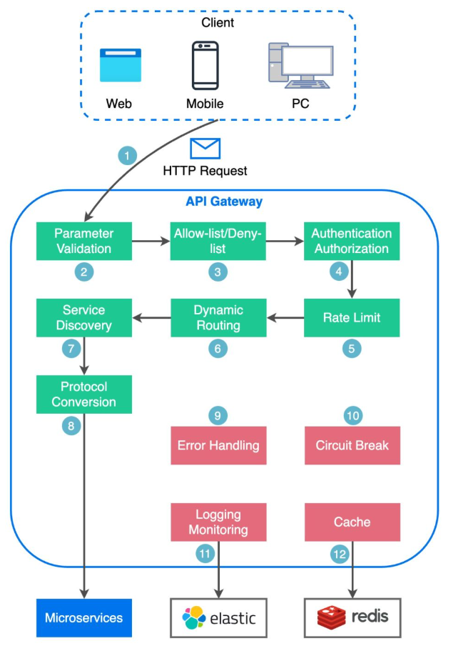

# API Gateway

O **API Gateway** é um componente fundamental em arquiteturas modernas, especialmente em aplicações baseadas em microsserviços. Ele atua como um ponto de entrada único para todas as requisições externas que precisam acessar múltiplas APIs ou serviços dentro de um sistema.

## O que é um API Gateway?

Um **API Gateway** é um servidor que recebe, gerencia, autentica, roteia e processa todas as solicitações de clientes (aplicações web, mobile, sistemas de terceiros etc.) para as APIs internas de uma organização. 

Em vez de o cliente se comunicar diretamente com cada serviço individual, todas as requisições passam pelo API Gateway, que centraliza o controle e oferece funcionalidades extras.

### Esquema Simplificado:



## Principais Funções do API Gateway

1. **Roteamento de Requisições**

   * Direciona cada solicitação recebida para o serviço interno correto, com base na URL, no método ou em regras de negócio.

2. **Autenticação e Autorização**

   * Verifica se o cliente possui permissão para acessar o recurso solicitado, podendo exigir tokens (como JWT), chaves de API, ou integração com sistemas de login.

3. **Agregação de Respostas**

   * Junta dados de múltiplos serviços internos em uma única resposta, facilitando para o cliente que receberá tudo de uma só vez.

4. **Rate Limiting e Throttling**

   * Limita o número de requisições que um usuário pode fazer em determinado período, protegendo a infraestrutura de sobrecarga e abusos.

5. **Cache de Requisições**

   * Armazena temporariamente respostas para evitar consultas repetidas aos serviços internos, melhorando a performance.

6. **Transformação de Dados**

   * Pode modificar ou adaptar dados das requisições e respostas para garantir compatibilidade entre clientes e serviços internos (ex: converter formatos de dados).

7. **Monitoramento e Logging**

   * Centraliza o registro de todas as requisições e respostas, facilitando auditoria, monitoramento e diagnóstico de problemas.

8. **Segurança**

   * Atua como uma camada extra de proteção, filtrando tráfego malicioso, aplicando regras de segurança e criptografando dados.

## Exemplo Prático

Imagine um aplicativo de e-commerce. Ao fazer login, buscar produtos ou finalizar uma compra, o aplicativo se comunica apenas com o API Gateway. O gateway, então, encaminha cada solicitação para o serviço interno correto: autenticação, catálogo de produtos, pagamento, etc. O cliente nunca acessa diretamente esses serviços.

```
App Mobile/Web
     │
     ▼
API Gateway
     ├─► Serviço de Autenticação
     ├─► Serviço de Produtos
     ├─► Serviço de Pagamento
     └─► Serviço de Entregas
```

## Diferença Entre API Gateway e Proxy Reverso

* **Proxy Reverso:** Faz apenas o encaminhamento de requisições externas para servidores internos, com funções como balanceamento de carga e cache, mas não entende o contexto das APIs.
* **API Gateway:** Vai além do proxy reverso, oferecendo funcionalidades específicas para APIs, como autenticação, agregação de respostas, limitação de requisições, transformação de dados, entre outros.

## Vantagens de Usar um API Gateway

* Centraliza e padroniza o acesso às APIs
* Facilita a implementação de políticas de segurança e autenticação
* Reduz a complexidade do cliente, que precisa se conectar a apenas um ponto
* Melhora a escalabilidade e a manutenção dos sistemas

## Resumindo

O **API Gateway** é o responsável por gerenciar e proteger o tráfego de dados entre clientes e os serviços internos de uma aplicação. Ele proporciona segurança, organização, escalabilidade e simplifica a comunicação em ambientes complexos, sendo indispensável em arquiteturas modernas como microservices.

Se quiser exemplos de ferramentas populares de API Gateway, exemplos de configuração ou uma comparação mais detalhada com outros componentes de rede, é só pedir!
