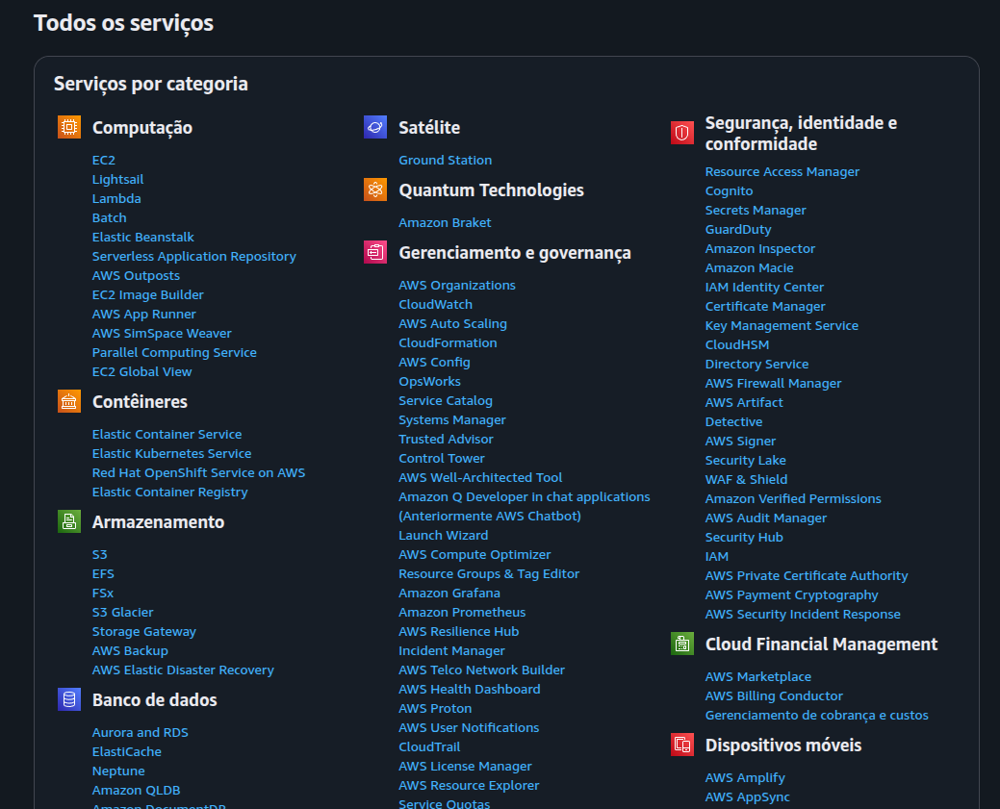

# Introdução ao Cloud Computing e Hospedagem de Websites

## 1. Criando um Website para Compartilhar Conhecimento

Queremos criar um website para compartilhar conteúdos e experiências sobre tecnologia e DevOps. Quando visitamos sites como o da Alura, notamos que ao clicar em seções como "Data Science" (Ciência de Dados), recebemos informações em tempo real: vídeos, imagens e conteúdos interativos.

Essas informações, porém, não estão no nosso computador local. Elas vêm de outro computador conectado à web — o **servidor**.

---

## 2. Entendendo o Papel do Servidor

### O que é um servidor?

Um servidor é um computador ou sistema configurado para fornecer serviços e dados a outros dispositivos (clientes), através da internet. Ele está sempre **respondendo às solicitações** feitas pelos clientes.

**Exemplo de interação:**

* **Cliente** → acessa o site pelo navegador.
* **Internet** → meio de transporte de dados.
* **Servidor** → responde com os conteúdos necessários (páginas, vídeos, dados).

Assim, os dispositivos como celulares, notebooks e até televisores atuam como clientes, enquanto o servidor fornece as informações.

---

## 3. Onde está o Servidor?

O servidor pode estar em nossa própria casa — um desktop configurado para trabalhar 24 horas por dia, 7 dias por semana. Porém, essa não é a opção mais prática para a maioria dos projetos.

Aqui entra a computação em nuvem (cloud computing).

---

## 4. O Conceito de Cloud Computing

A **computação em nuvem** consiste em **oferecer serviços computacionais como armazenamento, hospedagem de sites e bancos de dados** de forma **remota**, por meio da internet. Em vez de cuidar diretamente de um computador pessoal, contratamos um **provedor de serviços de nuvem** para gerenciar toda a infraestrutura.

---

## 5. Vantagens da Computação em Nuvem

As principais vantagens são:

* **Não precisamos manter um computador pessoal ligado o tempo todo**.
* **Não nos preocupamos com atualizações ou manutenção de hardware**.
* **Podemos focar no conteúdo e na experiência das pessoas usuárias**.

O provedor de nuvem cuida do servidor físico, enquanto nós cuidamos da aplicação e do que queremos oferecer aos visitantes.

---

## 6. Exemplos do Uso da Nuvem

Utilizamos computação em nuvem **no dia a dia**, muitas vezes sem perceber:

* **Armazenamento de arquivos**: Google Drive, Dropbox.
* **Uso de softwares pela internet**: Google Docs, serviços de e-mail.
* **Software como Serviço (SaaS)**: aplicações inteiras rodando em navegadores.
* **Hospedagem de bancos de dados** e **hospedagem de sites**.

A computação em nuvem oferece, assim, **recursos computacionais como serviço**. Isso significa que podemos contratar apenas o que precisamos, sem investir em hardware próprio.

---

## 7. Conclusão e Próximos Passos

A melhor opção para hospedar nosso site e compartilhar conteúdos é utilizar um serviço de **computação em nuvem**. Isso nos permite focar na parte mais importante: o **conteúdo e a experiência do usuário**.

Mas surge a pergunta:

**Onde está localizada essa "nuvem"?**
**Como as pessoas conseguem acessar o conteúdo que está armazenado em um servidor na nuvem?**

Essas são as próximas etapas do nosso estudo!

---

# AWS

## Visão Geral do Console

No console da AWS, há duas seções principais:

* **Lado esquerdo**: Serviços que visitamos recentemente.
* **Lado direito**: Aplicações que podem estar sendo executadas na nossa conta.

Ao descer a página, no lado direito, encontramos informações sobre **custos** e os serviços em uso.
É importante ressaltar que existe um custo associado à conta. Por isso, ao explorar o ambiente em nuvem, é essencial **desativar serviços não utilizados** para evitar cobranças desnecessárias.

---

## Navegando pelos Serviços

No topo da página, no canto superior esquerdo, há um botão chamado **"Serviços"**.
Clicando ali, veremos uma lista variada de serviços disponíveis.
Inicialmente, pode parecer confuso, mas pensando no nosso objetivo (hospedar um site usando um serviço de computação em nuvem), vamos focar nas **cinco principais categorias** relevantes para isso.

No menu suspenso, clique em:

* **"Todos os serviços"**
* **"Visualizar todos os serviços"**

Assim, você poderá explorar todas as categorias. Vamos começar pela primeira: **Computação**.

---

## Computação

Essa categoria reúne serviços para **execução de aplicações em servidores virtuais**.
Se estiver em inglês, aparecerá como **"Compute"**.

### Principais Serviços

* **EC2 (Elastic Compute Cloud)**
  Permite criar **instâncias**, ou seja, servidores virtuais na infraestrutura de nuvem.
  Essencial para o nosso projeto, pois oferece flexibilidade e escalabilidade.

* **Lambda**
  Serviço de computação **serverless** (sem servidor).
  Embora seja muito eficiente, nosso projeto requer servidores virtuais, então **usaremos o EC2**.

---

## Armazenamento

Além da computação, precisamos armazenar **dados, textos e vídeos do site**.
Um exemplo de serviço para isso é o:

* **S3 (Simple Storage Service)**
  Serviço de armazenamento altamente escalável e confiável.

---

## Banco de Dados

Para **validar o acesso de clientes a conteúdos exclusivos** (por exemplo, áreas com login e senha), usaremos serviços de banco de dados.
Esses bancos são fundamentais para gerenciar e armazenar essas informações.

---

## Redes e Entrega de Conteúdo

Esses serviços são usados para:

* **Configurar a rede**
* **Melhorar a experiência do usuário**
* **Garantir a disponibilidade do conteúdo**

Um exemplo prático é **replicar o site em múltiplos datacenters** dentro de uma região, usando serviços de rede e entrega de conteúdo.

---

## Segurança, Identidade e Conformidade

O serviço fundamental aqui é o:

* **IAM (Identity and Access Management)**
  Gerencia quem pode acessar determinados serviços dentro da conta ou organização.
  Define **como esse acesso será feito**.
  É **crucial** para configurar e gerenciar a segurança e as permissões na AWS.

---

Segue o conteúdo estruturado e didático, em formato de **apostila em Markdown**:

---

## A Importância na AWS

A segurança é um aspecto fundamental quando lidamos com aplicações web.
Imagine um cenário em que estamos lidando com dados sensíveis, como resultados de exames clínicos de pacientes em um site de uma clínica médica.
Esses são **dados sensíveis** que precisam ser protegidos.

Mas surge uma pergunta importante:
**Quem é responsável por um eventual vazamento desses dados se estivermos usando um serviço de computação em nuvem?**
Nós, como desenvolvedores e gestores do site?
Ou o provedor de serviços de nuvem, como a **AWS**?

---

## Responsabilidade Compartilhada

Na computação em nuvem, a **segurança é uma responsabilidade compartilhada** entre:

* **Cliente (nós)**: Gerenciar quem pode acessar a conta e os dados.
* **Provedor de serviços (AWS)**: Proteger a infraestrutura, a rede e os servidores físicos.

Por exemplo, a AWS garante a **segurança física** dos datacenters e mantém backups de aplicações, prevenindo perda de dados em casos de desastres.

Nós, como clientes, somos responsáveis por:
✅ Controlar o **acesso à conta**
✅ Gerenciar quem pode **ver, criar e modificar recursos**

---

## Implementação da Segurança com IAM

No console da AWS, podemos gerenciar a segurança usando o serviço **IAM (Identity and Access Management)**.

Para acessar o IAM, basta digitar "**IAM**" na barra de pesquisa do console.

---

### Autenticação Multifator (MFA)

Uma das primeiras recomendações ao acessar o IAM é **implementar a MFA** (autenticação multifator).

🔐 **O que é MFA?**
Além da senha, exige um **segundo fator de autenticação** (por exemplo, um aplicativo de código ou dispositivo físico).
Isso adiciona uma camada extra de segurança.

**Por que usar MFA?**
Hoje em dia, vazamentos de senhas são comuns.
Mesmo que a senha vaze, sem o segundo fator, um invasor não consegue acessar a conta.

---

### Gerenciamento de Políticas e Permissões

No painel do IAM, à esquerda, encontramos:

* **Grupo de usuários**
* **Usuários**
* **Funções**
* **Políticas**

🔑 **Política**: Objeto que define um conjunto de permissões.
Através das políticas, decidimos o que cada usuário ou grupo pode fazer.

---

### Criando uma Política

Podemos criar, por exemplo, uma política para permitir que usuários criem e gerenciem instâncias EC2.

Passos:

1. **Selecionar o serviço** (ex: EC2).

2. **Definir as ações permitidas** (ex: criar, excluir ou gerenciar instâncias).

3. **Escolher o escopo**:

   * Aplicar em recursos específicos
   * Ou em todos os recursos

4. **Nomear a política**:
   Exemplo: `permissao_ec2_org`

5. **Criar a política**.

---

### Atribuindo Políticas a Grupos e Usuários

Após criar a política, podemos:
✅ Atribuí-la diretamente a usuários.
✅ Ou, preferencialmente, a **grupos de usuários**.

💡 **Boa prática**:
Crie grupos baseados em funções (ex: `devops`, `engenharia_de_dados`).
Atribua políticas a esses grupos.
Isso facilita o gerenciamento de permissões!

---

### Exemplo Prático

1️⃣ Crie um grupo chamado `devops`.
2️⃣ Adicione os usuários que fazem parte da equipe de DevOps.
3️⃣ Associe ao grupo:

* A política personalizada que você criou (`permissao_ec2_org`)
* Políticas padrão da AWS, como `AdministratorAccess`, se necessário.

Assim, todos os membros do grupo terão automaticamente as permissões definidas, sem precisar configurar individualmente.

---

Segue o conteúdo reestruturado em **formato de apostila em Markdown**, organizado e didático para facilitar a leitura e entendimento:

---

## Hospedagem de Aplicações Web

Um website não “existe” online por si só – ele precisa estar **hospedado em servidores físicos**.
Esses servidores estão localizados em **datacenters**, que possuem grandes capacidades de processamento e armazenamento.
Quando acessamos um site, enviamos uma **requisição HTTP** e o servidor responde com todos os dados que serão exibidos no navegador.

---

## Latência

Durante esse processo, surge um fator importante: a **latência**.
Ela mede o tempo entre o envio da requisição e o recebimento da resposta.

💡 **Impacto na experiência:**

* Quanto maior a latência, maior o tempo de espera percebido.
* Usuários esperam **respostas rápidas** — é crucial reduzir a latência para manter a experiência fluida.

---

## Regiões de Disponibilidade da AWS

No console da **AWS**, vemos diferentes regiões (ex: Ohio, São Paulo).
Essas são as **regiões de disponibilidade**, cada uma com seus próprios datacenters.

🔍 **Escolha da região:**
1️⃣ **Latência**: Quanto mais perto dos usuários, menor a latência.
2️⃣ **Custo**: Os preços variam entre regiões.

* Exemplo:

  * São Paulo: US\$0.15/GB
  * Ohio: US\$0.09/GB

Nem sempre a região mais próxima é a mais econômica — é preciso equilibrar custo e desempenho!

---

## Zonas de Disponibilidade

Cada região tem **zonas de disponibilidade** (availability zones, AZs).
Elas são datacenters independentes dentro da mesma região.
A ideia é ter **redundância** e **alta disponibilidade**.

💡 Se um datacenter falhar, outro na mesma região mantém o site funcionando.

---

## Caso de Sucesso: Netflix

A **Netflix** utiliza computação em nuvem para oferecer vídeo sob demanda globalmente.
Eles distribuem serviços em várias regiões para:
✅ Estar próximo de cada usuário.
✅ Garantir qualidade e velocidade no streaming.
✅ Evitar lentidão e melhorar a experiência do cliente.

---

## Hospedagem de Websites Simples

Para um site simples, normalmente:
✅ Escolhe-se **uma única região**.
✅ Garante-se pelo menos uma AZ para manter o site ativo mesmo em falhas.

💡 **Por quê?**
Minimiza problemas e evita erros como:

* **502**: Bad Gateway
* **504**: Gateway Timeout

Esses erros podem prejudicar negócios (ex: e-commerce).

---

## Benefícios da Nuvem x On-Premises

| Característica           | Computação em Nuvem                      | On-Premises                        |
| ------------------------ | ---------------------------------------- | ---------------------------------- |
| **Backup e Redundância** | Garantidos pela nuvem (multi-AZ)         | Depende de estrutura local         |
| **Disponibilidade**      | Alta, mesmo em falhas                    | Pode sofrer interrupções           |
| **Latência**             | Menor, pois datacenters são distribuídos | Depende da conectividade local     |
| **Gerenciamento**        | Cuidado do provedor (AWS, Azure etc.)    | Totalmente gerenciado pela empresa |

💡 **Resumo:**
A nuvem oferece maior **disponibilidade** e **desempenho**, além de reduzir a preocupação com infraestrutura local.

---

## Organização da AWS

A AWS organiza seus datacenters em três níveis principais:

### 1️⃣ Regiões (Regions)

* Locais físicos onde datacenters estão agrupados.
* Cada região contém várias AZs.
* Ex: São Paulo, Ohio, Frankfurt.

### 2️⃣ Zonas de Disponibilidade (AZs)

* Conjunto de datacenters independentes dentro de uma região.
* Alta disponibilidade e tolerância a falhas.
* Conectadas por redes de fibra dedicadas e criptografadas.

### 3️⃣ Zonas Locais (Local Zones)

* **Proximidade ainda maior** dos usuários finais.
* Usadas para aplicações que exigem **latência mínima** (jogos, multimídia em tempo real, ML).

---

## Importância da Escolha

✅ **Latência**: Impacta diretamente a experiência do usuário.
✅ **Custo**: Regiões diferentes, custos diferentes.
✅ **Regulamentações**: Pode ser necessário escolher regiões específicas para seguir leis locais (ex: LGPD no Brasil).
✅ **Disponibilidade de Serviços**: Nem todos os serviços AWS estão disponíveis em todas as regiões.

---

💡 **Resumo Final:**

* A hospedagem de websites depende da escolha correta de **região, AZ e zonas locais**.
* O objetivo é oferecer **baixa latência, alta disponibilidade e conformidade regulatória**.
* Com a AWS e suas zonas de disponibilidade, podemos criar **infraestruturas resilientes e eficientes**, melhorando a experiência do usuário final!

---

