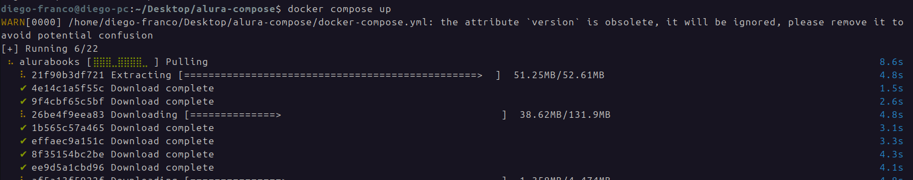

# Docker Compose - Orquestrando Contêineres

## 📚 Sumário Interativo Completo

- [O Problema: Gestão Manual de Contêineres](#1-o-problema-gestão-manual-de-contêineres)
- [A Solução: Docker Compose](#2-a-solução-docker-compose)
- [O Arquivo `docker-compose.yml`](#3-o-arquivo-docker-composeyml)
- [Instalação do Docker Compose](#4-instalação-do-docker-compose)
- [Comandos Essenciais](#5-comandos-essenciais)
- [Criando `docker-compose.yml`](#criando-docker-composeyml)
  - [Preparando o Ambiente](#preparando-o-ambiente)
  - [Construindo o `docker-compose.yml` Passo a Passo](#3-construindo-o-docker-composeyml-passo-a-passo)
  - [Arquivo `docker-compose.yml` Completo](#4-arquivo-docker-composeyml-completo)
  - [Executando a Aplicação com Docker Compose](#5-executando-a-aplicação-com-docker-compose)
  - [Verificando e Parando a Aplicação](#6-verificando-e-parando-a-aplicação)
- [Gerenciando a Ordem de Inicialização com `depends_on`](#gerenciando-a-ordem-de-inicialização-com-depends_on)
  - [Comandos de Gerenciamento](#2-comandos-de-gerenciamento)
  - [Persistindo Dados com `volumes`](#3-persistindo-dados-com-volumes)
  - [Preparando para Produção: A Seção `deploy`](#4-preparando-para-produção-a-seção-deploy)


## **1. O Problema: Gestão Manual de Contêineres**

Nos capítulos anteriores, subimos nossa aplicação (`Alura Books`) e seu banco de dados (`Mongo`) usando uma série de comandos `docker` manuais. Esta abordagem, embora funcional para dois serviços, torna-se rapidamente inviável e propensa a erros em cenários reais com dezenas de contêineres.

**Exemplo do Processo Manual:**

1.  Criar a rede.
2.  Subir o contêiner do banco com um comando extenso:
    ```bash
    docker run -d --network minha-bridge --name meu-mongo mongo:4.4.6
    ```
3.  Subir o contêiner da aplicação com outro comando longo, garantindo a conexão de rede e o mapeamento de portas.
4.  Para parar e remover tudo, seria preciso executar comandos individuais para cada contêiner e rede.

Essa gestão manual é insustentável.

##### **2. A Solução: Docker Compose**

O Docker Compose é a ferramenta oficial do Docker para resolver esse problema. Ele permite definir e gerenciar aplicações multi-contêiner de forma declarativa, usando um único arquivo de configuração.

**O que é Docker Compose?**

  * **Ferramenta de Orquestração Local:** Coordena múltiplos contêineres (serviços, redes, volumes) como se fossem uma única aplicação.
  * **Baseado em YAML:** Utiliza um arquivo, por padrão chamado `docker-compose.yml`, para definir toda a estrutura da aplicação.
  * **Simplifica a Gestão:** Permite subir, configurar, conectar e derrubar todos os serviços da aplicação com um único comando.

##### **3. O Arquivo `docker-compose.yml`**

Este arquivo YAML é a espinha dorsal do Docker Compose. Nele, descrevemos o estado desejado da nossa aplicação.

**Estrutura de um `docker-compose.yml` para nossa aplicação:**

```yaml
# Define a versão da sintaxe do Compose. "3.9" é uma versão moderna e estável.
version: "3.9"

# Define os contêineres (serviços) que compõem a aplicação.
services:
  # Define o serviço do banco de dados.
  meu-mongo:
    image: mongo:4.4.6
    # Conecta este serviço à rede 'minha-rede'.
    networks:
      - minha-rede

  # Define o serviço da aplicação.
  alura-books:
    image: aluradocker/alura-books:1.0
    # Mapeia a porta 8080 do host para a porta 3000 do contêiner.
    ports:
      - "3000:3000"
    # Conecta este serviço à rede 'minha-rede'.
    networks:
      - minha-rede
    # Define que este serviço depende do 'meu-mongo'. O Compose iniciará o mongo antes.
    depends_on:
      - meu-mongo

# Define as redes que os serviços utilizarão.
networks:
  # Cria uma rede chamada 'minha-rede'.
  minha-rede:
    driver: bridge
```

##### **4. Instalação do Docker Compose**

  * **Windows e macOS:** O Docker Compose já vem incluído no Docker Desktop. Nenhuma ação é necessária.
  * **Linux:** Em muitas distribuições Linux, ele precisa ser instalado separadamente.

**Passos para instalar no Linux (exemplo):**
*Atenção: A versão no comando abaixo (`v2.27.0`) é um exemplo. Sempre verifique a [página oficial de releases do Docker Compose no GitHub](https://github.com/docker/compose/releases) para baixar a versão mais recente.*

1.  **Baixar o binário:**
    ```bash
    sudo curl -L "https://github.com/docker/compose/releases/download/v2.27.0/docker-compose-$(uname -s)-$(uname -m)" -o /usr/local/bin/docker-compose
    ```
2.  **Aplicar permissões de execução:**
    ```bash
    sudo chmod +x /usr/local/bin/docker-compose
    ```
3.  **Verificar a instalação:**
    ```bash
    docker compose --version
    ```

##### **5. Comandos Essenciais**

Com o arquivo `docker-compose.yml` no seu diretório, você gerencia todo o ciclo de vida da aplicação com comandos simples:

  * `docker-compose up`: Cria e inicia os contêineres, redes e volumes. Use `docker-compose up -d` para rodar em segundo plano (detached).
  * `docker-compose down`: Para e remove os contêineres e as redes criadas pelo Compose.
  * `docker-compose ps`: Lista os contêineres gerenciados pelo Compose no projeto atual.
  * `docker-compose logs`: Mostra os logs de todos os serviços. Use `docker-compose logs -f [NOME_DO_SERVIÇO]` para acompanhar os logs de um serviço específico em tempo real.


---

## **Criando `docker-compose.yml`**

##### **Preparando o Ambiente**

Primeiro, vamos criar um diretório para nosso projeto.

1.  **Crie e acesse uma pasta para o projeto:**
    ```bash
    mkdir -p ~/Desktop/alura-compose
    cd ~/Desktop/alura-compose
    ```
2.  **Crie o arquivo de configuração:**
    Dentro da pasta `alura-compose`, crie um arquivo chamado `docker-compose.yml`.
    ```bash
    touch docker-compose.yml
    ```
    Agora, abra este arquivo em seu editor de código preferido.


##### **3. Construindo o `docker-compose.yml` Passo a Passo**

Um arquivo `docker-compose.yml` tem três seções principais: `version`, `services` e `networks`. Vamos construir o nosso.

1.  **Defina a versão:**
    É a primeira linha do arquivo. Indica qual versão da especificação do Compose estamos usando.

    ```yaml
    version: "3.9"
    ```

2.  **Defina os serviços (`services`):**
    Esta é a seção principal, onde cada contêiner é definido como um serviço.

      * **Serviço do MongoDB:**

        ```yaml
        services:
          # O nome 'mongodb' aqui servirá como hostname para a comunicação
          mongodb:
            image: mongo:4.4.6
            container_name: meu-mongo-compose
            networks:
              - compose-bridge
        ```

          - `mongodb:`: Nome do serviço dentro do Compose. Ele funcionará como o hostname na rede.
          - `image:`: Imagem Docker a ser usada (`mongo:4.4.6`).
          - `container_name:`: Nome explícito que o contêiner terá (visível com `docker ps`).
          - `networks:`: Lista de redes às quais o serviço se conectará.

      * **Serviço da Aplicação (Alura Books):**
        Adicione este serviço logo abaixo do serviço `mongodb`.

        ```yaml
          alurabooks:
            image: aluradocker/alura-books:1.0
            container_name: alurabooks-compose
            networks:
              - compose-bridge
            ports:
              - "3000:3000"
            depends_on:
              - mongodb
        ```

          - `ports:`: Mapeia a porta `3000` do contêiner para a porta `3000` do host.
          - `depends_on:`: Garante que o serviço `mongodb` seja iniciado *antes* do `alurabooks`.

3.  **Defina a rede (`networks`):**
    No final do arquivo, definimos a rede que será compartilhada pelos serviços.

    ```yaml
    networks:
      compose-bridge:
        driver: bridge
    ```

##### **4. Arquivo `docker-compose.yml` Completo**

Seu arquivo final deve ter a seguinte estrutura (a indentação é crucial em YAML):

```yaml
version: "3.9"

services:
  mongodb:
    image: mongo:4.4.6
    container_name: meu-mongo-compose
    networks:
      - compose-bridge
  
  alurabooks:
    image: aluradocker/alura-books:1.0
    container_name: alurabooks-compose
    networks:
      - compose-bridge
    ports:
      - "3000:3000"
    # Garante que o MongoDB inicie antes da aplicação
    depends_on:
      - mongodb

networks:
  compose-bridge:
    driver: bridge
```

*Atenção: A aplicação `alura-books` original busca pelo hostname "meu-mongo". No nosso `docker-compose.yml`, o serviço do banco de dados se chama `mongodb`, e este é o hostname que a aplicação `alurabooks` usará para encontrá-lo dentro da rede `compose-bridge`. Se a aplicação fosse codificada para um nome específico, teríamos que usar esse mesmo nome como a chave do serviço (ex: `meu-mongo:`).*

##### **5. Executando a Aplicação com Docker Compose**

1.  **Navegue até o diretório:**
    Certifique-se de que seu terminal está na pasta `alura-compose`, onde o arquivo `docker-compose.yml` se encontra.

2.  **Execute o comando `up`:**

    ```bash
    docker compose up
    ```


    Este comando irá:

      * Ler o arquivo `docker-compose.yml`.
      * Criar a rede `compose-bridge`.
      * Baixar as imagens, se não existirem localmente.
      * Iniciar os contêineres na ordem correta (`mongodb` primeiro, depois `alurabooks`).
      * Anexar os logs de ambos os contêineres ao seu terminal.

##### **6. Verificando e Parando a Aplicação**

1.  **Acesse no navegador:**
    Abra o navegador e acesse `http://localhost:3000` para ver o Alura Books.

2.  **Faça o seed do banco:**
    Acesse `http://localhost:3000/seed` para popular o banco com dados. Volte à página inicial e veja os livros carregados.

3.  **Parando os contêineres:**
    No terminal onde o `docker-compose up` está rodando, pressione `Ctrl + C`. Isso enviará um sinal para parar os contêineres de forma segura.

4.  **Para parar e remover (opção recomendada):**
    Se você iniciou com `docker-compose up -d` (em modo detached), ou se quer garantir que tudo seja removido (contêineres e rede), use o comando `down`:

    ```bash
    docker compose down
    ```

---


## **Gerenciando a Ordem de Inicialização com `depends_on`**

A instrução `depends_on` é usada para definir uma ordem de inicialização entre os serviços. O Docker Compose garantirá que os serviços dependentes só iniciem após suas dependências já terem sido iniciadas.

**Exemplo:**
No nosso `docker-compose.yml`, garantimos que o `alurabooks` só inicie depois do `mongodb`.

```yaml
version: "3.9"

services:
  mongodb:
    image: mongo:4.4.6
    networks:
      - compose-bridge

  alurabooks:
    image: aluradocker/alura-books:1.0
    networks:
      - compose-bridge
    ports:
      - "3000:3000"
    depends_on:
      - mongodb

networks:
  compose-bridge:
    driver: bridge
```

**Atenção: Limitação Importante**
O `depends_on` aguarda apenas que o **contêiner** do `mongodb` esteja no estado "iniciado". Ele **não espera** que o processo do banco de dados dentro do contêiner esteja pronto para aceitar conexões. Para cenários de produção, são necessárias estratégias mais robustas, como scripts de "wait-for-it" ou "healthchecks".

-----

#### **2. Comandos de Gerenciamento**

Vamos revisitar os comandos essenciais para gerenciar o ciclo de vida da nossa aplicação via Compose.

  * **Iniciar em segundo plano (`detached mode`):**
    Para iniciar todos os serviços sem prender seu terminal, use a flag `-d`.

    ```bash
    docker compose up -d
    ```

  * **Listar os serviços em execução:**
    Para verificar o status dos contêineres gerenciados pelo Compose no projeto atual.

    ```bash
    docker compose ps
    ```

  * **Parar e remover tudo:**
    Este é o comando correto para encerrar e remover os contêineres, redes e volumes (anônimos) criados pelo Compose.

    ```bash
    docker compose down
    ```

-----

#### **3. Persistindo Dados com `volumes`**

Quando executamos `docker-compose down`, os dados dentro do contêiner do MongoDB são perdidos. Para persistir os dados de forma definitiva, usamos **volumes nomeados**.

1.  **Declaramos um volume** no nível raiz do arquivo.
2.  **Montamos esse volume** no diretório onde o serviço armazena seus dados.

**Exemplo:**
Vamos modificar nosso `docker compose.yml` para que os dados do MongoDB sobrevivam.

```yaml
version: "3.9"

services:
  mongodb:
    image: mongo:4.4.6
    networks:
      - compose-bridge
    volumes:
      # Monta o volume 'dados-mongo' no diretório padrão de dados do MongoDB
      - dados-mongo:/data/db
  
  alurabooks:
    # ... (restante da configuração do alurabooks) ...
    image: aluradocker/alura-books:1.0
    networks:
      - compose-bridge
    ports:
      - "3000:3000"
    depends_on:
      - mongodb

networks:
  compose-bridge:
    driver: bridge

# Declara o volume nomeado que será gerenciado pelo Docker
volumes:
  dados-mongo:
```

Agora, mesmo após um `docker compose down` e `docker compose up`, os livros que você inseriu através do endpoint `/seed` continuarão lá.

-----

#### **4. Preparando para Produção: A Seção `deploy`**

O Docker Compose possui uma seção `deploy` que permite definir configurações relacionadas a ambientes de produção, como o número de réplicas de um serviço e políticas de atualização e reinicialização.

**Importante:** Esta seção é ignorada por um simples `docker compose up`. Ela só é utilizada em um ambiente de cluster **Docker Swarm**, através do comando `docker stack deploy`.

**Exemplo de uso em um contexto Swarm:**

```yaml
version: "3.9"

services:
  meu-servico-api:
    image: minha-api:latest
    deploy:
      # Garante que sempre haverá 3 instâncias (réplicas) deste serviço rodando
      replicas: 3
      # Configura como as atualizações de imagem serão feitas
      update_config:
        # Atualiza uma réplica de cada vez
        parallelism: 1
        # Espera 10 segundos antes de atualizar a próxima
        delay: 10s
      # Política para reiniciar o serviço em caso de falha
      restart_policy:
        condition: on-failure

# ... (outras configurações) ...
```

Este é um tópico avançado que introduz o conceito de **orquestração de contêineres em produção**, que vai além do Docker Compose e entra no território de ferramentas como Docker Swarm e Kubernetes.