# Docker

## Sumário Interativo

- [Contêineres e Docker](#contêineres-e-docker)
  - [O Processo de Desenvolvimento](#o-processo-de-desenvolvimento)
  - [Desafios na Transição Entre Ambientes](#desafios-na-transição-entre-ambientes)
  - [Solução com Contêineres](#solução-com-contêineres)
  - [Diferenças Entre Máquinas Virtuais e Contêineres](#diferenças-entre-máquinas-virtuais-e-contêineres)
  - [Mecanismos de Isolamento dos Contêineres](#mecanismos-de-isolamento-dos-contêineres)
- [Instalação do Docker no Linux](#instalação-do-docker-no-linux)
- [Imagem](#imagem)
  - [`docker run`](#docker-run)
  - [Principais Comandos](#principais-comandos)
  - [Subcomandos Úteis do `docker run`](#subcomandos-úteis-do-docker-run)
- [Docker Hub](#docker-hub)
- [Criando Contêineres](#criando-contêineres)
  - [Verificando Contêineres](#verificando-contêineres)
  - [Interagindo com Contêineres](#interagindo-com-contêineres)
- [Praticando: Criando Primeira Imagem com Docker](#praticando-criando-primeira-imagem-com-docker)
- [Acessando Aplicações Web com Docker](#acessando-aplicações-web-com-docker)
- [Estrutura de Imagens no Docker](#estrutura-de-imagens-no-docker)
- [Criando Imagens Docker Personalizadas](#criando-imagens-docker-personalizadas)
- [Persistência de Dados](#persistência-de-dados)
  - [Bind Mount](#bind-mount)
  - [Volumes](#volumes)
  - [TMPFS](#tmpfs)
- [Cloud](#cloud)
  - [Cloud Computing e a AWS](#cloud-computing-e-a-aws)
  - [Usando o Elastic Beanstalk para Implantação](#usando-o-elastic-beanstalk-para-implantação)
  - [Ajustando a Imagem Docker e Subindo na AWS](#ajustando-a-imagem-docker-e-subindo-na-aws)
  - [Subindo a Aplicação na Nuvem](#subindo-a-aplicação-na-nuvem)


---

<br>
<br>
<br>

---

# Contêineres e Docker

Contêineres são uma tecnologia de virtualização que permite empacotar uma aplicação e todas as suas dependências em uma unidade isolada, garantindo que ela funcione de maneira consistente em diferentes ambientes.

Isso resolve problemas comuns de incompatibilidade entre sistemas operacionais, bibliotecas ou configurações de ambiente.

O **Docker** é uma plataforma que utiliza contêineres para facilitar o desenvolvimento, implantação e execução de aplicações. Ele simplifica a criação, distribuição e gerenciamento de contêineres, proporcionando agilidade e consistência em todo o ciclo de vida do software.

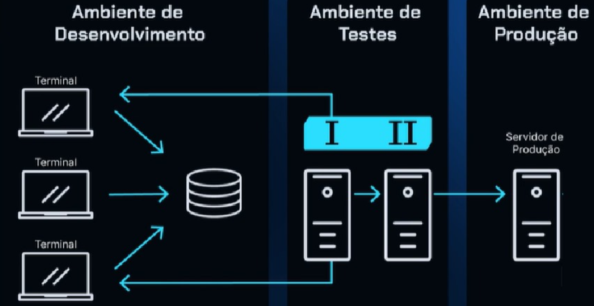

---

## O Processo de Desenvolvimento

O desenvolvimento de software segue um fluxo típico:

- **Identificação de Necessidades**: Definição dos requisitos funcionais e não funcionais da aplicação.
- **Especificação Técnica**: Documentação detalhada do que será desenvolvido.
- **Documentação e Desenvolvimento**: Implementação das funcionalidades seguindo as especificações.
- **Testes e Revisão**: Validação das funcionalidades para garantir qualidade.
- **Homologação e Produção**: Publicação da solução para que os usuários possam acessá-la.


Esse processo envolve transições entre diferentes ambientes (desenvolvimento, teste e produção), onde dependências e bibliotecas podem variar, gerando problemas de compatibilidade.

---

## Desafios na Transição Entre Ambientes

O principal desafio na transição entre ambientes é a **inconsistência causada por diferenças em**:

- Versões de bibliotecas.
- Configurações do sistema.
- Sistemas operacionais.

Um software pode funcionar no ambiente de desenvolvimento, mas falhar no de produção devido a essas diferenças.  
É essencial garantir que o ambiente seja **reproduzível e consistente** em todas as fases do ciclo de vida do software.

---

## Solução com Contêineres

Os contêineres encapsulam o software e suas dependências, garantindo que ele funcione da mesma forma em qualquer ambiente. Eles fornecem:

- **Isolamento**: Cada contêiner funciona de forma independente, como se fosse uma aplicação em sua própria máquina.
- **Eficiência**: Não é necessário executar sistemas operacionais completos, reduzindo o consumo de recursos.
- **Reprodutibilidade**: Asseguram que a aplicação tenha o mesmo comportamento em desenvolvimento, teste e produção.

---

## Diferenças Entre Máquinas Virtuais e Contêineres

### Máquinas Virtuais (VMs):

- Utilizam um **hypervisor** para criar ambientes virtuais.
- Cada VM executa um **sistema operacional completo**, consumindo mais recursos.
- Oferecem maior isolamento, mas são menos eficientes para execução de aplicações leves.

### Contêineres:

- Utilizam o **kernel do sistema operacional hospedeiro**, sem precisar de um hypervisor.
- Compartilham o sistema operacional, consumindo **menos recursos**.
- São mais **leves e rápidos**, ideais para escalar aplicações.

### Comparação Estrutural:

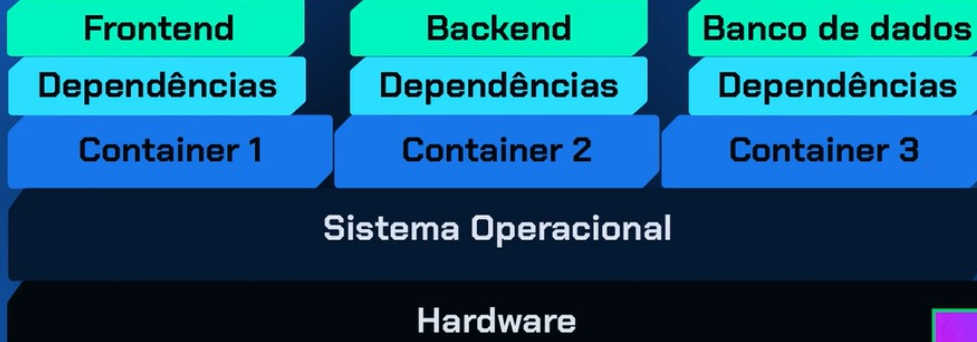

---

## Mecanismos de Isolamento dos Contêineres

Os contêineres utilizam **namespaces** e **cgroups** para isolar processos e gerenciar recursos.

### Namespaces

Isolam diferentes aspectos dos contêineres:

- **PID**: Isolamento dos processos.
- **NET**: Isolamento de redes e interfaces.
- **IPC**: Isolamento da comunicação entre processos.
- **MNT**: Isolamento do sistema de arquivos.
- **UTS**: Permite que o contêiner tenha seu próprio nome de host.

### Cgroups

Controlam o uso de recursos (CPU, memória, I/O) de cada contêiner.

Esses mecanismos permitem que os contêineres funcionem como **processos isolados dentro de uma máquina**, proporcionando **segurança e eficiência**.

---

Aqui está o conteúdo convertido para **Markdown**, seguindo o padrão da sua apostila:

---

[🔝 Voltar ao topo](#sumário-interativo)

---

<br>
<br>
<br>

---

# Instalação do Docker no Linux

## 1. Pré-requisitos

- **Sistema Operacional**: Distribuições baseadas em Linux como Ubuntu, Debian, Fedora, CentOS, etc.
- **Acesso de Superusuário**: Permissões para executar comandos com `sudo`.

---

## 2. Atualizar o Sistema

```bash
sudo apt-get update
sudo apt-get upgrade
````

---

## 3. Instalar Dependências

```bash
sudo apt-get install \
    ca-certificates \
    curl \
    gnupg \
    lsb-release
```

---

## 4. Adicionar a Chave GPG Oficial do Docker

```bash
sudo mkdir -p /etc/apt/keyrings

curl -fsSL https://download.docker.com/linux/ubuntu/gpg \
    | sudo gpg --dearmor -o /etc/apt/keyrings/docker.gpg
```

---

## 5. Adicionar o Repositório do Docker

```bash
echo \
  "deb [arch=$(dpkg --print-architecture) signed-by=/etc/apt/keyrings/docker.gpg] \
  https://download.docker.com/linux/ubuntu $(lsb_release -cs) stable" \
  | sudo tee /etc/apt/sources.list.d/docker.list > /dev/null
```

---

## 6. Atualizar os Pacotes e Instalar o Docker Engine

```bash
sudo apt-get update

sudo apt-get install docker-ce docker-ce-cli containerd.io docker-buildx-plugin docker-compose-plugin
```

---

## 7. Verificar a Instalação

```bash
sudo docker run hello-world
```

Esse comando baixa e executa uma imagem de teste para confirmar se o Docker está instalado corretamente.

---

## 8. Usar Docker sem `sudo` (opcional)

Para não precisar usar `sudo` a cada comando Docker, adicione seu usuário ao grupo `docker`.

### Adicione seu usuário ao grupo `docker`:

Substitua `<seu-usuario>` pelo seu nome de usuário, ou use `$USER`:

```bash
sudo usermod -aG docker <seu-usuario>
```

Ou:

```bash
sudo usermod -aG docker $USER
```

---

### Refaça o login ou ative a sessão com `newgrp`:

Você pode reiniciar a sessão, ou aplicar imediatamente:

```bash
newgrp docker
```

---

### Teste o Docker sem `sudo`:

```bash
docker ps
```

Se funcionar sem erro, a configuração está correta.

---

## ⚠️ Outras distribuições

Se estiver utilizando uma distribuição diferente do Ubuntu, consulte a documentação oficial do Docker:

[https://docs.docker.com/engine/install/](https://docs.docker.com/engine/install/)

---

[🔝 Voltar ao topo](#sumário-interativo)

---

<br>
<br>
<br>

---

# Imagem

No contexto do Docker, uma **imagem** é um arquivo que contém tudo o que é necessário para executar um contêiner: código da aplicação, bibliotecas, dependências, variáveis de ambiente e partes do sistema operacional.  
Em resumo, a imagem é um **modelo pronto** que define como o contêiner será criado e executado.

As **imagens são estáticas** — uma “fotografia” do ambiente. Ao criar um contêiner a partir de uma imagem, ele se torna um ambiente dinâmico e isolado no qual os processos podem ser executados.

---

## `docker run`

O comando `docker run` cria **e** executa um contêiner a partir de uma imagem. Etapas internas:

1. **Busca pela imagem**  
   - Se a imagem não existir localmente, o Docker faz download (pull) do Docker Hub ou repositório configurado.
2. **Criação do contêiner**  
   - A imagem é instanciada em um contêiner.
3. **Execução**  
   - O contêiner inicia e roda o comando definido (na imagem ou via CLI).

Exemplo:

```bash
docker run hello-world
```

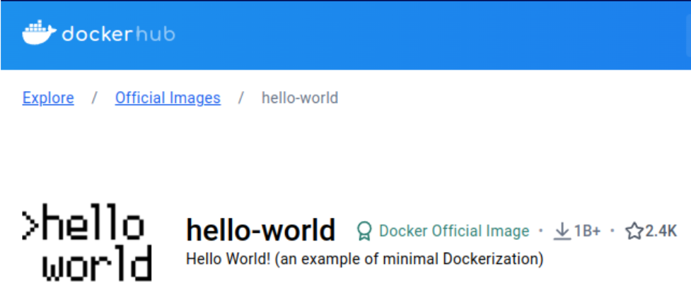

O Docker cria um contêiner a partir da imagem `hello-world` e exibe uma mensagem confirmando a instalação.

---

## Principais comandos

| Comando                      | Descrição                                                                       |
| ---------------------------- | ------------------------------------------------------------------------------- |
| `docker run <nome> sleep 1d` | Cria um contêiner (ou usa imagem já presente) e executa `sleep 1d` dentro dele. |
| `docker stop <nome>`         | Envia **SIGTERM** para parar o contêiner de forma controlada.                   |
| `docker start <nome>`        | Inicia um contêiner parado anteriormente.                                       |

---

## Subcomandos úteis do `docker run`

* `--name` / `-–name` — Define um nome amigável para o contêiner.
* `-d` — Executa em **segundo plano** (detached).
* `-it` — Modo interativo com terminal.
* `-p` — Mapeia portas (host\:container).
* `-v` — Monta **volumes** host ↔ contêiner.
* `--rm` — Remove o contêiner após saída.
* `-e`, `--env` — Define variáveis de ambiente.
* `--network` — Conecta o contêiner a uma rede Docker.
* `--cpus` — Limita CPU.
* `--memory` — Limita memória.
* `--restart` — Políticas de reinício automático.
* `--detach-keys` — Combinação de teclas para sair sem parar o contêiner.
* `--entrypoint` — Sobrescreve o comando de entrada.
* `--log-driver` — Define driver de logs.
* `--add-host` — Adiciona entradas ao `/etc/hosts` do contêiner.
* `--link` — Liga contêineres para comunicação direta.
* `--privileged` — Acesso privilegiado ao host.
* `--user` — Usuário que executa o comando dentro do contêiner.
* `--workdir` — Define diretório de trabalho no contêiner.
* `--health-cmd` — Comando de verificação de saúde.

---

[🔝 Voltar ao topo](#sumário-interativo)

---

<br>
<br>
<br>

---

# Docker Hub

O **Docker Hub** é o repositório oficial de imagens Docker, usado como fonte padrão para pulls.

* Hospeda **imagens oficiais** (ex.: `nginx`, `mysql`, `ubuntu`).
* Permite que usuários **publiquem** suas próprias imagens.
* O Docker procura imagens aqui por padrão.

### Exemplo de uso

1. Pesquise a imagem **Ubuntu**: [https://hub.docker.com](https://hub.docker.com)
2. Baixe a imagem:

```bash
docker pull ubuntu
```

Isso faz o download da versão mais recente da imagem **Ubuntu**.


---

# Criando Contêineres

Ao criar um contêiner a partir de uma imagem, você executa aplicações ou processos de forma isolada.

- Para criar **e** executar um contêiner com a imagem Ubuntu:

```bash
docker run ubuntu
````

O Docker verifica se a imagem está disponível localmente; se não, faz download do Docker Hub e cria o contêiner.

* Para **baixar** a imagem sem executá-la:

```bash
docker pull ubuntu
```

---

## Verificando Contêineres

| Comando        | Descrição                                              |
| -------------- | ------------------------------------------------------ |
| `docker ps`    | Lista apenas contêineres em execução.                  |
| `docker ps -a` | Lista **todos** os contêineres (ativos e finalizados). |

A saída inclui `CONTAINER ID`, `IMAGE`, `STATUS`, etc.

---

### Exemplo prático — Ubuntu

1. Execute:

   ```bash
   docker run ubuntu
   ```

2. Liste os contêineres:

   ```bash
   docker ps -a
   ```

O contêiner aparecerá com `STATUS` **Exited**, porque nenhum processo contínuo estava em execução.

---

[🔝 Voltar ao topo](#sumário-interativo)

---

<br>
<br>
<br>

---

# Interagindo com Contêineres

## Passo a passo — subindo a imagem Ubuntu

1. **Baixar a imagem**

   ```bash
   docker pull ubuntu
   ```

2. **Executar um contêiner em segundo plano**

   ```bash
   docker run --name meu_ubuntu -d ubuntu sleep 1d
   ```

3. **Verificar contêineres em execução**

   ```bash
   docker ps
   ```

4. **Acessar o terminal do contêiner**

   ```bash
   docker exec -it meu_ubuntu bash
   ```

   * `-it` → modo interativo
   * `bash` → abre shell dentro do contêiner

   Exemplos internos:

   ```bash
   ls -a            # listar arquivos
   touch arquivo_teste
   ```

   Saia com **`Ctrl + D`**.

5. **Parar o contêiner**

   ```bash
   docker stop meu_ubuntu            # parada controlada (SIGTERM)
   docker stop -t=0 meu_ubuntu       # parada imediata
   ```

6. **Reiniciar o contêiner**

   ```bash
   docker start meu_ubuntu
   ```

7. **Pausar / retomar processos**

   ```bash
   docker pause meu_ubuntu
   docker unpause meu_ubuntu
   ```

8. **Remover o contêiner**

   ```bash
   docker rm meu_ubuntu            # contêiner parado
   docker rm --force meu_ubuntu    # contêiner em execução
   ```

---

## Persistência e Isolamento

* **Isolamento**: arquivos dentro do contêiner não aparecem no host.
* **Persistência**: dados desaparecem quando o contêiner é removido, exceto se **volumes** ou **bind mounts** forem configurados.

---

## Tabela de comandos-chave

| Comando                      | Função                        |
| ---------------------------- | ----------------------------- |
| `docker exec -it <ctr> bash` | Abre shell interativo.        |
| `docker stop <ctr>`          | Para de forma controlada.     |
| `docker stop -t=0 <ctr>`     | Para imediatamente.           |
| `docker start <ctr>`         | Reinicia contêiner parado.    |
| `docker pause <ctr>`         | Pausa processos.              |
| `docker unpause <ctr>`       | Retoma processos.             |
| `docker rm <ctr>`            | Remove contêiner parado.      |
| `docker rm --force <ctr>`    | Remove contêiner em execução. |

---

[🔝 Voltar ao topo](#sumário-interativo)

---

<br>
<br>
<br>

---

## Praticando: Criando Primeira Imagem com Docker


Você é responsável por empacotar uma aplicação web estática (um site simples em HTML) utilizando Docker. O objetivo é garantir que essa aplicação funcione exatamente igual em qualquer máquina.

Para isso, você deverá:

1. Criar um diretório de projeto com uma página HTML.
2. Criar um **Dockerfile** que usa a imagem oficial `nginx` como base.
3. Copiar o conteúdo da página HTML para dentro da imagem.
4. Gerar uma imagem com o nome `meu-nginx-lab` e a tag `1.0`.
5. Executar um contêiner a partir dessa imagem com:
   - Um nome amigável (`web-lab`)
   - Porta 8080 mapeada para a porta 80 do contêiner
   - Montagem de volume em modo somente leitura
   - Execução em segundo plano (`-d`)
6. Verificar o funcionamento no navegador (`http://localhost:8080`) ou com `curl`.
7. Executar comandos extras como `docker ps`, `docker exec`, `docker logs` e `docker stop`.


### 🎯 Requisitos técnicos

- Utilizar o comando `docker build` para criar a imagem.
- Utilizar `docker run` com os parâmetros corretos.
- Utilizar `volumes` e `portas`.
- Usar o `nginx` como servidor HTTP.


### ✅ Entrega esperada

- Um contêiner rodando sua aplicação em `http://localhost:8080`.
- O código-fonte do seu site visível dentro do contêiner em `/usr/share/nginx/html`.
- A imagem criada localmente com o nome `meu-nginx-lab:1.0`.


# Resolução Proposta


## 1. Criar a estrutura de diretórios

```bash
mkdir -p ~/meu-docker-lab/app
cd ~/meu-docker-lab
````


```bash
cat > app/index.html <<'EOF'
<!DOCTYPE html>
<html>
  <head>
    <title>Meu Docker Lab</title>
    <meta charset="utf-8">
  </head>
  <body>
    <h1>Funcionando no contêiner!</h1>
  </body>
</html>
EOF
```


## 3. Criar o `Dockerfile`

```bash
cat > Dockerfile <<'EOF'
FROM nginx:alpine                
COPY app/ /usr/share/nginx/html  
EXPOSE 80                       
EOF
```

## 4. Construir a imagem

```bash
docker build -t meu-nginx-lab:1.0 .
```

> Resultado esperado: *“Successfully tagged meu-nginx-lab:1.0”*


## 5. Executar o contêiner

```bash
docker run -d \
  --name web-lab \
  -p 8080:80 \
  -v ~/meu-docker-lab/app:/usr/share/nginx/html:ro \
  --rm \
  meu-nginx-lab:1.0
```


## 6. Testar

```bash
curl http://localhost:8080
```

Deve retornar:

```html
<h1>Funcionando no contêiner!</h1>
```


## 7. Comandos de inspeção

```bash
docker ps
docker logs web-lab
docker exec -it web-lab sh
```

Saia do shell com `exit`.


## 8. Parar (encerra e remove por causa do --rm)

```bash
docker stop web-lab
```


## 9. Limpar a imagem (opcional)

```bash
docker image rm meu-nginx-lab:1.0
```

[🔝 Voltar ao topo](#sumário-interativo)

---

<br>
<br>
<br>

---

# Acessando Aplicações Web com Docker

No Docker, podemos executar aplicações web em contêineres e acessá-las diretamente pelo navegador.  
Abaixo, detalhamos como criar, gerenciar e acessar essas aplicações utilizando imagens públicas do Docker Hub.


## 1. Executando uma Aplicação Web no Contêiner

### Escolhendo a Imagem

Neste exemplo, usaremos a imagem `docker/example-voting-app-vote`, que já contém uma aplicação web de exemplo.

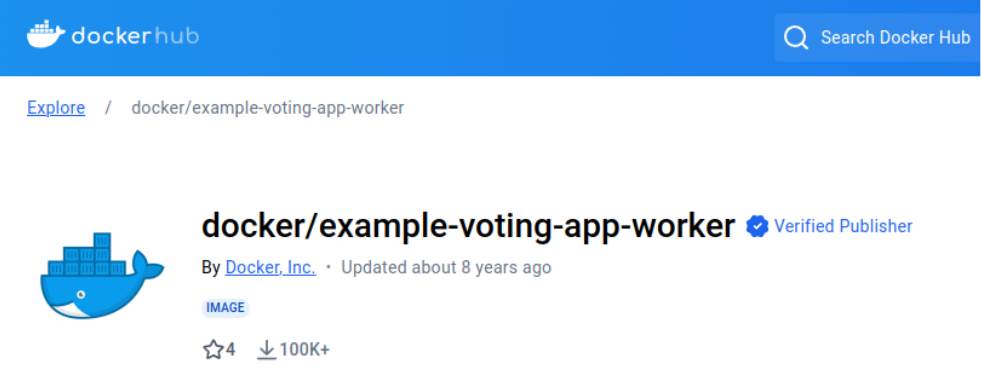

### Executando o contêiner:

```bash
docker run -d docker/example-voting-app-vote
```

## 2. Verificando o Contêiner

Após executar o contêiner, verifique se ele está rodando:

```bash
docker ps
```

Saída esperada (exemplo):

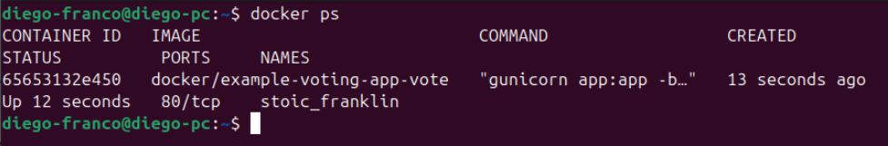


## 3. Mapeando Portas Externas

Ao acessar `localhost:80`, você pode ver erro de conexão. Isso acontece porque as portas do contêiner estão **isoladas** do host por padrão.

### 🔁 Mapeamento Automático de Portas

Execute com `-P`:

```bash
docker run -d -P docker/example-voting-app-vote
```

**O que `-P` faz?**

* Mapeia automaticamente as portas internas do contêiner para portas disponíveis do host.

Verifique com:

```bash
docker ps
```

Exemplo de saída:

```
0.0.0.0:32768->80
```

Acesse a aplicação no navegador:

```
http://localhost:32768
```


### 🎯 Mapeamento Manual de Porta

Você pode definir qual porta usar no host com `-p`:

```bash
docker run -d -p 3000:80 docker/example-voting-app-vote
```

Verifique com:

```bash
docker ps
```

Exemplo de saída:

```
0.0.0.0:3000->80
```

Acesse no navegador:

```
http://localhost:3000
```

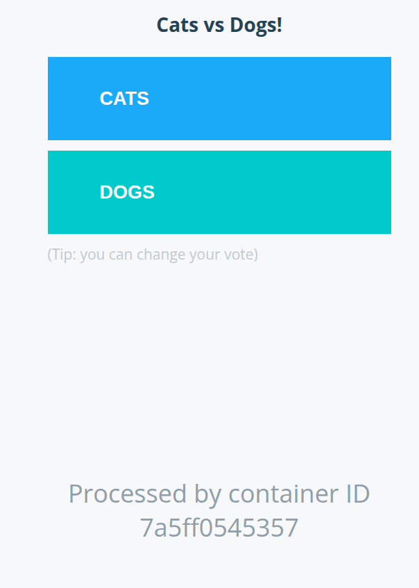

---

## 4. Gerenciamento de Contêineres

### Parar um Contêiner

```bash
docker stop <CONTAINER_ID>
```

### Remover um Contêiner

Primeiro pare:

```bash
docker stop <CONTAINER_ID>
```

Depois remova:

```bash
docker rm <CONTAINER_ID>
```

Se estiver em execução:

```bash
docker rm --force <CONTAINER_ID>
```

### Parar Todos os Contêineres

```bash
docker stop $(docker container ls -q)
```


## 📋 Resumo dos Comandos Usados

| Comando                                 | Função                                               |
| --------------------------------------- | ---------------------------------------------------- |
| `docker run -d <IMAGEM>`                | Executa um contêiner em segundo plano.               |
| `docker run -d -P <IMAGEM>`             | Executa o contêiner e mapeia portas automaticamente. |
| `docker run -d -p <HOST>:<CONTAINER>`   | Mapeia portas manualmente.                           |
| `docker ps`                             | Lista contêineres em execução.                       |
| `docker stop <ID>`                      | Para um contêiner.                                   |
| `docker rm <ID>`                        | Remove um contêiner parado.                          |
| `docker rm --force <ID>`                | Força a remoção de um contêiner em execução.         |
| `docker stop $(docker container ls -q)` | Para todos os contêineres ativos.                    |


Com esses passos, você pode **executar, acessar e gerenciar** aplicações web dentro de contêineres Docker, configurando o mapeamento de portas conforme necessário para acessá-las via navegador.

[🔝 Voltar ao topo](#sumário-interativo)

---

<br>
<br>
<br>

---


# Estrutura de Imagens no Docker

As imagens no Docker são fundamentais para o funcionamento dos contêineres. Elas contêm todos os arquivos, bibliotecas, dependências e configurações necessárias para criar um ambiente isolado. Este conteúdo descreve como as imagens são estruturadas, como interagimos com elas e quais os benefícios dessa estrutura para o uso de contêineres.

## Listando Imagens Localmente

Para listar todas as imagens armazenadas localmente no sistema:

```bash
docker image ls
````

Esse comando exibe uma tabela com as seguintes informações:

* **REPOSITORY**: Nome do repositório da imagem.
* **TAG**: Versão da imagem.
* **IMAGE ID**: Identificador único da imagem.
* **CREATED**: Data de criação da imagem.
* **SIZE**: Tamanho ocupado no disco.

## Camadas das Imagens

As imagens Docker são compostas por múltiplas camadas empilhadas. Essas camadas são:

* Imutáveis (read-only)````markdown
# Estrutura de Imagens no Docker

As imagens no Docker são fundamentais para o funcionamento dos contêineres. Elas contêm todos os arquivos, bibliotecas, dependências e configurações necessárias para criar um ambiente isolado. Este conteúdo descreve como as imagens são estruturadas, como interagimos com elas e quais os benefícios dessa estrutura para o uso de contêineres.

## Listando Imagens Localmente

Para listar todas as imagens armazenadas localmente no sistema:

```bash
docker image ls
````

Esse comando exibe uma tabela com as seguintes informações:

* **REPOSITORY**: Nome do repositório da imagem.
* **TAG**: Versão da imagem.
* **IMAGE ID**: Identificador único da imagem.
* **CREATED**: Data de criação da imagem.
* **SIZE**: Tamanho ocupado no disco.

## Camadas das Imagens

As imagens Docker são compostas por múltiplas camadas empilhadas. Essas camadas são:

* Imutáveis (read-only)
* Compartilhadas entre várias imagens e contêineres
* Otimizadas para reduzir o uso de disco e acelerar operações

## Baixando Imagens do Docker Hub

Para baixar uma imagem pública do Docker Hub, utilize:

```bash
docker pull nginx
```

O download ocorre em etapas, cada uma representando uma camada da imagem. Se uma camada já existir localmente, ela será reutilizada, evitando download desnecessário.

## Visualizando as Camadas de uma Imagem

Para inspecionar o histórico de camadas que compõem uma imagem:

```bash
docker history <IMAGE_ID>
```

Esse comando mostra o histórico de comandos usados para criar a imagem, além do tamanho de cada camada.

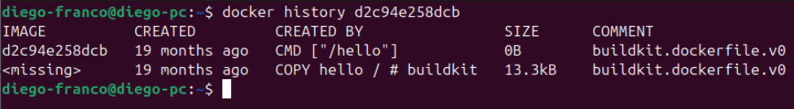

## Estrutura Interna de Contêineres

Ao criar um contêiner a partir de uma imagem, ele herda suas camadas de forma imutável. Entretanto, há uma camada adicional que permite alterações:

| Tipo de Camada | Característica                                           |
| -------------- | -------------------------------------------------------- |
| Read-Only      | Camadas herdadas da imagem base, imutáveis               |
| Read-Write     | Criada ao iniciar o contêiner, permite alterações locais |

## Funcionamento Interno

O cliente Docker envia comandos como `docker build`, `docker pull` e `docker run` para o Docker daemon, que gerencia as imagens e contêineres no host.

As imagens armazenadas no host consistem em camadas read-only. Quando um contêiner é iniciado, o Docker adiciona uma camada read-write no topo da imagem base.

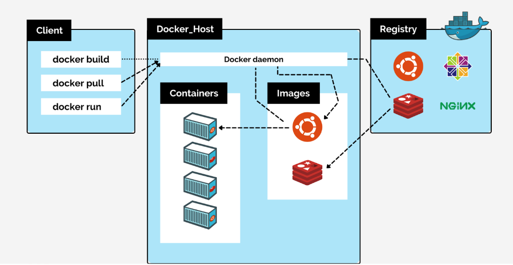

Fonte: https://www.gta.ufrj.br/ensino/eel879/trabalhos_v1_2017_2/docker/components.html

Essa camada read-write é usada para armazenar quaisquer alterações feitas durante a execução do contêiner, como criação de arquivos ou instalação de pacotes. A imagem base permanece inalterada, o que garante:

* Consistência entre diferentes contêineres
* Reutilização eficiente das camadas read-only
* Isolamento entre contêineres

## Eficiência na Utilização de Camadas

### Compartilhamento de Camadas

Múltiplas imagens e contêineres podem compartilhar camadas read-only comuns, otimizando o uso de espaço em disco.

### Alterações e Persistência

Todas as alterações feitas durante a execução de um contêiner são armazenadas na camada read-write. Quando o contêiner é removido, essas alterações são perdidas, a menos que sejam persistidas por meio de volumes.

## Conclusão

A estrutura de camadas do Docker proporciona:

* Eficiência no armazenamento
* Rapidez na criação de contêineres
* Isolamento entre aplicações
* Reaproveitamento de recursos

Esse modelo é essencial para que o Docker ofereça ambientes portáteis, leves e consistentes em diferentes sistemas e fases do desenvolvimento de software.


* Compartilhadas entre várias imagens e contêineres
* Otimizadas para reduzir o uso de disco e acelerar operações

[🔝 Voltar ao topo](#sumário-interativo)

---

<br>
<br>
<br>

---


# Criando Imagens Docker Personalizadas

Para contêinerizar uma aplicação como o front-end do projeto AllBooks, seguimos um processo estruturado que envolve a criação de uma imagem personalizada utilizando um arquivo `Dockerfile`. Abaixo estão as etapas detalhadas.

## 1. Clonando o Repositório do Projeto

Utilize o comando `git clone` para obter os arquivos da aplicação localmente:

```bash
git clone https://github.com/alura-cursos/curso-react-alurabooks/
cd ./curso-react-alurabooks/
```

## 2. Criando o Arquivo Dockerfile

O `Dockerfile` define as instruções para construir a imagem. Crie o arquivo com:

```bash
nano Dockerfile
```

Conteúdo do arquivo:

```dockerfile
FROM node:20
WORKDIR /app
COPY package.json .
RUN npm install
COPY . .
ENTRYPOINT ["npm", "start"]
```

Salve com `Ctrl + X`, `Y`, e `Enter`.

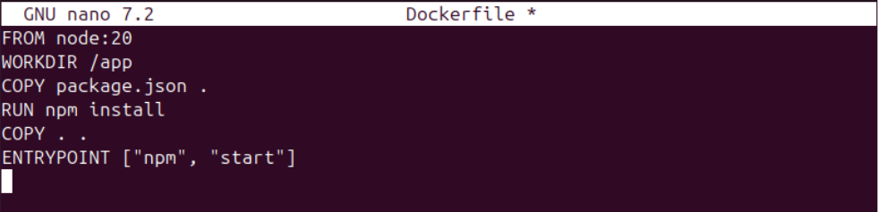

## 3. Construindo a Imagem

Com o `Dockerfile` criado e no diretório correto, execute:

```bash
docker build -t diego-franco/allbooks:1.1 .
```

Este comando executa:

* Download da imagem base (`node:20`)
* Cópia dos arquivos
* Instalação de dependências com `npm install`
* Criação da nova imagem

Após a construção, visualize com:

```bash
docker image ls
```

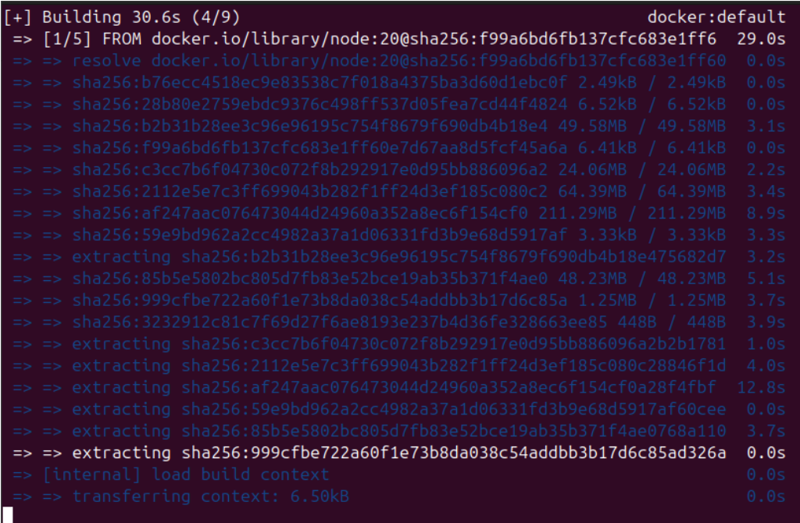

## 4. Criando e Executando o Contêiner

Execute a imagem com o seguinte comando:

```bash
docker run -d -p 8080:3000 diego-franco/allbooks:1.1
```

Explicação:

* `-d`: Executa em segundo plano
* `-p 8080:3000`: Mapeia porta 8080 do host para 3000 do contêiner

Verifique se o contêiner está ativo:

```bash
docker ps
```

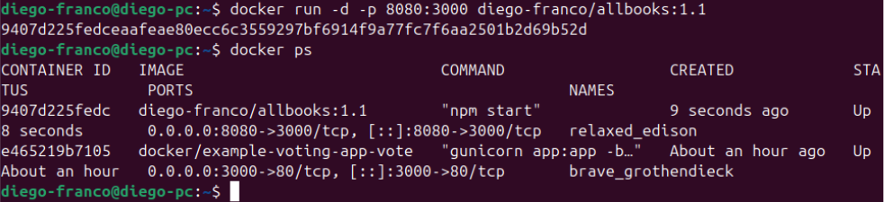

## 5. Testando a Aplicação no Navegador

Abra o navegador e acesse:

```
http://localhost:8080
```

Se a porta estiver corretamente mapeada, a aplicação AllBooks será exibida.


## 6. Publicando a Imagem no Docker Hub

Autentique-se no Docker Hub:

```bash
docker login
```

Publique a imagem:

```bash
docker push diego-franco/allbooks:1.1
```

A imagem agora está disponível publicamente no seu repositório no Docker Hub.

## 7. Inspecionando a Estrutura Interna de uma Imagem

Use o comando abaixo para obter informações detalhadas da imagem:

```bash
docker inspect <IMAGE_ID>
```

Informações exibidas:

* **Id**: Identificador único da imagem
* **RepoTags**: Tags associadas
* **Created**: Data de criação
* **Configurações**: Variáveis de ambiente, entrypoint, etc.
* **Digest**: Hash da imagem

Exemplo de retorno resumido:

```json
{
  "Id": "sha256:fd1d8f58e8aedc22...",
  "RepoTags": ["ubuntu:latest"],
  "Created": "2024-01-25T17:54:41Z",
  "ContainerConfig": {
    "Hostname": "fa818c501516",
    "Cmd": ["/bin/bash"],
    "Env": ["PATH=/usr/local/sbin:/usr/local/bin"]
  }
}
```

[🔝 Voltar ao topo](#sumário-interativo)

---

<br>
<br>
<br>

---

# Persistência de Dados

Persistência de dados é uma funcionalidade essencial em containers, pois permite que informações importantes sejam armazenadas e recuperadas mesmo após a interrupção ou remoção de um container. No Docker, existem três mecanismos principais para persistir dados: **volumes**, **bind mounts** e **tmpfs mounts**. A seguir, detalhamos cada um, com foco inicial no bind mount.

## Bind Mount

O bind mount cria uma ligação direta entre um diretório do sistema de arquivos do host e um diretório específico dentro de um container. Isso permite que dados armazenados no container sejam acessados diretamente pelo host e vice-versa. Esse mecanismo é útil para compartilhar arquivos entre o host e o container.

### Exemplo Prático

**Criar um Diretório no Host**

```bash
mkdir volume-docker
````

**Criar um Container com Bind Mount**

```bash
docker run -it --mount type=bind,source=home/diego-franco/volume-docker,target=/app ubuntu bash
```

* `type=bind`: Define o tipo de montagem como bind mount.
* `source`: Especifica o diretório do host (`/home/alura/volume-docker`).
* `target`: Especifica o diretório no container (`/app`).

**Criar um Arquivo no Container**

```bash
cd /app
touch teste_arquivo
ls
```

O arquivo `teste_arquivo` será exibido dentro do diretório `/app` no container.

**Verificar a Persistência no Host**

Saia do container (Ctrl + D ou `exit`) e verifique o conteúdo no host:

```bash
cd volume-docker
ls
```

O arquivo `teste_arquivo` estará disponível no diretório `volume-docker` no host, confirmando a persistência.

**Recriar o Container**

```bash
docker run -it --mount type=bind,source=/home/diego-franco/volume-docker,target=/app ubuntu bash
```

O arquivo `teste_arquivo` continuará acessível dentro do diretório `/app`.

### Desvantagem do Bind Mount

Embora o bind mount seja simples e eficiente, ele apresenta um ponto fraco: o Docker **não gerencia** o diretório do host. Isso significa que:

* Se o diretório for alterado ou excluído manualmente no host, os dados serão perdidos.
* A segurança e consistência dos dados dependem diretamente do cuidado no gerenciamento do sistema de arquivos do host.

---

## Volumes

Volumes são o mecanismo de persistência de dados mais recomendado pelo Docker, especialmente para ambientes de produção. Ao contrário dos bind mounts, onde a persistência depende de um diretório do sistema de arquivos do host, os volumes utilizam uma área especial dentro do Docker, proporcionando maior segurança e controle.

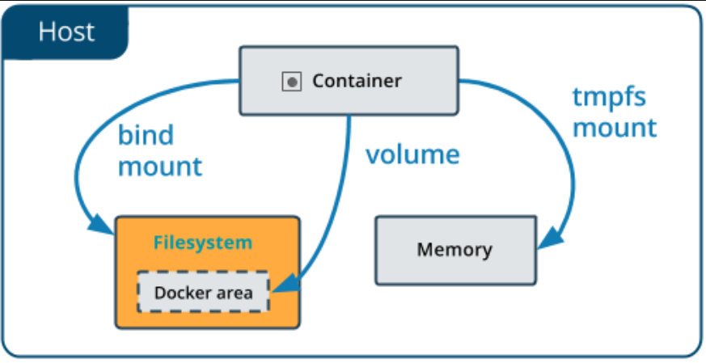

### Por que usar volumes?

**Segurança:**
Os dados são armazenados em uma área reservada do Docker, reduzindo a exposição a alterações acidentais ou maliciosas no sistema de arquivos do host.

**Gerenciamento Centralizado:**
O Docker controla todo o ciclo de vida dos volumes, garantindo que os dados sejam gerenciados de forma eficiente.

**Recomendado para Produção:**
Em ambientes onde a integridade dos dados é crítica, volumes são a escolha ideal.

-----

### Criando e Usando Volumes

**1. Listando Volumes Existentes**

Para ver os volumes que você já tem no Docker, use este comando:

```bash
docker volume ls
```

Se você nunca criou um volume antes, a lista estará vazia.

-----

**2. Criando um Volume**

Vamos criar um novo volume chamado `novo-volume`:

```bash
docker volume create novo-volume
```

Para confirmar que ele foi criado, liste os volumes novamente:

```bash
docker volume ls
```

-----

### Onde os arquivos do volume são armazenados?

Os volumes Docker são gerenciados pelo próprio Docker e, por padrão, ficam em um local específico no seu sistema de arquivos.

Primeiro, saia de qualquer contêiner que você esteja usando (se aplicável) com `exit`.

Em seguida, entre como superusuário, pois os diretórios do Docker geralmente exigem permissões de root:

```bash
sudo su
```

(Insira sua senha se for solicitado.)

O diretório onde o Docker armazena suas informações, incluindo volumes, é `/var/lib/docker`. Vamos até ele:

```bash
cd /var/lib/docker/
```

Se você listar o conteúdo dessa pasta (`ls`), verá vários diretórios como `plugins`, `buildkit`, `image`, `overlay`, e, o que nos interessa, `volumes`. Acesse-o:

```bash
cd volumes
```

Dentro de `volumes`, você pode listar o conteúdo (`ls`) e notará o seu `novo-volume` (ou `meu-volume` se você usou esse nome no seu exemplo anterior) lá dentro\! Acesse-o:

```bash
cd novo-volume
```

Agora, dê um `ls` novamente. Você provavelmente verá uma pasta chamada `_data`. Essa é a pasta onde os dados reais do seu volume são armazenados. Acesse-a:

```bash
cd _data
```

Qualquer arquivo que você colocar neste volume dentro de um contêiner aparecerá aqui. Por exemplo, se você tivesse um `um-arquivo-qualquer` dentro do seu volume, ele estaria aqui.

Então, o caminho completo para os seus arquivos de volume é: `/var/lib/docker/volumes/novo-volume/_data`. É importante notar que este local é **totalmente gerenciado pelo Docker**.

-----

### Gerenciamento de Volumes

O Docker oferece uma interface de linha de comando robusta para gerenciar seus volumes. Se você sair do modo superusuário (com `exit`) e digitar `docker volume` sem nenhum outro argumento, você verá uma lista dos comandos disponíveis para gerenciamento de volumes:

  * `create`: Para criar novos volumes.
  * `inspect`: Para visualizar detalhes sobre um volume específico.
  * `ls`: Para listar todos os volumes.
  * `prune`: Para remover volumes que não estão sendo usados por nenhum contêiner.
  * `rm`: Para remover um volume específico, mesmo que esteja em uso (use com cautela).

Isso significa que você pode gerenciar seus volumes de forma eficiente através dos comandos do Docker, sem precisar navegar diretamente pelo sistema de arquivos do seu sistema operacional. 

O Docker abstrai e gerencia essa parte para você, garantindo que os volumes estejam sempre nesse diretório dedicado, independentemente de detalhes específicos da sua estrutura de pastas.

**3. Criando um Container com Volume**

```bash
docker run -it --mount source=novo-volume,target=/app ubuntu bash
```

* `source=novo-volume`: Nome do volume criado.
* `target=/app`: Diretório no container mapeado para o volume.
* `ubuntu`: Imagem usada.
* `bash`: Comando de terminal interativo.

**4. Testando a Persistência**

```bash
cd /app
touch teste_volume
ls
```

O arquivo `teste_volume` será exibido no diretório. Saia do container com Ctrl + D.

**5. Recuperando Dados de um Volume**

```bash
docker run -it --mount source=novo-volume,target=/app ubuntu bash
cd /app
ls
```

O arquivo `teste_volume` estará presente, provando que o volume manteve a persistência dos dados.

**Inspecionando um Volume**

```bash
docker volume inspect novo-volume
```

Esse comando fornece informações detalhadas sobre o volume, como sua localização e configurações.

---

## TMPFS

O TMPFS é um mecanismo de persistência temporária no Docker, ideal para armazenar dados sensíveis como senhas, informações pessoais ou outros dados que não devem ser compartilhados ou persistidos entre containers. Diferente dos volumes e dos bind mounts, o TMPFS armazena os dados **apenas em memória**, e eles desaparecem assim que o container é encerrado.

### Características do TMPFS

* **Armazenamento Temporário:**
  Os dados são armazenados na memória volátil do sistema e não persistem após o término do container.

* **Maior Segurança:**
  Como os dados não são gravados no disco, o TMPFS é indicado para dados sensíveis que precisam ser protegidos contra acessos externos.

* **Dependência do Ambiente:**
  Funciona melhor em ambientes Linux, aproveitando o sistema de arquivos temporários nativo do kernel.

* **Não indicado para Produção de Longo Prazo:**
  Por ser temporário, o TMPFS não deve ser usado para armazenar dados que precisam ser recuperados posteriormente.

### Como Criar um Container com TMPFS

```bash
docker run -it --tmpfs=/app ubuntu bash
```

* `-it`: Cria o container de forma interativa.
* `--tmpfs=/app`: Define o diretório `/app` como temporário.
* `ubuntu`: Imagem utilizada.
* `bash`: Comando executado ao iniciar o container.

**Verificar diretórios temporários**

```bash
ls
```

Diretórios como `/app` e `/tmp` estarão destacados como temporários.

**Criar um arquivo no diretório TMPFS**

```bash
cd /app
touch tesetetmpfs.txt
ls
```

O arquivo estará visível no diretório.

**Saia do container** com `Ctrl + D`.

### Testando a Persistência Temporária

Verifique se o container ainda está ativo:

```bash
docker ps
```

Recrie o container:

```bash
docker run -it --tmpfs=/app ubuntu bash
cd /app
ls
```

O arquivo criado anteriormente (`tesetetmpfs.txt`) **não estará mais presente**, confirmando que os dados armazenados com TMPFS são temporários.

### Por que Usar TMPFS?

O TMPFS é ideal para:

* **Dados Sensíveis**: Como senhas e tokens.
* **Processamento Temporário**: Dados que só precisam existir durante a execução.
* **Ambientes Seguros**: Impede a gravação de dados confidenciais em disco.

O TMPFS complementa os volumes e bind mounts como uma opção leve e segura para armazenamento temporário, oferecendo uma solução eficiente para casos onde a persistência dos dados não é necessária ou é indesejável.

[🔝 Voltar ao topo](#sumário-interativo)

---

<br>
<br>
<br>

---
---


# Docker e Comunicação em Rede

## O Desafio da Comunicação

Aplicações modernas são distribuídas. Um front-end precisa consumir uma API, que por sua vez consulta um banco de dados. Por padrão, contêineres Docker são ambientes isolados. Como garantir que eles se comuniquem de forma segura e eficiente? A resposta está nas redes Docker.

## A Rede Padrão: `bridge`

Quando o Docker é instalado, ele cria automaticamente uma rede virtual do tipo `bridge`. Todo contêiner, por padrão, é conectado a essa rede. Pense nela como uma rede local (LAN) privada para seus contêineres, permitindo que eles se comuniquem entre si, ao mesmo tempo que os mantém isolados da rede do host.

Para listar as redes Docker disponíveis em sua máquina, use:

```bash
docker network ls
```

Você verá as redes padrão: `bridge`, `host` e `none`. Focaremos na `bridge`.

-----

## Experimento Prático: Comunicação via IP

Vamos provar que dois contêineres na mesma rede `bridge` podem se comunicar usando seus endereços IP.

### 3.1. Preparando o Ambiente

1.  **Inicie o primeiro contêiner (C1):**

    ```bash
    docker run -it -d --name c1 ubuntu bash
    ```

      * `-d`: Executa o contêiner em modo "detached" (em segundo plano).
      * `--name c1`: Nomeia o contêiner como `c1` para facilitar a referência.

2.  **Inicie o segundo contêiner (C2):**

    ```bash
    docker run -it -d --name c2 ubuntu bash
    ```

### 3.2. Obtendo os Endereços IP

Cada contêiner na rede `bridge` recebe um endereço IP único. Use o comando `docker inspect` para descobri-los.

1.  **Obtenha o IP do C1:**

    ```bash
    docker inspect -f '{{range .NetworkSettings.Networks}}{{.IPAddress}}{{end}}' c1
    ```

2.  **Obtenha o IP do C2:**

    ```bash
    docker inspect -f '{{range .NetworkSettings.Networks}}{{.IPAddress}}{{end}}' c2
    ```

Anote os endereços IP retornados.

### 3.3. Testando a Conexão com `ping`

Agora, vamos acessar o primeiro contêiner (`c1`) e tentar "pingar" o segundo (`c2`) usando seu endereço IP.

1.  **Acesse o terminal do `c1`:**

    ```bash
    docker exec -it c1 bash
    ```

2.  Dentro do contêiner, **instale as ferramentas de rede** (o `ping` não vem por padrão na imagem mínima do Ubuntu):

    ```bash
    apt-get update && apt-get install -y iputils-ping
    ```

3.  **Execute o `ping`** para o endereço IP do `c2` (substitua `<IP_DO_CONTAINER_2>` pelo IP que você anotou):

    ```bash
    ping <IP_DO_CONTAINER_2>
    ```

Você verá pacotes sendo enviados e recebidos, confirmando a comunicação. Para sair do `ping`, pressione `Ctrl+C`. Para sair do contêiner, digite `exit`.

-----

### 4. Limitações da Comunicação via IP

Embora funcional, usar o endereço IP diretamente é uma má prática em ambientes dinâmicos por duas razões principais:

  * **Instabilidade:** O endereço IP de um contêiner **não é garantido**. Se você reiniciar ou recriar um contêiner, ele provavelmente receberá um novo IP, quebrando a comunicação.
  * **Manutenção Difícil:** Configurar aplicações para apontar para IPs fixos torna o sistema frágil e difícil de manter. Qualquer mudança na infraestrutura exige reconfiguração manual.

**Conclusão:** A comunicação via IP na rede `bridge` padrão serve para demonstrar a conectividade, mas não é uma solução para produção. No próximo capítulo, veremos a forma correta de gerenciar a comunicação: **redes customizadas e a descoberta de serviços (service discovery) baseada em nomes**.


[🔝 Voltar ao topo](#sumário-interativo)

---

<br>
<br>
<br>

---


