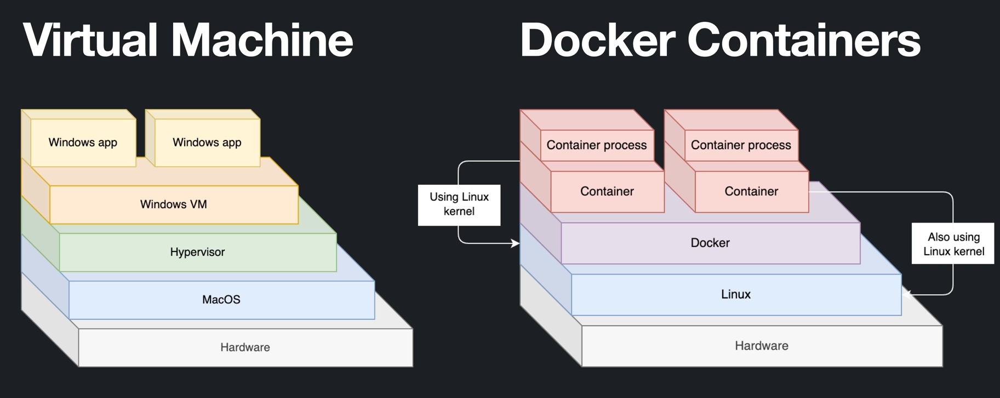

# Contêineres e Docker

Contêineres são uma tecnologia de virtualização que permite empacotar uma aplicação e todas as suas dependências em uma unidade isolada, garantindo que ela funcione de maneira consistente em diferentes ambientes.

Isso resolve problemas comuns de incompatibilidade entre sistemas operacionais, bibliotecas ou configurações de ambiente.

O **Docker** é uma plataforma que utiliza contêineres para facilitar o desenvolvimento, implantação e execução de aplicações. Ele simplifica a criação, distribuição e gerenciamento de contêineres, proporcionando agilidade e consistência em todo o ciclo de vida do software.


---

## O Processo de Desenvolvimento

O desenvolvimento de software segue um fluxo típico:

- **Identificação de Necessidades**: Definição dos requisitos funcionais e não funcionais da aplicação.
- **Especificação Técnica**: Documentação detalhada do que será desenvolvido.
- **Documentação e Desenvolvimento**: Implementação das funcionalidades seguindo as especificações.
- **Testes e Revisão**: Validação das funcionalidades para garantir qualidade.
- **Homologação e Produção**: Publicação da solução para que os usuários possam acessá-la.


Esse processo envolve transições entre diferentes ambientes (desenvolvimento, teste e produção), onde dependências e bibliotecas podem variar, gerando problemas de compatibilidade.

---

## Desafios na Transição Entre Ambientes

O principal desafio na transição entre ambientes é a **inconsistência causada por diferenças em**:

- Versões de bibliotecas.
- Configurações do sistema.
- Sistemas operacionais.

Um software pode funcionar no ambiente de desenvolvimento, mas falhar no de produção devido a essas diferenças.  
É essencial garantir que o ambiente seja **reproduzível e consistente** em todas as fases do ciclo de vida do software.

---

## Solução com Contêineres

Os contêineres encapsulam o software e suas dependências, garantindo que ele funcione da mesma forma em qualquer ambiente. Eles fornecem:

- **Isolamento**: Cada contêiner funciona de forma independente, como se fosse uma aplicação em sua própria máquina.
- **Eficiência**: Não é necessário executar sistemas operacionais completos, reduzindo o consumo de recursos.
- **Reprodutibilidade**: Asseguram que a aplicação tenha o mesmo comportamento em desenvolvimento, teste e produção.

---

## Diferenças Entre Máquinas Virtuais e Contêineres

### Máquinas Virtuais (VMs):

- Utilizam um **hypervisor** para criar ambientes virtuais.
- Cada VM executa um **sistema operacional completo**, consumindo mais recursos.
- Oferecem maior isolamento, mas são menos eficientes para execução de aplicações leves.

### Contêineres:

- Utilizam o **kernel do sistema operacional hospedeiro**, sem precisar de um hypervisor.
- Compartilham o sistema operacional, consumindo **menos recursos**.
- São mais **leves e rápidos**, ideais para escalar aplicações.

### Comparação Estrutural:



---

## Mecanismos de Isolamento dos Contêineres

Os contêineres utilizam **namespaces** e **cgroups** para isolar processos e gerenciar recursos.

### Namespaces

Isolam diferentes aspectos dos contêineres:

- **PID**: Isolamento dos processos.
- **NET**: Isolamento de redes e interfaces.
- **IPC**: Isolamento da comunicação entre processos.
- **MNT**: Isolamento do sistema de arquivos.
- **UTS**: Permite que o contêiner tenha seu próprio nome de host.

### Cgroups

Controlam o uso de recursos (CPU, memória, I/O) de cada contêiner.

Esses mecanismos permitem que os contêineres funcionem como **processos isolados dentro de uma máquina**, proporcionando **segurança e eficiência**.

---

Aqui está o conteúdo convertido para **Markdown**, seguindo o padrão da sua apostila:

---

# Instalação do Docker no Linux

## 1. Pré-requisitos

- **Sistema Operacional**: Distribuições baseadas em Linux como Ubuntu, Debian, Fedora, CentOS, etc.
- **Acesso de Superusuário**: Permissões para executar comandos com `sudo`.

---

## 2. Atualizar o Sistema

```bash
sudo apt-get update
sudo apt-get upgrade
````

---

## 3. Instalar Dependências

```bash
sudo apt-get install \
    ca-certificates \
    curl \
    gnupg \
    lsb-release
```

---

## 4. Adicionar a Chave GPG Oficial do Docker

```bash
sudo mkdir -p /etc/apt/keyrings

curl -fsSL https://download.docker.com/linux/ubuntu/gpg \
    | sudo gpg --dearmor -o /etc/apt/keyrings/docker.gpg
```

---

## 5. Adicionar o Repositório do Docker

```bash
echo \
  "deb [arch=$(dpkg --print-architecture) signed-by=/etc/apt/keyrings/docker.gpg] \
  https://download.docker.com/linux/ubuntu $(lsb_release -cs) stable" \
  | sudo tee /etc/apt/sources.list.d/docker.list > /dev/null
```

---

## 6. Atualizar os Pacotes e Instalar o Docker Engine

```bash
sudo apt-get update

sudo apt-get install docker-ce docker-ce-cli containerd.io docker-buildx-plugin docker-compose-plugin
```

---

## 7. Verificar a Instalação

```bash
sudo docker run hello-world
```

Esse comando baixa e executa uma imagem de teste para confirmar se o Docker está instalado corretamente.

---

## 8. Usar Docker sem `sudo` (opcional)

Para não precisar usar `sudo` a cada comando Docker, adicione seu usuário ao grupo `docker`.

### Adicione seu usuário ao grupo `docker`:

Substitua `<seu-usuario>` pelo seu nome de usuário, ou use `$USER`:

```bash
sudo usermod -aG docker <seu-usuario>
```

Ou:

```bash
sudo usermod -aG docker $USER
```

---

### Refaça o login ou ative a sessão com `newgrp`:

Você pode reiniciar a sessão, ou aplicar imediatamente:

```bash
newgrp docker
```

---

### Teste o Docker sem `sudo`:

```bash
docker ps
```

Se funcionar sem erro, a configuração está correta.

---

## ⚠️ Outras distribuições

Se estiver utilizando uma distribuição diferente do Ubuntu, consulte a documentação oficial do Docker:

[https://docs.docker.com/engine/install/](https://docs.docker.com/engine/install/)

---

# Imagem

No contexto do Docker, uma **imagem** é um arquivo que contém tudo o que é necessário para executar um contêiner: código da aplicação, bibliotecas, dependências, variáveis de ambiente e partes do sistema operacional.  
Em resumo, a imagem é um **modelo pronto** que define como o contêiner será criado e executado.

As **imagens são estáticas** — uma “fotografia” do ambiente. Ao criar um contêiner a partir de uma imagem, ele se torna um ambiente dinâmico e isolado no qual os processos podem ser executados.

---

## `docker run`

O comando `docker run` cria **e** executa um contêiner a partir de uma imagem. Etapas internas:

1. **Busca pela imagem**  
   - Se a imagem não existir localmente, o Docker faz download (pull) do Docker Hub ou repositório configurado.
2. **Criação do contêiner**  
   - A imagem é instanciada em um contêiner.
3. **Execução**  
   - O contêiner inicia e roda o comando definido (na imagem ou via CLI).

Exemplo:

```bash
docker run hello-world
````


O Docker cria um contêiner a partir da imagem `hello-world` e exibe uma mensagem confirmando a instalação.

---

## Principais comandos

| Comando                      | Descrição                                                                       |
| ---------------------------- | ------------------------------------------------------------------------------- |
| `docker run <nome> sleep 1d` | Cria um contêiner (ou usa imagem já presente) e executa `sleep 1d` dentro dele. |
| `docker stop <nome>`         | Envia **SIGTERM** para parar o contêiner de forma controlada.                   |
| `docker start <nome>`        | Inicia um contêiner parado anteriormente.                                       |

---

## Subcomandos úteis do `docker run`

* `--name` / `-–name` — Define um nome amigável para o contêiner.
* `-d` — Executa em **segundo plano** (detached).
* `-it` — Modo interativo com terminal.
* `-p` — Mapeia portas (host\:container).
* `-v` — Monta **volumes** host ↔ contêiner.
* `--rm` — Remove o contêiner após saída.
* `-e`, `--env` — Define variáveis de ambiente.
* `--network` — Conecta o contêiner a uma rede Docker.
* `--cpus` — Limita CPU.
* `--memory` — Limita memória.
* `--restart` — Políticas de reinício automático.
* `--detach-keys` — Combinação de teclas para sair sem parar o contêiner.
* `--entrypoint` — Sobrescreve o comando de entrada.
* `--log-driver` — Define driver de logs.
* `--add-host` — Adiciona entradas ao `/etc/hosts` do contêiner.
* `--link` — Liga contêineres para comunicação direta.
* `--privileged` — Acesso privilegiado ao host.
* `--user` — Usuário que executa o comando dentro do contêiner.
* `--workdir` — Define diretório de trabalho no contêiner.
* `--health-cmd` — Comando de verificação de saúde.

---

# Docker Hub

O **Docker Hub** é o repositório oficial de imagens Docker, usado como fonte padrão para pulls.

* Hospeda **imagens oficiais** (ex.: `nginx`, `mysql`, `ubuntu`).
* Permite que usuários **publiquem** suas próprias imagens.
* O Docker procura imagens aqui por padrão.

### Exemplo de uso

1. Pesquise a imagem **Ubuntu**: [https://hub.docker.com](https://hub.docker.com)
2. Baixe a imagem:

```bash
docker pull ubuntu
```

Isso faz o download da versão mais recente da imagem **Ubuntu**.


