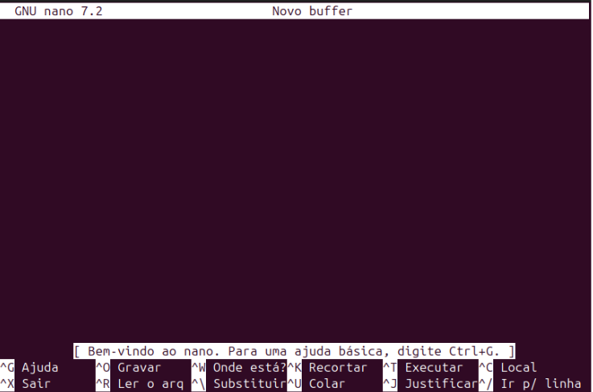

# Comandos Linux

## Sumário

- [1. Criação e Gestão de Arquivos e Diretórios](#1-criação-e-gestão-de-arquivos-e-diretórios)
- [2. Navegação entre Diretórios](#2-navegação-entre-diretórios)
- [3. Movendo Arquivos e Diretórios](#3-movendo-arquivos-e-diretórios)
- [4. Copiando e Renomeando Arquivos](#4-copiando-e-renomeando-arquivos)
- [5. Controle e Acesso ao Sistema](#5-controle-e-acesso-ao-sistema)
- [6. Redirecionando Saídas](#6-redirecionando-saídas)
- [7. Analisando Processos em Execução](#7-analisando-processos-em-execução)
- [8. Trabalhando com Textos](#8-trabalhando-com-textos)
- [9. Manipulação de Compactação](#9-manipulação-de-compactação)
- [10. Comandos Úteis Adicionais](#10-comandos-úteis-adicionais)
- [11. Gerenciamento de Usuários e Permissões](#11-gerenciamento-de-usuários-e-permissões)
- [12. Protocolos de Rede e Memória](#12-protocolos-de-rede-e-memória)
- [13. Gerenciamento de Pacotes e Serviços](#13-gerenciamento-de-pacotes-e-serviços)
- [14. GNU Nano](#14-gnu-nano)
- [15. Monitoramento](#15-monitoramento)
- [16. Scripts de Automação](#16-scripts-de-automação)

---

### 1. Criação e Gestão de Arquivos e Diretórios


* **mkdir**: Cria um novo diretório.

```bash
$ mkdir nova_pasta
```

* **rmdir**: Remove diretórios vazios.

```bash
$ rmdir pasta_vazia
```

* **rm**: Remove arquivos ou diretórios (use com cuidado).

```bash
$ rm arquivo.txt                 # Remove um arquivo
$ rm -r pasta_com_conteudo       # Remove um diretório com conteúdo
```

* **touch**: Cria arquivos vazios.

```bash
$ touch arquivo1.txt arquivo2.txt
```

* **cat**: Exibe ou cria arquivos.

```bash
$ cat arquivo.txt                # Exibe o conteúdo de um arquivo
$ cat > novo_arquivo.txt         # Cria um arquivo e escreve conteúdo
```

* **chmod**: Altera permissões de arquivos.

```bash
$ chmod 755 script.sh            # Permissão para leitura, gravação e execução pelo dono, leitura/execução para grupo e outros
```

Tabela de permissões do `chmod`

| Permissão | Número | Significado para o Dono/Grupo/Outros |
| --------- | ------ | ------------------------------------ |
| `---`     | 0      | Nenhuma permissão                    |
| `--x`     | 1      | Execução somente                     |
| `-w-`     | 2      | Escrita somente                      |
| `-wx`     | 3      | Escrita e execução                   |
| `r--`     | 4      | Leitura somente                      |
| `r-x`     | 5      | Leitura e execução                   |
| `rw-`     | 6      | Leitura e escrita                    |
| `rwx`     | 7      | Leitura, escrita e execução          |

Esses números são combinados em três grupos (dono, grupo e outros) para formar o número final que você usa com o `chmod`. Por exemplo:

* `chmod 755 arquivo`:

  * Dono: 7 (rwx)
  * Grupo: 5 (r-x)
  * Outros: 5 (r-x)

* `chmod 644 arquivo`:

  * Dono: 6 (rw-)
  * Grupo: 4 (r--)
  * Outros: 4 (r--)


* **chown**: Altera o dono e grupo de um arquivo.

```bash
$ chown usuario:grupo arquivo.txt
```

[🔝 Voltar ao topo](#sumário)

---

<br>
<br>
<br>

---

### 2. Navegação entre Diretórios

- **pwd**: Exibe o diretório atual.

```bash
$ pwd
/home/usuario
````

* **ls**: Lista arquivos e pastas do diretório atual.

```bash
$ ls
documento.txt  imagens/  projeto/
```

* **cd**: Change Directory, Acessa um diretório.

```bash
$ cd Downloads  
$ cd ..         # Retorna ao diretório anterior
```

* **find**: Busca arquivos e diretórios.

```bash
$ find /caminho -name "arquivo.txt"  # Busca por nome
$ find /caminho -type f -size +1M     # Busca arquivos maiores que 1MB
$ find /caminho -type f -atime +7     # Arquivos não acessados nos últimos 7 dias
$ find /caminho -type f -iname "ARQUIVO.txt"  # Busca insensível a maiúsculas
```

[🔝 Voltar ao topo](#sumário)

---

<br>
<br>
<br>

---

### 3. Movendo Arquivos e Diretórios

Para organizar melhor os arquivos, podemos criar subdiretórios e mover arquivos entre eles. Por exemplo:

* Criação de um subdiretório:

```bash
mkdir ideias
```

* Listagem do conteúdo:

```bash
ls
```

Retorno esperado: `ideias  projeto_ideas.txt`

* Movendo o arquivo `projeto_ideas.txt` para o subdiretório `ideias`:

```bash
mv projeto_ideas.txt ideias/
```

* Verificação da movimentação:

```bash
ls
ls ideias/
```

* Criação de um novo diretório chamado `rascunho`:

```bash
mkdir rascunho
```

* Movendo o diretório `rascunho` para dentro de `ideias`:

```bash
mv rascunho ideias/
```

* Verificação final:

```bash
ls ideias/
```

As permissões são exibidas com:

```bash
ls -al
```

No formato:

```
drwxr-xr-x
```

Sendo:

* `d`: diretório
* `rwx`: proprietário (leitura, escrita, execução)
* `r-x`: grupo e outros (leitura, execução)

Isso facilita a gestão e organização dos arquivos e diretórios no Linux.

[🔝 Voltar ao topo](#sumário)

---

<br>
<br>
<br>

---

### 4. Copiando e Renomeando Arquivos


* Para duplicar um arquivo:

```bash
cp arquivo_original arquivo_copia
```

Exemplo:

```bash
cp projeto_ideias.txt projeto_ideias_v1.txt
```

Isso cria uma cópia chamada `projeto_ideias_v1.txt`.

#### Renomeando Arquivos e Diretórios

* Para renomear:

```bash
mv nome_antigo nome_novo
```

Exemplo:

```bash
mv rascunho modelo
```

Isso renomeia o diretório `rascunho` para `modelo`.


#### Movendo Arquivos entre Diretórios

* Para mover arquivos para outro diretório:

```bash
mv arquivo_a_mover diretorio_destino
```

Exemplo:

```bash
mv projeto_ideias_v1.txt modelo/
```

Isso move o arquivo para dentro do diretório `modelo`.


[🔝 Voltar ao topo](#sumário)

---

<br>
<br>
<br>

---

### 5. Controle e Acesso ao Sistema


* **exit**: Termina a sessão no terminal.

```bash
$ exit
```

* **logout**: Desloga do usuário atual no sistema.

```bash
$ logout
```

* **passwd**: Altera a senha do usuário.

```bash
$ passwd
```

* **ssh**: Conecta a um servidor remoto.

```bash
$ ssh usuario@servidor.com
```

#### sudo ("super user do")

* **Descrição**: O `sudo` é usado para executar comandos como superusuário, permitindo realizar ações que exigem privilégios administrativos.

> **Importante:** Use o `sudo` com cuidado, pois ele permite modificar arquivos de configuração e afetar a integridade do sistema.

* **Listar conteúdo do diretório root**:
  Para listar o conteúdo do diretório root com privilégios elevados:

```bash
sudo ls /root
```

O sistema solicitará a senha configurada durante a instalação do Ubuntu. Dentro do diretório root, encontraremos o diretório `snap`, que é uma biblioteca.

* **Comandos internos do shell**:
  O `sudo` funciona apenas para comandos externos do shell. Comandos internos, como o `cd`, que alteram o estado do shell, não podem ser usados diretamente com o `sudo`.

**Exemplo:**

```bash
sudo cd ./root
```

Isso retorna um erro porque `cd` é um comando interno do shell.

* **Iniciar uma sessão como superusuário**:
  Para acessar o diretório `/root`, precisamos iniciar uma sessão como superusuário usando:

```bash
sudo -i
```

Esse comando inicia uma sessão com privilégios administrativos com o usuário root, permitindo acessar e modificar qualquer parte do sistema.

> **Aviso:** Tenha cuidado ao usar essa sessão, pois você tem permissão para realizar qualquer ação no sistema.

* **Acessar o arquivo de configuração sudoers**:
  O arquivo `sudoers` configura e define as permissões para que os usuários possam executar ações administrativas no sistema. Para acessar o conteúdo desse arquivo:

```bash
cat /etc/sudoers
```

O arquivo lista os usuários com permissão para usar o `sudo`.

* **Saindo do modo superusuário**:
  Após realizar alterações ou acessar diretórios restritos como superusuário, é importante sair desse modo:

```bash
exit
```

Isso retorna à navegação como usuário normal, sem permissões administrativas.

> **Aviso:** Use o modo de superusuário apenas quando necessário para evitar erros que possam impactar o sistema.


[🔝 Voltar ao topo](#sumário)

---

<br>
<br>
<br>

---

### 6. Redirecionando Saídas


```bash
pgrep nginx > /dev/null
```

Redireciona a saída do comando para o dispositivo `/dev/null` (uma "lixeira" do sistema), evitando exibir qualquer informação no terminal.

**Comando com Redireção de Erros:**

```bash
pgrep nginx &> /dev/null
```

Redireciona tanto as saídas padrão quanto os erros para o descarte.


[🔝 Voltar ao topo](#sumário)

---

<br>
<br>
<br>

---

### 7. Analisando Processos em Execução

#### Comando `top`

O comando `top` (table of processes) é utilizado para visualizar os processos em execução em tempo real. Para utilizá-lo, basta abrir o terminal e digitar:

```bash
top
```

Ao executar o comando, você verá uma tabela dinâmica com informações sobre os processos em execução.
Na parte superior da tabela, você encontrará várias siglas e abreviações. Vamos entender cada uma delas:

* **%CPU**: Percentual de utilização da CPU pelo processo.
* **%MEM**: Percentual de utilização da memória pelo processo.
* **PID**: Número de identificação do processo (process id).
* **USER**: Usuário que está utilizando o processo.
* **PR**: Prioridade geral do processo.
* **NI**: Nice value (valor agradável) do processo, que influencia na prioridade.
* **VIRT**: Memória virtual usada pelo processo.
* **RES**: Memória residente usada (realmente alocada como RAM).
* **SHR**: Memória compartilhada usada pelo processo.
* **S**: Estado do processo (S = sleeping, R = running, T = stopped).


#### Exemplo de Ordenação

* Execute o comando `top`.
* Pressione `P` para ver os processos ordenados pelo uso da CPU.
* Pressione `M` para ver os processos ordenados pelo uso da memória.


#### Comando `ps`

O comando `ps` (**Process Status**) é a base para a análise de processos. Ao executá-lo sem opções, você obtém uma visão limitada dos processos ativos no momento:

```bash
ps
```


#### Comando `ps aux`

Para obter uma visão mais ampla dos processos, utilizamos o comando `ps aux`:

```bash
ps aux
```

Esse comando apresenta uma tabela com informações detalhadas sobre todos os processos em execução. Os principais campos são:

* **USER**: Usuário do processo
* **PID**: Número de identificação do processo
* **%CPU**: Percentual de CPU utilizado
* **%MEM**: Percentual de memória utilizado
* **VSZ**: Memória virtual utilizada
* **RSS**: Memória RAM alocada
* **TTY**: Tipo de terminal utilizado
* **STAT**: Status do processo
* **START**: Momento em que o processo foi iniciado
* **TIME**: Tempo de execução
* **COMMAND**: Comando vinculado ao processo

[🔝 Voltar ao topo](#sumário)

---

<br>
<br>
<br>

---

### 8. Trabalhando com Textos

* **cat**: Exibe o conteúdo de um arquivo.

```bash
$ cat arquivo.txt
```

* **cut**: Extrai campos de um arquivo.

```bash
$ cut -d "," -f 1 arquivo.csv  # Extrai a primeira coluna de um CSV
```

* **head** e **tail**: Exibem linhas do início ou fim de um arquivo.

```bash
$ head -n 5 arquivo.txt   # Exibe as 5 primeiras linhas
$ tail -n 10 arquivo.txt  # Exibe as 10 últimas linhas
```

* **more** e **less**: Exibem o conteúdo de arquivos de forma paginada.

```bash
$ more arquivo.txt
$ less arquivo.txt
```

* **grep**: Pesquisa por padrões em arquivos.

```bash
$ grep "padrão" arquivo.txt        # Encontra linhas que contêm "padrão"
$ grep -r "padrão" diretorio/     # Pesquisa recursivamente em um diretório
```

[🔝 Voltar ao topo](#sumário)

---

<br>
<br>
<br>

---

### 9. Manipulação de Compactação

* **tar**: Cria ou extrai arquivos compactados.

```bash
$ tar -czvf arquivo.tar.gz pasta/    # Compacta com gzip
$ tar -xzvf arquivo.tar.gz           # Extrai arquivo compactado
```

* **gzip/bzip2**: Compacta arquivos individualmente.

```bash
$ gzip arquivo.txt       # Compacta o arquivo para arquivo.txt.gz
$ bzip2 arquivo.txt      # Compacta o arquivo para arquivo.txt.bz2
```

* **zip/unzip**: Compacta e descompacta arquivos ZIP.

```bash
$ zip arquivos.zip arquivo1 arquivo2
$ unzip arquivos.zip
```

[🔝 Voltar ao topo](#sumário)

---

<br>
<br>
<br>

---

### 10. Comandos Úteis Adicionais

* **clear**: Limpa o terminal.

```bash
$ clear
```

* **df -h**: Exibe o uso do sistema de arquivos.

```bash
$ df -h
```

* **free -h**: Exibe informações sobre o uso de memória.

```bash
$ free -h
```

* **sudo apt-get update && sudo apt-get upgrade**: Atualiza o sistema.

```bash
$ sudo apt-get update && sudo apt-get upgrade
```

* **updatedb/locate**: Atualiza o banco de dados e busca arquivos.

```bash
$ sudo updatedb
$ locate arquivo.txt
```

* **which**: Localiza o caminho de um executável.

```bash
$ which ls
```

[🔝 Voltar ao topo](#sumário)

---

<br>
<br>
<br>

---

### 11. Gerenciamento de Usuários e Permissões

* **adduser**: Adiciona um novo usuário.

```bash
$ sudo adduser novo_usuario
```

* **usermod**: Modifica informações de um usuário.

```bash
$ sudo usermod -aG grupo usuario   # Adiciona o usuário a um grupo
```

* **chown**: Altera o dono e grupo de um arquivo.

```bash
$ sudo chown usuario:grupo arquivo.txt
```

* **chmod**: Modifica permissões de arquivos.

```bash
$ chmod 755 arquivo.txt
```

[🔝 Voltar ao topo](#sumário)

---

<br>
<br>
<br>

---

### 12. Protocolos de Rede e Memória


* **ping**: Testa a conectividade com um host.

```bash
$ ping google.com
```

* **ip addr**: Exibe informações de rede.

```bash
$ ip addr
```

* **ip route**: Exibe a tabela de roteamento.

```bash
$ ip route
```


[🔝 Voltar ao topo](#sumário)

---

<br>
<br>
<br>

---

### 13. Gerenciamento de Pacotes e Serviços

* **apt-get**: Instala e gerencia pacotes no sistema.

```bash
$ sudo apt-get install pacote   # Instala um pacote
$ sudo apt-get remove pacote    # Remove um pacote
```

* **service/systemctl**: Gerencia serviços do sistema.

```bash
$ sudo service apache2 start    # Inicia um serviço
$ sudo systemctl restart apache2
```

[🔝 Voltar ao topo](#sumário)

---

<br>
<br>
<br>

---

## 14. GNU Nano

O **GNU Nano** é um editor de texto simples e poderoso que vem pré-instalado em muitas distribuições Linux. Ele é usado diretamente no terminal e foi projetado para ser fácil de usar, mesmo para iniciantes. Nano é particularmente útil para editar arquivos de configuração ou criar scripts rapidamente, sem a necessidade de interfaces gráficas.

### Principais Características do GNU Nano

- **Simplicidade**: Ele é amigável, com comandos básicos exibidos na parte inferior da tela.
- **Baseado em Terminal**: Você pode usá-lo em servidores remotos ou sistemas sem interface gráfica.
- **Compatível com Vários Arquivos**: Permite abrir e editar múltiplos arquivos ao mesmo tempo.
- **Pesquisa e Substituição**: Inclui ferramentas de busca e substituição simples.
- **Open Source**: Faz parte do projeto GNU, ou seja, é gratuito e de código aberto.


### Como Usar o GNU Nano

No terminal, digite o comando abaixo seguido do nome do arquivo que você deseja editar:

```bash
nano
````

Exemplo para editar um arquivo chamado `config.txt`:

```bash
nano config.txt
```

Quando você abre o Nano, verá:


Fonte: *[Autor](Autor)*

* **Conteúdo do arquivo**: A parte superior e central da tela mostra o texto do arquivo.
* **Linha de Status**: Abaixo do conteúdo, há informações como o nome do arquivo e o número da linha.
* **Atalhos de Comando**: Na parte inferior, comandos básicos aparecem com um símbolo de `^`. O `^` representa a tecla Ctrl.

#### Comandos Básicos no GNU Nano

| Atalho   | Descrição                             |
| -------- | ------------------------------------- |
| Ctrl + O | Salvar o arquivo.                     |
| Ctrl + X | Sair do editor.                       |
| Ctrl + W | Buscar um texto no arquivo.           |
| Ctrl + K | Cortar uma linha.                     |
| Ctrl + U | Colar o texto cortado anteriormente.  |
| Ctrl + G | Abrir o menu de ajuda.                |
| Ctrl + T | Verificar ortografia (se habilitado). |

#### Editando Arquivos

* **Abrir e Digitar**: Após abrir o arquivo, basta começar a digitar ou navegar usando as setas do teclado.
* **Salvar as Alterações**:
  Pressione `Ctrl + O` para salvar.
  O Nano perguntará se você deseja salvar no mesmo arquivo ou em outro nome.
  Pressione `Enter` para confirmar.

#### Sair do Nano

Para sair, pressione `Ctrl + X`.
Se houver alterações não salvas, o Nano perguntará:

```
Save modified buffer? (Answering "No" will DISCARD changes)
```

* Digite `Y` para salvar.
* Digite `N` para sair sem salvar.

[🔝 Voltar ao topo](#sumário)

---

<br>
<br>
<br>

---

## 15. Monitoramento

Monitorando Processos com o Comando top

Exibe uma visão dinâmica e em tempo real dos processos em execução no sistema.  
Mostra o consumo de recursos (CPU, memória) e o estado dos processos.

### Exemplo de Saída:

| PID  | USER   | PR | NI | VIRT | RES  | SHR  | S | %CPU | %MEM | TIME+   | COMMAND  |
|------|--------|----|----|------|------|------|---|------|------|----------|----------|
| 1    | root   | 20 | 0  | 1015 | 1286 | 8456 | S | 0.0  | 0.3  | 0:01.29  | systemd  |
| 2    | root   | 20 | 0  | 0    | 0    | 0    | S | 0.0  | 0.0  | 0:00.01  | kthreadd |
| 2527 | diego  | 20 | 0  | 1730 | 8100 | 5704 | S | 0.1  | 0.2  | 0:00.07  | sshd     |

### Como Interpretar:

- **PID**: Identificador único do processo.
- **USER**: Usuário que iniciou o processo.
- **PR (Priority)**: Prioridade do processo.
- **%CPU**: Percentual de uso da CPU pelo processo.
- **%MEM**: Percentual de uso da memória pelo processo.
- **TIME+**: Tempo total de CPU consumido.
- **COMMAND**: Nome ou comando associado ao processo.

### Filtrando por Usuário:

Durante o uso do top, digite `u` e insira o nome do usuário para visualizar processos apenas daquele usuário.

#### Listando Processos com ps

**Comando:**

```bash
ps aux
```

Exibe uma lista detalhada de processos no sistema.

Exemplo de Saída:

| USER     | PID | %CPU | %MEM | VSZ    | RSS   | TTY | STAT | START | TIME  | COMMAND               |
| -------- | --- | ---- | ---- | ------ | ----- | --- | ---- | ----- | ----- | --------------------- |
| root     | 1   | 0.0  | 0.3  | 101584 | 12864 | ?   | Ss   | 08:12 | 00:01 | /sbin/init            |
| root     | 2   | 0.0  | 0.0  | 0      | 0     | ?   | S    | 08:12 | 00:00 | \[kthreadd]           |
| www-data | 225 | 0.0  | 0.1  | 5585   | 5796  | ?   | S    | 12:27 | 00:00 | nginx: worker process |

Como Interpretar:

* **USER**: Usuário dono do processo.
* **%CPU**: Percentual de uso da CPU.
* **%MEM**: Percentual de uso da memória.
* **VSZ**: Tamanho virtual do processo em KB.
* **RSS**: Tamanho da memória residente em KB.
* **STAT**: Estado do processo (S para sleeping, R para running, etc.).
* **COMMAND**: Comando que iniciou o processo.

#### Filtrando Processos com Pipe e Grep

**Comando:**

```bash
ps aux | grep nginx
```

Filtra os processos listados pelo comando `ps aux` para mostrar apenas os relacionados ao Nginx.

Exemplo de Saída:

| USER     | PID  | %CPU | %MEM | VSZ   | RSS   | TTY | STAT | START | TIME  | COMMAND                               |
| -------- | ---- | ---- | ---- | ----- | ----- | --- | ---- | ----- | ----- | ------------------------------------- |
| root     | 2255 | 0.0  | 0.3  | 55180 | 12044 | ?   | S    | 12:27 | 00:00 | nginx: master process /usr/sbin/nginx |
| www-data | 2258 | 0.0  | 0.1  | 55852 | 5796  | ?   | S    | 12:27 | 00:00 | nginx: worker process                 |
| www-data | 2259 | 0.0  | 0.1  | 55852 | 5796  | ?   | S    | 12:27 | 00:00 | nginx: worker process                 |

Explicação:

Lista os processos relacionados ao Nginx.
O último processo listado pode ser o próprio comando de busca (`grep`). Para evitar isso, usamos:

```bash
ps aux | grep -v grep | grep nginx
```

[🔝 Voltar ao topo](#sumário)

---

<br>
<br>
<br>

---

## 16. Scripts de Automação 

Um **script** é um arquivo de texto que contém um conjunto de instruções que podem ser executadas por um interpretador, como o Bash no Linux. Ele automatiza tarefas rotineiras e repetitivas, permitindo maior eficiência e consistência nos processos.

Os scripts de automação servem para **automatizar processos**, como:

* Processar arquivos de logs.
* Realizar backups.
* Monitorar sistemas.
* Executar tarefas administrativas.
* Configurar ambientes de desenvolvimento ou produção.


### Preparando o Ambiente do Projeto

#### 1️⃣ Criação do Diretório

Abra o seu terminal e crie um diretório chamado `myapp/logs`:

```bash
mkdir -p myapp/logs
```

Em seguida, entre no diretório:

```bash
cd myapp/logs
```


#### 2️⃣ Criação e Edição dos Arquivos de Logs

No diretório `myapp/logs`, crie um arquivo chamado **myapp-backend.log** e adicione o seguinte conteúdo:

```plaintext
2024-09-01 10:05:21 ERROR: Database connection failed.
2024-09-01 10:06:10 INFO: Retrying database connection...
2024-09-01 10:07:35 ERROR: Database connection failed.
2024-09-01 10:09:55 INFO: Database connection established.
2024-09-01 11:00:00 INFO: SENSITIVE_DATA: User password is 12345.
2024-09-01 11:10:00 INFO: User logged in with username: admin.
2024-09-01 12:30:45 ERROR: SENSITIVE_DATA: Unauthorized access attempt from IP 192.168.1.10.
2024-09-01 13:00:00 ERROR: SENSITIVE_DATA: Credit card information exposed.
2024-09-01 13:05:00 INFO: Backup completed successfully.
2024-09-01 14:15:30 INFO: Application running smoothly.
2024-09-01 14:20:10 ERROR: Disk space low on /var.
2024-09-01 15:00:00 INFO: Application shut down for maintenance.
2024-09-01 16:30:00 ERROR: Database connection failed.
2024-09-01 16:30:00 ERROR: Database connection failed.
2024-09-01 16:35:00 ERROR: Disk space low on /var.
2024-09-01 16:40:00 ERROR: Disk space low on /var.
2024-09-01 17:00:00 INFO: Maintenance completed.
2024-09-01 17:15:45 ERROR: Application crash due to memory leak.
2024-09-01 18:05:21 INFO: Application restarted.
2024-09-01 19:30:00 INFO: User admin logged out.
2024-09-02 09:15:22 ERROR: SENSITIVE_DATA: User password reset request with token 98765.
2024-09-02 10:00:30 INFO: SENSITIVE_DATA: User email: user@example.com accessed sensitive data.
2024-09-02 11:20:11 ERROR: SENSITIVE_DATA: Failed login attempt with username: guest.
2024-09-02 12:45:00 INFO: SENSITIVE_DATA: API key leaked: ABCD1234EFGH5678.
2024-09-02 13:30:00 INFO: Scheduled maintenance started.
2024-09-02 14:15:00 ERROR: Database connection failed during maintenance.
2024-09-02 15:00:00 INFO: Maintenance completed.
2024-09-03 08:00:00 INFO: SENSITIVE_DATA: User credit card last four digits: 1234.
2024-09-03 09:45:00 ERROR: Unauthorized access attempt from IP 192.168.1.15.
2024-09-03 10:30:00 INFO: User admin logged in from IP 10.0.0.2.
2024-09-03 11:00:00 INFO: Application settings updated by user: admin.
2024-09-03 12:00:00 ERROR: SENSITIVE_DATA: Database backup contains sensitive information.
```

#### 3️⃣ Criação do Arquivo de Log do Frontend

Ainda em `myapp/logs`, crie outro arquivo chamado **myapp-frontend.log** com o conteúdo abaixo:

```plaintext
2024-09-01 10:05:21 INFO: Frontend initialized successfully.
2024-09-01 10:15:00 ERROR: Failed to load user profile for user ID 12345.
2024-09-01 10:20:10 INFO: SENSITIVE_DATA: User email: user@example.com fetched profile data.
2024-09-01 10:30:45 INFO: User admin navigated to dashboard.
2024-09-01 11:05:00 INFO: SENSITIVE_DATA: Session token for user admin is active.
2024-09-01 11:30:00 ERROR: SENSITIVE_DATA: Failed login attempt for username: admin.
2024-09-01 12:00:00 INFO: User admin logged out successfully.
2024-09-01 13:00:00 INFO: Frontend rendering completed for page: /adoption.
2024-09-01 14:15:30 ERROR: SENSITIVE_DATA: Credit card information exposed in logs.
2024-09-01 15:00:00 INFO: Application theme switched to dark mode by user admin.
2024-09-02 09:30:00 INFO: SENSITIVE_DATA: User password changed for user ID 67890.
2024-09-02 10:00:00 ERROR: Unable to fetch data from the API: 500 Internal Server Error.
2024-09-02 11:45:00 INFO: User logged in with username: guest.
2024-09-02 12:30:00 INFO: SENSITIVE_DATA: User session initiated with token: TOKEN1234.
2024-09-02 13:00:00 ERROR: Invalid token used for API request.
2024-09-03 08:15:00 INFO: User admin updated account settings.
2024-09-03 09:00:00 ERROR: SENSITIVE_DATA: User IP 10.0.0.3 accessed sensitive endpoint.
2024-09-03 10:30:00 INFO: SENSITIVE_DATA: API key for external service accessed.
2024-09-03 11:00:00 INFO: User admin logged out successfully.
2024-09-03 12:00:00 INFO: Frontend performance metrics collected.
```


#### 4️⃣ Criação de Arquivos Vazios

Para finalizar a preparação do ambiente, crie dois arquivos vazios para configuração e relatórios:

```bash
touch app.config
touch relatorio.txt
```

Pronto! Agora temos o ambiente configurado e os arquivos de logs preparados. A partir daqui, vamos construir scripts para processar e analisar esses arquivos de forma automatizada.


Segue o texto reescrito e adaptado para usar o editor de texto **Nano** em vez do Vim, mantendo o formato claro, didático e completo:

---

### Processamento de logs

Como os arquivos de log contêm informações relevantes sobre o estado e a saúde da aplicação, é interessante monitorá-los. No Linux, existem comandos úteis para processar esses logs, extraindo informações como erros e dados sensíveis que possam ter vazado, permitindo solucionar problemas na aplicação.

Esse processamento de logs segue uma série de instruções e comandos repetitivos. Em vez de digitar esses comandos manualmente no terminal toda vez que quisermos processar um arquivo de log, podemos consumir essas instruções de forma automática.

Vamos criar um script para monitorar nossos logs.

#### Criando um script

Com o terminal aberto, primeiramente, criaremos uma pasta para armazenar nosso script. Execute o seguinte comando:

```bash
mkdir scripts-linux
```

Em seguida, vamos entrar na pasta, com o seguinte comando:

```bash
cd scripts-linux
```

Precisamos de um editor de texto para criar o script.

No curso anterior, aprendemos a usar o Nano no Linux, mas ele não é a única opção disponível. É interessante conhecer diversos editores de texto, pois cada um possui recursos diferentes, pontos positivos e negativos dependendo da situação.

Caso não haja um motivo específico para usar determinado editor, podemos escolher de acordo com nossas preferências. Neste curso, utilizaremos o **Nano** como editor de texto.

Para criar um arquivo e nosso script com o Nano, digitamos no terminal o comando `nano` seguido do nome do arquivo, que será nosso script. A extensão **.sh** indica que se trata de um script Bash (um script de Shell do Linux):

```bash
nano monitoramento-logs.sh
```

Ao pressionar **Enter**, o editor Nano abrirá um arquivo vazio pronto para edição.

Um script é um tipo de código. Utilizaremos o script do tipo Bash, que oferece funcionalidades básicas de programação e suporte a comandos Linux executados no terminal.

Um script Bash possui uma estrutura. Além da extensão **.sh**, precisamos especificar algumas informações para indicar que se trata de um script.

A primeira linha que adicionamos é chamada de **shebang**, começando com `#!`, seguido do caminho para o interpretador que executará o código. Como é um script Bash, utilizaremos o Bash como interpretador, logo:

```bash
#!/bin/bash
```

Os scripts podem ser escritos em diversas linguagens, como Python. Dependendo da linguagem escolhida, muda-se o caminho para o interpretador utilizado.

Agora que configuramos o necessário, podemos pular uma linha e começar a escrever nosso script e adicionar funcionalidades para processar e monitorar os arquivos de log.

### Escrevendo o script

A primeira ação no script é criar uma variável que armazenará o diretório onde estão nossos logs. Uma variável é um recurso no código para armazenar informações. Neste caso, o diretório de logs.

A variável será chamada **LOG\_DIR**. Para atribuir um valor, usamos o sinal de igual. O valor deve ser escrito entre aspas duplas:

```bash
LOG_DIR=" "
```

Começamos o caminho com `..`, que indica que vamos sair da pasta atual. Em seguida, `/myapp/logs`, que é a pasta criada na atividade de preparação do ambiente:

```bash
LOG_DIR="../myapp/logs"
```

As aspas duplas são opcionais ao atribuir valores a uma variável, mas é uma boa prática usá-las para evitar problemas com caracteres especiais.

Outra funcionalidade do script é exibir uma mensagem na tela. Para isso, usamos o comando **echo** do Linux, que nos permite escrever uma mensagem entre aspas duplas.

Vamos escrever "Verificando logs no diretório" e, em seguida, queremos indicar qual é esse diretório. Como já temos o diretório salvo na variável **LOG\_DIR**, utilizaremos o valor armazenado nela. No script Bash, chamamos a variável usando o sinal de cifrão `$` seguido do nome da variável, portanto:

```bash
echo "Verificando logs no diretorio $LOG_DIR"
```

Assim, essa mensagem será exibida na tela quando o script for executado.

#### Salvando o arquivo no Nano

Para salvar as alterações no arquivo usando o **Nano**, siga estes passos:

1. Pressione as teclas **Ctrl + O** (a letra "O" vem de "output", que significa "salvar").
2. O Nano pedirá o nome do arquivo — pressione **Enter** para manter o nome atual.
3. Em seguida, pressione **Ctrl + X** para sair do editor e retornar ao terminal.

Pronto! Já entendemos o que é um script e criamos as primeiras linhas de código. Na sequência, aprenderemos como **executar nosso script**.

---

### Caso deseje usar o editor Vim

Se quiser utilizar o editor Vim para criar e editar seu script, siga este passo a passo:

#### 1. Iniciando o Vim

Para abrir um arquivo:

```bash
vim nome_do_arquivo
```

#### 2. Modos do Vim

O Vim possui diferentes modos, sendo os principais:

* **Modo Normal**: Usado para navegação e comandos (o modo padrão ao abrir o Vim).
* **Modo de Inserção**: Usado para inserir texto.
* **Modo de Comando**: Usado para executar comandos do Vim.

#### 3. Mudando de modos

* Para entrar no modo de inserção: pressione **i** (inserir antes do cursor) ou **a** (inserir após o cursor).
* Para voltar ao modo normal: pressione **Esc**.

#### 4. Navegação

É possível usar as teclas de seta para navegar pelo arquivo no Vim:

* **Seta para cima**: move o cursor uma linha para cima.
* **Seta para baixo**: move o cursor uma linha para baixo.
* **Seta para esquerda**: move o cursor um caractere para a esquerda.
* **Seta para direita**: move o cursor um caractere para a direita.

Embora usar as teclas de seta seja conveniente, muitos usuários preferem os comandos de navegação do Vim, que proporcionam mais eficiência:

* **h**: move o cursor para a esquerda.
* **j**: move o cursor para baixo.
* **k**: move o cursor para cima.
* **l**: move o cursor para a direita.

Outros comandos de navegação úteis:

* **gg**: ir para o início do arquivo.
* **G**: ir para o final do arquivo.
* **0**: ir para o início da linha.
* **\$**: ir para o final da linha.

#### 5. Salvar e sair

* Para salvar as alterações: no modo normal, digite `:w` e pressione **Enter**.
* Para sair do Vim:

  * `:q`: sai se não houver alterações.
  * `:q!`: sai sem salvar as alterações.
  * `:wq`: salva e sai.

---
---

### Gerenciando Permissões

Com o terminal aberto na pasta onde está o script, vamos rodar o seguinte comando para dar permissão de execução ao arquivo:

```bash
chmod 755 monitoramento-logs.sh
```

Após pressionar **Enter**, já teremos aplicado a permissão de execução.

O comando **chmod** no Linux é utilizado para gerenciar permissões, adicionando ou removendo permissões em arquivos e diretórios. Mas o que significam os números que utilizamos? Como sabemos quais números usar para adicionar e remover essas permissões? Vamos entender em detalhes como funciona essa gestão de permissões no Linux.


### Tipos de permissões

É importante compreender esses detalhes de gerenciamento de permissões, pois são fundamentais para a segurança e administração do sistema. Existem diferentes tipos de permissões que podemos conceder ou retirar de arquivos e diretórios:

* **Leitura** (**r** - *read*): permite acessar o conteúdo de um arquivo ou listar arquivos de um diretório.
* **Escrita** (**w** - *write*): permite modificar arquivos ou o conteúdo de um diretório.
* **Execução** (**x** - *execute*): permite executar códigos, scripts e acessar diretórios.


### Classes de usuário

Além das permissões, existem classes de usuários no Linux:

* **u** (*user*): proprietário, que é o dono do arquivo.
* **g** (*group*): grupo de usuários que não são os donos do arquivo, mas podem ter acesso a ele.
* **o** (*others*): outros usuários que não são nem o proprietário, nem parte de um grupo.
* **a** (*all*): representa todos os usuários (proprietário, grupo e outros).


### Notação Octal

Quando escrevemos o comando `chmod 755`, utilizamos uma notação octal para representar as permissões. Essa notação usa números para indicar o tipo de permissão que estamos aplicando ou removendo:

* **Leitura (r)** tem o valor **4**.
* **Gravação (w)** tem o valor **2**.
* **Execução (x)** tem o valor **1**.

O número **755** significa:

* **7** (4+2+1): proprietário com permissões de leitura, gravação e execução.
* **5** (4+1): grupo com permissões de leitura e execução.
* **5** (4+1): outros com permissões de leitura e execução.


### Notação Simbólica

Além da notação octal, podemos usar a notação simbólica no `chmod`, que utiliza letras e símbolos para representar operações e usuários:

* **+**: adiciona permissões.
* **-**: remove permissões.
* **=**: define permissões exatas.

Exemplos:

* `chmod u+x arquivo.sh`: atribui permissão de execução ao proprietário.
* `chmod g-w arquivo.sh`: remove a permissão de gravação do grupo.

Para o caso do `chmod 755`, poderíamos usar:

```bash
chmod +x monitoramento-logs.sh
```

Como estamos atribuindo a permissão de execução para todas as classes, podemos simplesmente usar o operador `+x`.

---

### Verificando Permissões

Para limpar a tela do terminal:

```bash
Ctrl + L
```

Para verificar as permissões de um arquivo, usamos o comando:

```bash
ls -l
```

Exemplo de saída:

```
-rwxr-xr-x
```

* O primeiro traço indica um arquivo regular (ou "d" para diretórios).
* Os três primeiros caracteres são as permissões do proprietário (rwx).
* Os três seguintes, do grupo (r-x).
* Os últimos, de outros usuários (r-x).

Em seguida, temos o nome do proprietário e o grupo atribuído ao arquivo.

---

### Executando o Script

Agora que entendemos a gestão de permissões, podemos executar nosso script com o seguinte comando:

```bash
./monitoramento-logs.sh
```

A saída na tela, gerada pelo comando **echo**, será:

```
Verificando logs no diretorio ../myapp/logs
```

A mensagem confirma que o script está verificando logs no diretório especificado.

---

Segue o texto formatado de forma profissional, didática e estruturada:

---

### Gerenciamento de Grupos

Quando trabalhamos em um projeto de software, é comum haver um time envolvido. Nossa aplicação geralmente será executada em um servidor, em uma máquina onde todos terão acesso. Queremos que as pessoas possam acessar nosso script de processamento de logs.

No Linux, a gestão das classes de usuários e dos grupos nos ajuda com isso, pois podemos criar um grupo e adicionar diversos usuários, facilitando o gerenciamento de acesso. Em vez de dar permissões individualmente para cada pessoa envolvida no time, podemos utilizar um grupo para centralizar as permissões.

---
---

### Criando Usuários

Meu usuário atual é "diego", como aparece na tela do terminal. Podemos criar um novo usuário para o time usando o comando **sudo adduser** seguido do nome. Por exemplo, para criar a usuária gustavo:

```bash
sudo adduser gustavo
```

Em seguida, precisamos informar a senha do usuário atual e responder a algumas perguntas para criar o novo usuário. A primeira é a senha do novo usuário, que deve ser confirmada. As demais perguntas podem ser deixadas em branco pressionando **Enter**. No final, confirmamos as informações digitando **Y** e pressionando **Enter**.

O novo usuário chmado **gustavo** foi criado. Para verificar se a criação foi bem-sucedida, podemos rodar o seguinte comando para listar os usuários:

```bash
cat /etc/passwd
```

Ao final da lista, veremos **gustavo** com seu diretório home.

---

### Criando um Grupo

Queremos que o gustavo trabalhe conosco e ajude no script de processamento de logs. Portanto, criaremos um grupo para adicionar ele e outras futuras colaboradoras do projeto.

Para criar um grupo, usamos o comando:

```bash
sudo addgroup devs
```

Para verificar se o grupo foi criado com sucesso:

```bash
getent group devs
```

Agora, vamos adicionar o **gustavo** ao grupo **devs** com o comando:

```bash
sudo usermod -aG devs gustavo
```

Para checar se ele foi adicionado corretamente:

```bash
getent group devs
```

---

### Gerenciando Acessos

O próximo passo é conceder acesso ao grupo para que possam executar o script. Vamos entrar na pasta onde o script foi criado com:

```bash
cd scripts-linux
```

E rodar o comando para conferir as permissões:

```bash
ls -ld
```

Exemplo de saída:

```
drwxr-xr-x diego diego
```

Notamos que o grupo tem permissão de leitura e execução, mas não de escrita. Quando atribuímos permissões, é necessário que todos os diretórios-pais também tenham as permissões adequadas.

No momento, o grupo ainda não é **devs**, mas **diego**. Se formos para o diretório-pai com:

```bash
cd ..
```

E rodarmos:

```bash
ls -ld
```

Veremos algo como:

```
drwxr-x--- diego diego
```

O grupo do diretório-pai deve ser o mesmo do diretório-filho que queremos acessar.

Para alterar o grupo do diretório-pai e seus subdiretórios, usamos:

```bash
sudo chown -R :devs /home/diego
```

A opção **-R** aplica a modificação recursivamente. Esse processo pode demorar um pouco, dependendo da quantidade de diretórios no computador.

Após a execução, rodamos novamente:

```bash
ls -ld
```

Verificaremos que o grupo foi alterado para **devs**:

```
drwxr-x--- diego devs
```

---

### Verificando o Acesso de um Usuário

Vamos verificar se **gustavo** consegue executar o script. Para isso, trocamos o usuário com:

```bash
su - gustavo
```

Após informar a senha, o nome do host mudará. Acessamos a pasta dos scripts:

```bash
cd /home/diego/scripts-linux
```

(Altere "diego" para o nome do seu usuário!)

Agora, rodamos o script:

```bash
./monitoramento-logs.sh
```

Confirmamos que o **gustavo** consegue executar o script!

---

### Considerações Finais

Quando gerenciamos uma máquina ou servidor, é importante decidir se todos os usuários do grupo devem ter acesso a todas as pastas dentro do diretório. Podemos conceder acesso apenas a pastas específicas, sem usar a opção **-R**.

Para voltar ao usuário original, usamos:

```bash
su - diego
```

E informamos a senha novamente.

---
---

### Encontrando e Filtrando Arquivos

No terminal, acesse a pasta:

```bash
cd /myapp/logs
```

Use o comando **ls** para listar os itens da pasta. Perceba que temos arquivos com extensão **.log** e outros que não queremos processar. Para filtrar apenas os arquivos de log, usamos:

```bash
find . -name "*.log"
```

O retorno será:

```
./myapp-frontend.log
./myapp-backend.log
```

### Incrementando o Script de Monitoramento

Acesse a pasta onde está o script:

```bash
cd scripts-linux
```

Abra o script para edição com o **nano**:

```bash
nano monitoramento-logs.sh
```

No arquivo, edite para ficar assim:

```bash
#!/bin/bash

LOG_DIR="../myapp/logs"

echo "Verificando logs no diretorio $LOG_DIR"

find $LOG_DIR -name "*.log"
```

Pressione **Ctrl + O** para salvar, depois **Enter** para confirmar. Para sair, use **Ctrl + X**.

---

### Adicionando Laço de Repetição

Queremos processar cada arquivo encontrado. Para isso, vamos usar o **while** em conjunto com o **find** e o operador **|** (pipe). Reabra o script com:

```bash
nano monitoramento-logs.sh
```

Adicione o laço de repetição no final do script:

```bash
find $LOG_DIR -name "*.log" -print0 | while IFS= read -r -d '' arquivo; do
    echo "Arquivo encontrado $arquivo"
done
```

A explicação de cada parte:

* **-print0**: faz o **find** usar delimitador nulo.
* **IFS=**: evita problemas com espaços em nomes.
* **read -r -d '' arquivo**: lê o nome do arquivo sem interpretar caracteres especiais.
* **echo**: exibe o nome do arquivo encontrado.

Salve com **Ctrl + O**, pressione **Enter** e saia com **Ctrl + X**.

---

### Executando o Script

Para rodar o script:

```bash
./monitoramento-logs.sh
```

A saída será:

```
Verificando logs no diretorio ../myapp/logs
Arquivo encontrado ../myapp/logs/myapp-frontend.log
Arquivo encontrado ../myapp/logs/myapp-backend.log
```

---

Segue o mesmo conteúdo formatado para substituição do **Vim** pelo **Nano**:

---

### Encontrando e filtrando arquivos

No terminal, vamos acessar a pasta "/myapp/logs" e executar o comando `ls` para listar os itens da pasta. Temos alguns arquivos com a extensão .log, mas também há outros com extensões diferentes que não queremos processar.

É interessante criar um filtro para processar somente os arquivos `myapp-backend.log` e `myapp-frontend.log`, que contêm as informações de log da nossa aplicação.

Para fazer esse filtro e obter somente os nomes dos arquivos que nos interessam, podemos usar o comando `find` no Linux. Vamos digitar:

```bash
find . -name "*.log"
```

O retorno será:

```
./myapp-frontend.log
./myapp/backend.log
```

Esse comando retorna somente os nomes dos arquivos que terminam com `.log`. A seguir, vamos entender mais a fundo o que cada parte do comando faz.

* O `find` realiza uma busca.
* O ponto `.` especifica que a busca deve ser feita a partir do diretório atual.
* A opção `-name` permite especificar o padrão de busca. Entre as aspas duplas, utilizamos o caractere especial `*`, que representa qualquer cadeia de caracteres em uma string. Assim, qualquer texto que termine com ".log" será retornado.

Portanto, esse comando filtra apenas os arquivos de log e podemos utilizá-lo no nosso script de monitoramento.

Vamos copiar o comando com `Ctrl + Shift + C`, sair da pasta com `cd`, entrar na pasta do script com `cd scripts-linux` e abrir o script usando o editor Nano:

```bash
nano monitoramento-logs.sh
```

---

### Incrementando o script de monitoramento

No script, vamos adicionar o comando `find` após o `echo`. A estrutura do script ficará assim:

```bash
#!/bin/bash

LOG_DIR="../myapp/logs"

echo "Verificando logs no diretorio $LOG_DIR"

find $LOG_DIR -name "*.log"
```

Agora, podemos usar os nomes dos arquivos filtrados para percorrer cada um deles e fazer o devido processamento dos logs.

---

### Laços de repetição

Para percorrer o conteúdo, utilizamos laços de repetição. Para redirecionar a saída do comando `find` para um laço de repetição, usamos o operador `|` (pipe). O laço de repetição que utilizaremos é o `while`. Antes de especificar as condições e as ações do laço, vamos entender sua estrutura:

```bash
find $LOG_DIR -name "*.log" | while [condição]; do
    [ações]
done
```

Na sequência, especificamos a condição e as ações a serem realizadas. Para a condição, usaremos o `IFS=` (Internal Field Separator) definido como vazio, para evitar que nomes de arquivos com espaços ou caracteres especiais sejam quebrados:

```bash
find $LOG_DIR -name "*.log" | while IFS= ; do
    ações
done
```

Em seguida, usamos `read` para ler os arquivos passados pelo `find`, com algumas opções extras. A opção `-r` impede a interpretação de caracteres especiais e `-d ''` indica que o delimitador é o caractere nulo:

```bash
find $LOG_DIR -name "*.log" | while IFS= read -r -d ''; do
    ações
done
```

Por padrão, o `find` não utiliza o delimitador nulo. Para alterar essa configuração, vamos inserir `-print0` antes do pipe:

```bash
find $LOG_DIR -name "*.log" -print0 | while IFS= read -r -d '' arquivo; do
    echo "Arquivo encontrado: $arquivo"
done
```

---

### Finalizando a edição no Nano

* Pressione `Ctrl + O` e `Enter` para salvar.
* Pressione `Ctrl + X` para sair.

---

### Executando o script

No terminal, execute:

```bash
./monitoramento-logs.sh
```

A saída será:

```
Verificando logs no diretorio ../myapp/logs
Arquivo encontrado: ../myapp/logs/myapp-frontend.log
Arquivo encontrado: ../myapp/logs/myapp-backend.log
```

---

Pronto! Agora, substituímos o uso do **Vim** pelo **Nano** para editar o script. 


