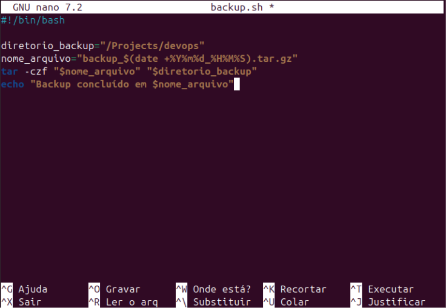

# Comandos Linux

## Sumário

- [1. Criação e Gestão de Arquivos e Diretórios](#1-criação-e-gestão-de-arquivos-e-diretórios)
- [2. Navegação entre Diretórios](#2-navegação-entre-diretórios)
- [3. Movendo Arquivos e Diretórios](#3-movendo-arquivos-e-diretórios)
- [4. Copiando e Renomeando Arquivos](#4-copiando-e-renomeando-arquivos)
- [5. Controle e Acesso ao Sistema](#5-controle-e-acesso-ao-sistema)
- [6. Redirecionando Saídas](#6-redirecionando-saídas)
- [7. Analisando Processos em Execução](#7-analisando-processos-em-execução)
- [8. Trabalhando com Textos](#8-trabalhando-com-textos)
- [9. Manipulação de Compactação](#9-manipulação-de-compactação)
- [10. Scripts e Automação](#10-scripts-e-automação)
- [11. Comandos Úteis Adicionais](#11-comandos-úteis-adicionais)
- [12. Gerenciamento de Usuários e Permissões](#12-gerenciamento-de-usuários-e-permissões)
- [13. Protocolos de Rede e Memória](#13-protocolos-de-rede-e-memória)
- [14. Gerenciamento de Pacotes e Serviços](#14-gerenciamento-de-pacotes-e-serviços)
- [15. GNU Nano](#15-gnu-nano)
- [16. Scripts de Automação e Monitoramento](#16-scripts-de-automação-e-monitoramento)

---

### 1. Criação e Gestão de Arquivos e Diretórios


* **mkdir**: Cria um novo diretório.

```bash
$ mkdir nova_pasta
```

* **rmdir**: Remove diretórios vazios.

```bash
$ rmdir pasta_vazia
```

* **rm**: Remove arquivos ou diretórios (use com cuidado).

```bash
$ rm arquivo.txt                 # Remove um arquivo
$ rm -r pasta_com_conteudo       # Remove um diretório com conteúdo
```

* **touch**: Cria arquivos vazios.

```bash
$ touch arquivo1.txt arquivo2.txt
```

* **cat**: Exibe ou cria arquivos.

```bash
$ cat arquivo.txt                # Exibe o conteúdo de um arquivo
$ cat > novo_arquivo.txt         # Cria um arquivo e escreve conteúdo
```

* **chmod**: Altera permissões de arquivos.

```bash
$ chmod 755 script.sh            # Permissão para leitura, gravação e execução pelo dono, leitura/execução para grupo e outros
```

Tabela de permissões do `chmod`

| Permissão | Número | Significado para o Dono/Grupo/Outros |
| --------- | ------ | ------------------------------------ |
| `---`     | 0      | Nenhuma permissão                    |
| `--x`     | 1      | Execução somente                     |
| `-w-`     | 2      | Escrita somente                      |
| `-wx`     | 3      | Escrita e execução                   |
| `r--`     | 4      | Leitura somente                      |
| `r-x`     | 5      | Leitura e execução                   |
| `rw-`     | 6      | Leitura e escrita                    |
| `rwx`     | 7      | Leitura, escrita e execução          |

Esses números são combinados em três grupos (dono, grupo e outros) para formar o número final que você usa com o `chmod`. Por exemplo:

* `chmod 755 arquivo`:

  * Dono: 7 (rwx)
  * Grupo: 5 (r-x)
  * Outros: 5 (r-x)

* `chmod 644 arquivo`:

  * Dono: 6 (rw-)
  * Grupo: 4 (r--)
  * Outros: 4 (r--)


* **chown**: Altera o dono e grupo de um arquivo.

```bash
$ chown usuario:grupo arquivo.txt
```

---

### 2. Navegação entre Diretórios

- **pwd**: Exibe o diretório atual.

```bash
$ pwd
/home/usuario
````

* **ls**: Lista arquivos e pastas do diretório atual.

```bash
$ ls
documento.txt  imagens/  projeto/
```

* **cd**: Change Directory, Acessa um diretório.

```bash
$ cd Downloads  
$ cd ..         # Retorna ao diretório anterior
```

* **find**: Busca arquivos e diretórios.

```bash
$ find /caminho -name "arquivo.txt"  # Busca por nome
$ find /caminho -type f -size +1M     # Busca arquivos maiores que 1MB
$ find /caminho -type f -atime +7     # Arquivos não acessados nos últimos 7 dias
$ find /caminho -type f -iname "ARQUIVO.txt"  # Busca insensível a maiúsculas
```

---

### 3. Movendo Arquivos e Diretórios

*(Conteúdo completo da seção, exatamente como estava no arquivo)*

---

### 4. Copiando e Renomeando Arquivos

*(Conteúdo completo da seção, exatamente como estava no arquivo)*

---

### 5. Controle e Acesso ao Sistema

*(Conteúdo completo da seção, exatamente como estava no arquivo)*

---

### 6. Redirecionando Saídas

*(Conteúdo completo da seção, exatamente como estava no arquivo)*

---

### 7. Analisando Processos em Execução

*(Conteúdo completo da seção, exatamente como estava no arquivo)*

---

### 8. Trabalhando com Textos

*(Conteúdo completo da seção, exatamente como estava no arquivo)*

---

### 9. Manipulação de Compactação

*(Conteúdo completo da seção, exatamente como estava no arquivo)*

---

### 10. Scripts e Automação

*(Conteúdo completo da seção, exatamente como estava no arquivo)*

---

### 11. Comandos Úteis Adicionais

*(Conteúdo completo da seção, exatamente como estava no arquivo)*

---

### 12. Gerenciamento de Usuários e Permissões

*(Conteúdo completo da seção, exatamente como estava no arquivo)*

---

### 13. Protocolos de Rede e Memória

*(Conteúdo completo da seção, exatamente como estava no arquivo)*

---

### 14. Gerenciamento de Pacotes e Serviços

*(Conteúdo completo da seção, exatamente como estava no arquivo)*

---

### 15. GNU Nano

*(Conteúdo completo da seção, exatamente como estava no arquivo)*

---

### 16. Scripts de Automação e Monitoramento

*(Conteúdo completo da seção, exatamente como estava no arquivo)*

---


---

## Movendo Arquivos e Diretórios

Para organizar melhor os arquivos, podemos criar subdiretórios e mover arquivos entre eles. Por exemplo:

* Criação de um subdiretório:

```bash
mkdir ideias
```

* Listagem do conteúdo:

```bash
ls
```

Retorno esperado: `ideias  projeto_ideas.txt`

* Movendo o arquivo `projeto_ideas.txt` para o subdiretório `ideias`:

```bash
mv projeto_ideas.txt ideias/
```

* Verificação da movimentação:

```bash
ls
ls ideias/
```

* Criação de um novo diretório chamado `rascunho`:

```bash
mkdir rascunho
```

* Movendo o diretório `rascunho` para dentro de `ideias`:

```bash
mv rascunho ideias/
```

* Verificação final:

```bash
ls ideias/
```

As permissões são exibidas com:

```bash
ls -al
```

No formato:

```
drwxr-xr-x
```

Sendo:

* `d`: diretório
* `rwx`: proprietário (leitura, escrita, execução)
* `r-x`: grupo e outros (leitura, execução)

Isso facilita a gestão e organização dos arquivos e diretórios no Linux.

---


## Copiando Arquivos

* Para duplicar um arquivo:

```bash
cp arquivo_original arquivo_copia
```

Exemplo:

```bash
cp projeto_ideias.txt projeto_ideias_v1.txt
```

Isso cria uma cópia chamada `projeto_ideias_v1.txt`.

---

## Renomeando Arquivos e Diretórios

* Para renomear:

```bash
mv nome_antigo nome_novo
```

Exemplo:

```bash
mv rascunho modelo
```

Isso renomeia o diretório `rascunho` para `modelo`.

---

## Movendo Arquivos entre Diretórios

* Para mover arquivos para outro diretório:

```bash
mv arquivo_a_mover diretorio_destino
```

Exemplo:

```bash
mv projeto_ideias_v1.txt modelo/
```

Isso move o arquivo para dentro do diretório `modelo`.

---

## Combinando os Comandos

Exemplo de sequência para organização:

```bash
cp arquivo_original.txt arquivo_copia.txt
mv arquivo_copia.txt novo_nome.txt
mv novo_nome.txt diretorio_destino/
```


### Exercícios Práticos

1. Crie um arquivo:

```bash
nano lista_de_tarefas.txt
```

2. Copie o arquivo:

```bash
cp lista_de_tarefas.txt lista_de_tarefas_backup.txt
```

3. Renomeie:

```bash
mv lista_de_tarefas_backup.txt lista_de_tarefas_seguranca.txt
```

4. Crie um diretório:

```bash
mkdir arquivos_antigos
```

5. Mova o arquivo para o novo diretório:

```bash
mv lista_de_tarefas_seguranca.txt arquivos_antigos/
```

---


## Controle e Acesso ao Sistema

* **exit**: Termina a sessão no terminal.

```bash
$ exit
```

* **logout**: Desloga do usuário atual no sistema.

```bash
$ logout
```

* **passwd**: Altera a senha do usuário.

```bash
$ passwd
```

* **ssh**: Conecta a um servidor remoto.

```bash
$ ssh usuario@servidor.com
```

### sudo ("super user do")

* **Descrição**: O `sudo` é usado para executar comandos como superusuário, permitindo realizar ações que exigem privilégios administrativos.

> **Importante:** Use o `sudo` com cuidado, pois ele permite modificar arquivos de configuração e afetar a integridade do sistema.

* **Listar conteúdo do diretório root**:
  Para listar o conteúdo do diretório root com privilégios elevados:

```bash
sudo ls /root
```

O sistema solicitará a senha configurada durante a instalação do Ubuntu. Dentro do diretório root, encontraremos o diretório `snap`, que é uma biblioteca.

* **Comandos internos do shell**:
  O `sudo` funciona apenas para comandos externos do shell. Comandos internos, como o `cd`, que alteram o estado do shell, não podem ser usados diretamente com o `sudo`.

**Exemplo:**

```bash
sudo cd ./root
```

Isso retorna um erro porque `cd` é um comando interno do shell.

* **Iniciar uma sessão como superusuário**:
  Para acessar o diretório `/root`, precisamos iniciar uma sessão como superusuário usando:

```bash
sudo -i
```

Esse comando inicia uma sessão com privilégios administrativos com o usuário root, permitindo acessar e modificar qualquer parte do sistema.

> **Aviso:** Tenha cuidado ao usar essa sessão, pois você tem permissão para realizar qualquer ação no sistema.

* **Acessar o arquivo de configuração sudoers**:
  O arquivo `sudoers` configura e define as permissões para que os usuários possam executar ações administrativas no sistema. Para acessar o conteúdo desse arquivo:

```bash
cat /etc/sudoers
```

O arquivo lista os usuários com permissão para usar o `sudo`.

* **Saindo do modo superusuário**:
  Após realizar alterações ou acessar diretórios restritos como superusuário, é importante sair desse modo:

```bash
exit
```

Isso retorna à navegação como usuário normal, sem permissões administrativas.

> **Aviso:** Use o modo de superusuário apenas quando necessário para evitar erros que possam impactar o sistema.


---

## Redirecionando Saídas

O redirecionamento de saída é uma funcionalidade útil no Linux, permitindo que a saída de um comando seja salva em um arquivo.

---

### Redirecionando Saída com `>`

Para redirecionar a saída de um comando para um arquivo, usamos o símbolo de maior que (`>`). Isso sobrescreve o conteúdo do arquivo, caso ele já exista.

**Exemplo:**

```bash
ls > lista_projeto.txt
```

Após executar esse comando, o arquivo `lista_projeto.txt` será criado (ou sobrescrito) com a lista de arquivos do diretório atual.

---

### Adicionando Informações com `>>`

Se quisermos adicionar informações ao final de um arquivo sem sobrescrever seu conteúdo, usamos dois símbolos de maior que (`>>`).

**Exemplo:**

```bash
ls >> lista_projeto.txt
```

Isso adicionará a nova saída do comando `ls` ao final do arquivo `lista_projeto.txt`.


## Exibindo Informações

O comando `echo` é utilizado para exibir informações no terminal. Ele pode ser usado para interagir com o usuário ou para registrar informações em arquivos.

**Exemplo:**

```bash
echo hello world
```

**Saída:**

```
hello world
```


### Redirecionando a Saída do `echo`

Podemos redirecionar a saída do comando `echo` para um arquivo da mesma forma que fizemos com o `ls`.

**Exemplo:**

```bash
echo teste_funcionalidade >> lista_projeto.txt
```

Isso adicionará a string `"teste_funcionalidade"` ao final do arquivo `lista_projeto.txt`.

---


## Analisando Processos em Execução

Assim como no Windows, onde usamos o atalho "Ctrl + Alt + Del" para verificar quais aplicações estão utilizando a CPU, no Linux temos um comando específico para isso.


### Comando `top`

O comando `top` (table of processes) é utilizado para visualizar os processos em execução em tempo real. Para utilizá-lo, basta abrir o terminal e digitar:

```bash
top
```

Ao executar o comando, você verá uma tabela dinâmica com informações sobre os processos em execução. Vamos entender cada uma delas:

* **%CPU**: Percentual de utilização da CPU pelo processo.
* **%MEM**: Percentual de utilização da memória pelo processo.
* **PID**: Número de identificação do processo (process id).
* **USER**: Usuário que está utilizando o processo.
* **PR**: Prioridade geral do processo.
* **NI**: Nice value (valor agradável) do processo, que influencia na prioridade.
* **VIRT**: Memória virtual usada pelo processo.
* **RES**: Memória residente usada (realmente alocada como RAM).
* **SHR**: Memória compartilhada usada pelo processo.
* **S**: Estado do processo (S = sleeping, R = running, T = stopped).

---

Segue o texto formatado no modelo e estilo dos exemplos anteriores, pronto para integrar com o restante do seu material:

---

## Analisando Processos em Execução

Assim como no Windows, onde usamos o atalho "Ctrl + Alt + Del" para verificar quais aplicações estão utilizando a CPU, no Linux temos um comando específico para isso.

---

### 2.1 Comando `top`

O comando `top` (table of processes) é utilizado para visualizar os processos em execução em tempo real. Para utilizá-lo, basta abrir o terminal e digitar:

```bash
top
```

Ao executar o comando, você verá uma tabela dinâmica com informações sobre os processos em execução.

---

### 2.2 Estrutura da Mesa de Processos

Na parte superior da tabela, você encontrará várias siglas e abreviações. Vamos entender cada uma delas:

* **%CPU**: Percentual de utilização da CPU pelo processo.
* **%MEM**: Percentual de utilização da memória pelo processo.
* **PID**: Número de identificação do processo (process id).
* **USER**: Usuário que está utilizando o processo.
* **PR**: Prioridade geral do processo.
* **NI**: Nice value (valor agradável) do processo, que influencia na prioridade.
* **VIRT**: Memória virtual usada pelo processo.
* **RES**: Memória residente usada (realmente alocada como RAM).
* **SHR**: Memória compartilhada usada pelo processo.
* **S**: Estado do processo (S = sleeping, R = running, T = stopped).


### Exemplo de Ordenação

* Execute o comando `top`.
* Pressione `P` para ver os processos ordenados pelo uso da CPU.
* Pressione `M` para ver os processos ordenados pelo uso da memória.

---
Segue o conteúdo formatado no modelo do seu material:

---

## Comando `ps`

O comando `ps` (**Process Status**) é a base para a análise de processos. Ao executá-lo sem opções, você obtém uma visão limitada dos processos ativos no momento:

```bash
ps
```

---

## Comando `ps aux`

Para obter uma visão mais ampla dos processos, utilizamos o comando `ps aux`:

```bash
ps aux
```

Esse comando apresenta uma tabela com informações detalhadas sobre todos os processos em execução. Os principais campos são:

* **USER**: Usuário do processo
* **PID**: Número de identificação do processo
* **%CPU**: Percentual de CPU utilizado
* **%MEM**: Percentual de memória utilizado
* **VSZ**: Memória virtual utilizada
* **RSS**: Memória RAM alocada
* **TTY**: Tipo de terminal utilizado
* **STAT**: Status do processo
* **START**: Momento em que o processo foi iniciado
* **TIME**: Tempo de execução
* **COMMAND**: Comando vinculado ao processo

---

## Filtrando Processos por Usuário

Podemos filtrar os processos por usuário utilizando a flag `-u`. Por exemplo, para ver os processos do usuário `root`, usamos:

```bash
ps -u root
```

Para visualizar os processos do seu usuário pessoal, substitua `root` pelo seu nome de usuário:

```bash
ps -u lcs
```

---

## Visualização em Árvore

Para visualizar a hierarquia dos processos, podemos usar o comando `pstree`:

```bash
pstree
```

Esse comando apresenta os processos em uma estrutura de árvore, mostrando quais processos estão subordinados a outros.

---

## Filtrando Processos Específicos

Para consultar informações de um processo específico, podemos usar a flag `-C` seguida do nome do processo. Por exemplo, para o processo `bash`:

```bash
ps -C bash
```


---

## Interrompendo um Processo

Vamos abrir um novo terminal Ubuntu na nossa linha de comando, deixando a aba atual aberta. Clique no "+" do menu superior e depois em "Ubuntu" para inicializá-lo.

Vamos inicializar um processo simples, por exemplo, o editor de texto, que já conhecemos:

```bash
nano
```

Feito isso, estaremos com o processo do `nano` em execução.

---

## Verificando o PID do Processo

Na aba anterior do terminal, vamos rodar o Process Status:

```bash
ps aux
```

Com isso, veremos o `nano` em execução ao final da lista e poderemos coletar o número do PID dele — no caso do instrutor, é `24605`. Se quisermos enviar um sinal para esse processo, teremos que usar esse número.

Por exemplo, vamos rodar o seguinte comando para interromper o processo do `nano` (usando o PID do processo na sua máquina):

```bash
kill 24605
```

---

## Retorno e Encerramento

Ao fazer isso, não recebemos nenhum retorno de sucesso ou erro. Isso significa que o comando foi reconhecido.

Voltando para a outra aba, onde abrimos o editor de texto `nano`, veremos a seguinte mensagem:

```
Received SIGHUP or SIGTERM
```

Esse retorno indica que o tipo de sinal recebido foi o **SIGTERM**, que é o sinal padrão quando não especificamos qual ação queremos para o processo.

---

## Interrompendo um Processo Abruptamente

Esse sinal de interrupção faz com que o processo seja encerrado de forma suave, dando um tempo para que o editor de texto seja fechado, por exemplo. Se quisermos interromper de maneira **abrupta** um processo, podemos usar o sinal **9**. Vamos testar:

1. Reabra o editor de texto na segunda aba:

```bash
nano
```

2. Na outra aba, rode novamente o comando `ps`:

```bash
ps aux
```

3. Desça a lista até encontrar o `nano` em execução. O número do processo será diferente do anterior.

4. Copie o PID e envie um sinal de interrupção abrupta:

```bash
kill -9 25035
```


## Observação

Retornando à aba do terminal onde abrimos o editor de texto `nano`, note que o processo foi encerrado de maneira tão abrupta que o `nano` nem teve a oportunidade de ser encerrado adequadamente. Nesse caso, a mensagem exibida é apenas:

```
Killed
```

Em geral, como **boa prática**, preferimos o encerramento suave para que as aplicações e processos em execução tenham tempo de salvar dados e finalizar corretamente. O sinal de interrupção abrupta deve ser usado apenas em casos de processos muito indesejados ou travados.


## Pausando um Processo

No terminal principal, também podemos usar o `kill` para pausar um processo, utilizando o sinal **-STOP**, com o PID do processo:

```bash
kill -STOP <PID>
```


## Controlando um Processo pelo Nome

Podemos usar o `kill` de uma forma diferente: ao invés do PID, podemos identificar o processo pelo seu nome com o comando **pkill**:

```bash
pkill nome_processo
```

Uma variação desse comando é o **killall**, que envia um sinal para todos os processos com nomes similares. **Use com cuidado** para não encerrar aplicações importantes em execução.

---


## 7. Filtrando por Quantidade de Processos e Tipo de Recurso

Se quisermos listar os processos que estão fazendo o maior uso de memória, utilizamos:

```bash
ps aux --sort=-%mem
```

Para exibir apenas os 10 processos que mais consomem memória, combinamos com o comando `head`:

```bash
ps aux --sort=-%mem | head -n 11
```

---

## 5. Trabalhando com Textos

* **cat**: Exibe o conteúdo de um arquivo.

```bash
$ cat arquivo.txt
```

* **cut**: Extrai campos de um arquivo.

```bash
$ cut -d "," -f 1 arquivo.csv  # Extrai a primeira coluna de um CSV
```

* **head** e **tail**: Exibem linhas do início ou fim de um arquivo.

```bash
$ head -n 5 arquivo.txt   # Exibe as 5 primeiras linhas
$ tail -n 10 arquivo.txt  # Exibe as 10 últimas linhas
```

* **more** e **less**: Exibem o conteúdo de arquivos de forma paginada.

```bash
$ more arquivo.txt
$ less arquivo.txt
```

* **grep**: Pesquisa por padrões em arquivos.

```bash
$ grep "padrão" arquivo.txt        # Encontra linhas que contêm "padrão"
$ grep -r "padrão" diretorio/     # Pesquisa recursivamente em um diretório
```

---

## 6. Manipulação de Compactação

* **tar**: Cria ou extrai arquivos compactados.

```bash
$ tar -czvf arquivo.tar.gz pasta/    # Compacta com gzip
$ tar -xzvf arquivo.tar.gz           # Extrai arquivo compactado
```

* **gzip/bzip2**: Compacta arquivos individualmente.

```bash
$ gzip arquivo.txt       # Compacta o arquivo para arquivo.txt.gz
$ bzip2 arquivo.txt      # Compacta o arquivo para arquivo.txt.bz2
```

* **zip/unzip**: Compacta e descompacta arquivos ZIP.

```bash
$ zip arquivos.zip arquivo1 arquivo2
$ unzip arquivos.zip
```

---

## 7. Scripts e Automação

### Criação de Script Bash

```bash
echo "Olá, mundo!"
```

Para executar, torne o script executável e rode:

```bash
$ chmod +x script.sh
$ ./script.sh
```

### Backup com Script

Exemplo de script para backup:

```bash
#!/bin/bash
DATA=$(date +"%Y-%m-%d")
DESTINO="/backup/$DATA"
mkdir -p $DESTINO
cp -r /pasta/origem/* $DESTINO
echo "Backup concluído com sucesso!"
```

### Permissões de Execução

```bash
$ chmod +x script.sh
```

---

## 8. Comandos Úteis Adicionais

* **clear**: Limpa o terminal.

```bash
$ clear
```

* **df -h**: Exibe o uso do sistema de arquivos.

```bash
$ df -h
```

* **free -h**: Exibe informações sobre o uso de memória.

```bash
$ free -h
```

* **sudo apt-get update && sudo apt-get upgrade**: Atualiza o sistema.

```bash
$ sudo apt-get update && sudo apt-get upgrade
```

* **updatedb/locate**: Atualiza o banco de dados e busca arquivos.

```bash
$ sudo updatedb
$ locate arquivo.txt
```

* **which**: Localiza o caminho de um executável.

```bash
$ which ls
```

---

## 9. Gerenciamento de Usuários e Permissões

* **adduser**: Adiciona um novo usuário.

```bash
$ sudo adduser novo_usuario
```

* **usermod**: Modifica informações de um usuário.

```bash
$ sudo usermod -aG grupo usuario   # Adiciona o usuário a um grupo
```

* **chown**: Altera o dono e grupo de um arquivo.

```bash
$ sudo chown usuario:grupo arquivo.txt
```

* **chmod**: Modifica permissões de arquivos.

```bash
$ chmod 755 arquivo.txt
```

---

## 10. Protocolos de Rede e Memória

* **ping**: Testa a conectividade com um host.

```bash
$ ping google.com
```

* **ip addr**: Exibe informações de rede.

```bash
$ ip addr
```

* **ip route**: Exibe a tabela de roteamento.

```bash
$ ip route
```

---

## 11. Gerenciamento de Pacotes e Serviços

* **apt-get**: Instala e gerencia pacotes no sistema.

```bash
$ sudo apt-get install pacote   # Instala um pacote
$ sudo apt-get remove pacote    # Remove um pacote
```

* **service/systemctl**: Gerencia serviços do sistema.

```bash
$ sudo service apache2 start    # Inicia um serviço
$ sudo systemctl restart apache2
```


---
---
---

# GNU Nano

O **GNU Nano** é um editor de texto simples e poderoso que vem pré-instalado em muitas distribuições Linux. Ele é usado diretamente no terminal e foi projetado para ser fácil de usar, mesmo para iniciantes. Nano é particularmente útil para editar arquivos de configuração ou criar scripts rapidamente, sem a necessidade de interfaces gráficas.

## Principais Características do GNU Nano

- **Simplicidade**: Ele é amigável, com comandos básicos exibidos na parte inferior da tela.
- **Baseado em Terminal**: Você pode usá-lo em servidores remotos ou sistemas sem interface gráfica.
- **Compatível com Vários Arquivos**: Permite abrir e editar múltiplos arquivos ao mesmo tempo.
- **Pesquisa e Substituição**: Inclui ferramentas de busca e substituição simples.
- **Open Source**: Faz parte do projeto GNU, ou seja, é gratuito e de código aberto.

---

## Como Usar o GNU Nano

### 1. Abrindo o GNU Nano

No terminal, digite o comando abaixo seguido do nome do arquivo que você deseja editar:

```bash
nano
````

Exemplo para editar um arquivo chamado `config.txt`:

```bash
nano config.txt
```

### 2. Interface do GNU Nano

Quando você abre o Nano, verá:


Fonte: *[Autor](Autor)*

* **Conteúdo do arquivo**: A parte superior e central da tela mostra o texto do arquivo.
* **Linha de Status**: Abaixo do conteúdo, há informações como o nome do arquivo e o número da linha.
* **Atalhos de Comando**: Na parte inferior, comandos básicos aparecem com um símbolo de `^`. O `^` representa a tecla Ctrl.

### 3. Comandos Básicos no GNU Nano

| Atalho   | Descrição                             |
| -------- | ------------------------------------- |
| Ctrl + O | Salvar o arquivo.                     |
| Ctrl + X | Sair do editor.                       |
| Ctrl + W | Buscar um texto no arquivo.           |
| Ctrl + K | Cortar uma linha.                     |
| Ctrl + U | Colar o texto cortado anteriormente.  |
| Ctrl + G | Abrir o menu de ajuda.                |
| Ctrl + T | Verificar ortografia (se habilitado). |

### 4. Editando Arquivos

* **Abrir e Digitar**: Após abrir o arquivo, basta começar a digitar ou navegar usando as setas do teclado.
* **Salvar as Alterações**:
  Pressione `Ctrl + O` para salvar.
  O Nano perguntará se você deseja salvar no mesmo arquivo ou em outro nome.
  Pressione `Enter` para confirmar.

### 5. Sair do Nano

Para sair, pressione `Ctrl + X`.
Se houver alterações não salvas, o Nano perguntará:

```
Save modified buffer? (Answering "No" will DISCARD changes)
```

* Digite `Y` para salvar.
* Digite `N` para sair sem salvar.

---

## Script de Backup

Este script automatiza o processo de criação de backups de um diretório específico no sistema Linux. Ele faz isso ao compactar todos os arquivos de um diretório e nomear o arquivo de backup com base na data e hora em que foi criado.

## Passo a Passo para Criar e Executar o Script

### 1. Acessar o Terminal

Abra o terminal no seu sistema Linux ou conecte-se a um servidor remoto usando SSH.

### 2. Criar o Script

Crie um novo arquivo chamado `backup.sh` usando o editor Nano:

```bash
nano backup.sh
```

No editor, insira o seguinte conteúdo do script:

```bash
#!/bin/bash
# Diretório que contém os arquivos a serem backupados
diretorio_backup="/Projects/devops"

# Nome do arquivo de backup, com data e hora atuais
nome_arquivo="backup_$(date +%Y%m%d_%H%M%S).tar.gz"

# Compactar os arquivos do diretório em um arquivo .tar.gz
tar -czf "$nome_arquivo" "$diretorio_backup"

# Mensagem para o usuário indicando sucesso
echo "Backup concluído em $nome_arquivo"
```


Fonte: *[Autor](Autor)*

Salvar e sair do editor: Pressione `Ctrl + X`, digite `Y` e pressione `Enter`.

### 3. Tornar o Script Executável

Antes de executar o script, ele precisa ter permissão para ser executado. Use o comando:

```bash
chmod +x backup.sh
```

### 4. Executar o Script

Execute o script para criar o backup:

```bash
bash backup.sh
```

### 5. Verificar o Resultado

Após executar o script, você verá uma mensagem como:

```
Backup concluído em backup_20231122_175022.tar.gz
```

O arquivo de backup será criado no diretório atual onde o script foi executado.
O nome do arquivo inclui a data e a hora em que o backup foi realizado, como `backup_20231122_175022.tar.gz`.

---

## Automação Adicional com Cron (Opcional)

Se você deseja que o backup seja executado automaticamente em intervalos regulares (diariamente, semanalmente, etc.), pode usar o cron, um agendador de tarefas do Linux.

Abra o editor do cron:

```bash
crontab -e
```

Adicione uma linha para executar o script diariamente às 2h da manhã:

```bash
0 2 * * * /caminho/para/backup.sh
```

Salve e saia. Agora o script será executado automaticamente no horário especificado.

---

## Script de Compactação

## Criação do Script

Abra o editor nano ou outro de sua preferência:

```bash
nano compactador.sh
```

Script:

```bash
#!/bin/bash

# Verifica se o número de parâmetros é menor que 2
if [ "$#" -lt 2 ]; then
    echo "O programa, $0, requer o nome do arquivo final e os arquivos a serem compactados."
    exit 1
fi

# Nome do arquivo de saída
arquivo_saida="$1"

# Lista de arquivos a serem compactados (do segundo parâmetro em diante)
arquivos=("${@:2}")

# Compacta os arquivos utilizando o comando tar
tar -czf "$arquivo_saida" "${arquivos[@]}"

# Exibe mensagem de sucesso
echo "Compactado com sucesso em $arquivo_saida"
```

Cole o código acima no editor.
Salve o arquivo com `CTRL + O`, depois pressione `Enter` e saia com `CTRL + X`.

### Tornar o Script Executável

Conceda permissão de execução ao script:

```bash
chmod +x compactador.sh
```

### Execução do Script

Execute o script com os parâmetros necessários:

```bash
./compactador.sh saida.tar.gz /caminho/para/arquivo1.txt /caminho/para/arquivo2.txt
```

* `saida.tar.gz`: Nome do arquivo compactado.
* `/caminho/para/arquivo1.txt`, `/caminho/para/arquivo2.txt`: Caminho completo dos arquivos a serem compactados.

### Verificação do Arquivo Compactado

Liste o conteúdo do arquivo compactado para verificar se tudo foi incluído corretamente:

```bash
tar -tf saida.tar.gz
```

---

## Script de Mensagem

```bash
#!/bin/bash
echo "Olá, mundo!"
```

---

## Script de Criação de Diretório

```bash
#!/bin/bash
echo "Digite o nome do diretório a ser criado:"
read nome_diretorio
mkdir -p "$nome_diretorio"
echo "Diretório '$nome_diretorio' criado com sucesso!"
```

---

## Script de Verificação de Diretório

```bash
#!/bin/bash
echo "Digite o nome do diretório para verificar:"
read nome_diretorio
if [ -d "$nome_diretorio" ]; then
    echo "O diretório '$nome_diretorio' existe."
else
    echo "O diretório '$nome_diretorio' não existe."
fi
```

---

## Script de Múltiplas Tarefas

```bash
#!/bin/bash

read -p "Entre com a operação desejada: 'compactar' ou 'descompactar': " operacao

case "$operacao" in
    "compactar")
        read -p "Nome do arquivo final (.tar.gz): " arquivo_saida
        read -p "Lista de arquivos separados por espaço: " arquivos
        tar -czf "$arquivo_saida" $arquivos
        echo "Compactados com sucesso em $arquivo_saida"
    ;;
    "descompactar")
        read -p "Nome do arquivo a descompactar (.tar.gz): " arquivo
        read -p "Diretorio de destino: " diretorio
        tar -xzf "$arquivo" -C "$diretorio"
        echo "Descompactado com sucesso em $diretorio"
    ;;
    *)
        echo "Operação inválida!"
        echo "Selecione 'compactar' ou 'descompactar'."
        exit 1
    ;;
esac
```

### Como Criar e Usar o Script

* **Criação do Script**:
  Abra o editor nano:

  ```bash
  nano compedescomp.sh
  ```

  Cole o código acima. Salve com `CTRL + O`, pressione `Enter`, e saia com `CTRL + X`.

* **Tornar o Script Executável**:

  ```bash
  chmod +x compedescomp.sh
  ```

* **Executar o Script**:

  ```bash
  ./compedescomp.sh
  ```

---
---
---

# Monitoramento

Abaixo, apresento um resumo dos tópicos explicados, os comandos utilizados, exemplos de saídas e explicações detalhadas de como interpretar os logs e os dados apresentados.

---

## Monitorando Processos com o Comando top

Exibe uma visão dinâmica e em tempo real dos processos em execução no sistema.  
Mostra o consumo de recursos (CPU, memória) e o estado dos processos.

### Exemplo de Saída:

| PID  | USER   | PR | NI | VIRT | RES  | SHR  | S | %CPU | %MEM | TIME+   | COMMAND  |
|------|--------|----|----|------|------|------|---|------|------|----------|----------|
| 1    | root   | 20 | 0  | 1015 | 1286 | 8456 | S | 0.0  | 0.3  | 0:01.29  | systemd  |
| 2    | root   | 20 | 0  | 0    | 0    | 0    | S | 0.0  | 0.0  | 0:00.01  | kthreadd |
| 2527 | diego  | 20 | 0  | 1730 | 8100 | 5704 | S | 0.1  | 0.2  | 0:00.07  | sshd     |

### Como Interpretar:

- **PID**: Identificador único do processo.
- **USER**: Usuário que iniciou o processo.
- **PR (Priority)**: Prioridade do processo.
- **%CPU**: Percentual de uso da CPU pelo processo.
- **%MEM**: Percentual de uso da memória pelo processo.
- **TIME+**: Tempo total de CPU consumido.
- **COMMAND**: Nome ou comando associado ao processo.

### Filtrando por Usuário:

Durante o uso do top, digite `u` e insira o nome do usuário para visualizar processos apenas daquele usuário.

---

## Listando Processos com ps

**Comando:**

```bash
ps aux
````

Exibe uma lista detalhada de processos no sistema.

### Exemplo de Saída:

| USER     | PID | %CPU | %MEM | VSZ    | RSS   | TTY | STAT | START | TIME  | COMMAND               |
| -------- | --- | ---- | ---- | ------ | ----- | --- | ---- | ----- | ----- | --------------------- |
| root     | 1   | 0.0  | 0.3  | 101584 | 12864 | ?   | Ss   | 08:12 | 00:01 | /sbin/init            |
| root     | 2   | 0.0  | 0.0  | 0      | 0     | ?   | S    | 08:12 | 00:00 | \[kthreadd]           |
| www-data | 225 | 0.0  | 0.1  | 5585   | 5796  | ?   | S    | 12:27 | 00:00 | nginx: worker process |

### Como Interpretar:

* **USER**: Usuário dono do processo.
* **%CPU**: Percentual de uso da CPU.
* **%MEM**: Percentual de uso da memória.
* **VSZ**: Tamanho virtual do processo em KB.
* **RSS**: Tamanho da memória residente em KB.
* **STAT**: Estado do processo (S para sleeping, R para running, etc.).
* **COMMAND**: Comando que iniciou o processo.

---

## Filtrando Processos com Pipe e Grep

**Comando:**

```bash
ps aux | grep nginx
```

Filtra os processos listados pelo comando `ps aux` para mostrar apenas os relacionados ao Nginx.

### Exemplo de Saída:

| USER     | PID  | %CPU | %MEM | VSZ   | RSS   | TTY | STAT | START | TIME  | COMMAND                               |
| -------- | ---- | ---- | ---- | ----- | ----- | --- | ---- | ----- | ----- | ------------------------------------- |
| root     | 2255 | 0.0  | 0.3  | 55180 | 12044 | ?   | S    | 12:27 | 00:00 | nginx: master process /usr/sbin/nginx |
| www-data | 2258 | 0.0  | 0.1  | 55852 | 5796  | ?   | S    | 12:27 | 00:00 | nginx: worker process                 |
| www-data | 2259 | 0.0  | 0.1  | 55852 | 5796  | ?   | S    | 12:27 | 00:00 | nginx: worker process                 |

### Explicação:

Lista os processos relacionados ao Nginx.
O último processo listado pode ser o próprio comando de busca (`grep`). Para evitar isso, usamos:

```bash
ps aux | grep -v grep | grep nginx
```

---

## Verificando Processos com pgrep

**Comando:**

```bash
pgrep nginx
```

### O Que Faz:

Exibe os PID dos processos relacionados ao Nginx de forma direta.

**Exemplo de Saída:**

```
2255
2258
2259
```

### Redirecionando Saídas para Descarte

```bash
pgrep nginx > /dev/null
```

Redireciona a saída do comando para o dispositivo `/dev/null` (uma "lixeira" do sistema), evitando exibir qualquer informação no terminal.

**Comando com Redireção de Erros:**

```bash
pgrep nginx &> /dev/null
```

Redireciona tanto as saídas padrão quanto os erros para o descarte.

---

## Script de Monitoramento

**Comando para Criar o Script:**

```bash
nano monitoramento.sh
```

**Conteúdo do Script:**

```bash
#!/bin/bash

if pgrep nginx &> /dev/null
then
    echo "Nginx está operando $(date +"%Y-%m-%d %H:%M:%S")"
else
    echo "Nginx fora de operação $(date +"%Y-%m-%d %H:%M:%S")"
fi
```

**Salvar e Tornar o Script Executável:**

* Pressione `Ctrl + X`, depois `Y` e `Enter`.
* Conceder permissão de execução:

```bash
chmod +x monitoramento.sh
```

**Executando o Script:**

```bash
./monitoramento.sh
```

---

## Parando e Reiniciando o Nginx para Testar

**Parar o Nginx:**

```bash
sudo service nginx stop
```

**Executar o Script:**

```bash
./monitoramento.sh
```

**Exemplo de Saída:**

```
Nginx fora de operação 2023-11-23 12:59:37
```

**Reiniciar o Nginx:**

```bash
sudo service nginx start
```

**Executar o Script Novamente:**

```bash
./monitoramento.sh
```

**Exemplo de Saída:**

```
Nginx está operando 2023-11-23 13:01:15
```

---

## Resumo

* Você pode monitorar processos ativos no sistema.
* O comando `top` oferece uma visão geral e dinâmica do uso de recursos.
* `ps`, combinado com `grep`, permite filtrar processos específicos.
* `pgrep` simplifica o processo de busca.
* O script automatiza a verificação de status de serviços como o Nginx, exibindo mensagens claras para o usuário.

---

*Conteúdo completo convertido em markdown, mantendo todas as informações fornecidas.*


