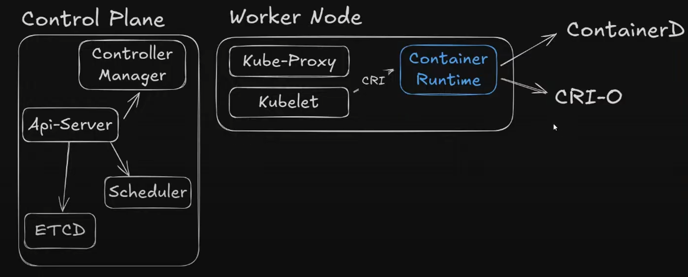

## Aula 1


### 1:40

Sobre como rodar container postgres com variáveis de ambiente

```bash
docker container run -d -p 5432:5432 -e POSTGRES\_PASSWORD=Pg@123 -e POSTGRES\_USER=maratona -e POSTGRES\_DB=maratona postgres
```

### 2:04

É possível criar e excluir e gerenciar containers com a IA

IA é uma facilitadora, você utiliza ela como ferramenta para interagir com o container, mas é o conhecimento do devops que vai ditar o que ele que fazer com o container

IA não deve decidir as escolhas, mas apenas facilitar e otimizar o trabalho do devops


### 2:24

Criando imagem com Docker build

```bash
docker build -t conversao-temperatura -f Dockerfile .
```

```bash
docker run -d -p 8080:8080 conversao-temperatura
```


### 2:35


Para um projeto node ver a versão do node na nossa maquina e adicionar ele no FROM do dockerfile e dai como fizemos uma alteração no docekre file temos que criar uma nova imagem

usamos o padrão:


```bash
namespace/repositório:tag
```

proprietário/repositório:versão


```bash
docker build -t diegusfr/conversao-temperatura:v1 -f Dockerfile .
```

Fazer um push no meu repositório:


```bash
docker push diegusfr/conversao-temperatura:v1
```


**=====================================================================================**


# **Aula 2**


## Porque usar Kubernets?

O Docker é uma ferramenta poderosa, mas ele apenas isola o ambiente e virtualiza ele, para poder gerenciar vários containers precisamos de um orquestrador de containers, podemos usar Docker Swarm, ou o Kubernets 


## Cluster

É um conjunto de máquinas, onde cada maquina exerce 1 de dois papeis possiveis, como **Plane** ou como  **Worker Node**

### Control Plane

é o orquetsrador do Cluster Kubernets, como se fosse o maestro de uma orquestra, garantindo que todos os musicos (containers) sejam gerenciados.

  - API-Sever

Faz parte do control plane e é a porta de entrada do cluster Kubernet, toda vez que executamos um comando ou uma chama de API, estamos nos comunicando com o API server 

  - ETCD

Banco de dados, todas as informações do cluster kubernets são armazendas nele, registrando deployments e pods, persistindo dados.
NBão é possivel acessra ele diretamente para acessar informações, apenas via API-server

  - Scheduler

Endereça a execução dos container, a função dele é toda vez que o api server recebe a requisição para criar ou executra um container no cluster,é enviado ao scheduler que analisa toda a especificação do que vai ser executado, o pod e do container, para dai sim ele eleger em qual worker node o container vai ser executado.

  - Controller Manager

O kubernets trabalha com base nos estados e parametros que estão sendo executados.
Quando executamos processos e serviços isso forma o estado no nosso cluster kubernets 

Parametro: Numero de nodes = 4
Se um worker node cair, passa para 3, isso é uma mudança de estado no cluster kubernets

Os controladores (que são varios no controller manager) vizualizam esses parametros e tomam uma decisão com base no estado do cluster kubernets.


### Worker Node

Cria os container e execurta as aplicações (musicos)

  - Kub-Proxy

Responsavél pela Comunicação de rede do cluster

  - Kubelet

Garante e assegura a execução dos containers

  - Container Runtime

O kubelet se comunica com o container runtime, atravéz do **CRI** (Container Runtime Interface) para saber como esta a execução desses containers e verificar o estado de execiução dos container, caso algo não esteja como esperado o kubelet se comunica com o api-server

O docker é um container run, porem no Container Runtime não utiliza mais docker, porque o docker não suporta o **CRI**. Dessa forma no Container Runtime do docker é usado **ConatinerD** ou **CRI-O**.




## Cloud (Kubernets as a Service)

  - AWS -> EKS
  - Azure -> AKS
  - GCP -> GKE

Também é possivel usar o Kubernets Local (On-premisse). Ferramentas:

  - Kind
  - K3D
  ...

---

## Iniciando 

  1. **Criar Cluster na Cloud**

  2. **Instalação do Kubectl**

o kubectl é a principal ferramenta de linha de comando para dar ordens e controlar clusters Kubernetes.

#### **No Linux via WSL**

Execute no terminal do WSL (Ubuntu ou outra distro Linux):

```bash
curl -LO "https://dl.k8s.io/release/$(curl -sL https://dl.k8s.io/release/stable.txt)/bin/linux/amd64/kubectl"

sudo install -o root -g root -m 0755 kubectl /usr/local/bin/kubectl

kubectl version --client
```

---

#### **No Windows usando o WinGet**

```powershell
winget install -e --id Kubernetes.kubectl
```

---


 3. **Baixar Config File**

 Precismaos baixar o arquivo de configuração do nosso cluster Kubernets, para podemros nos comunicar com ele pelo kubectl.

 O arquivo é um **kubeconfig.yml**

 


