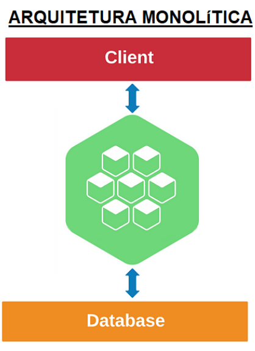
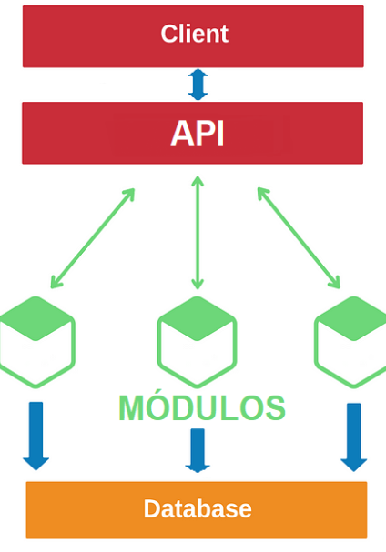
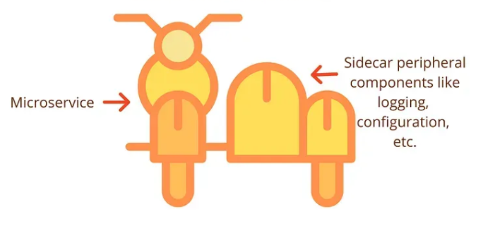
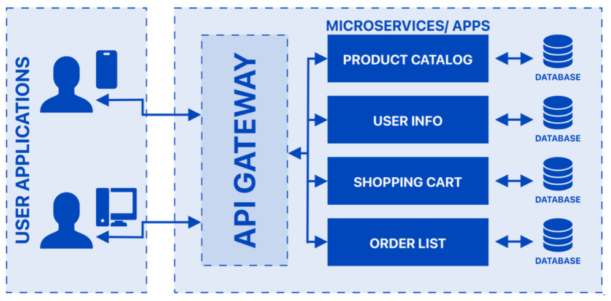
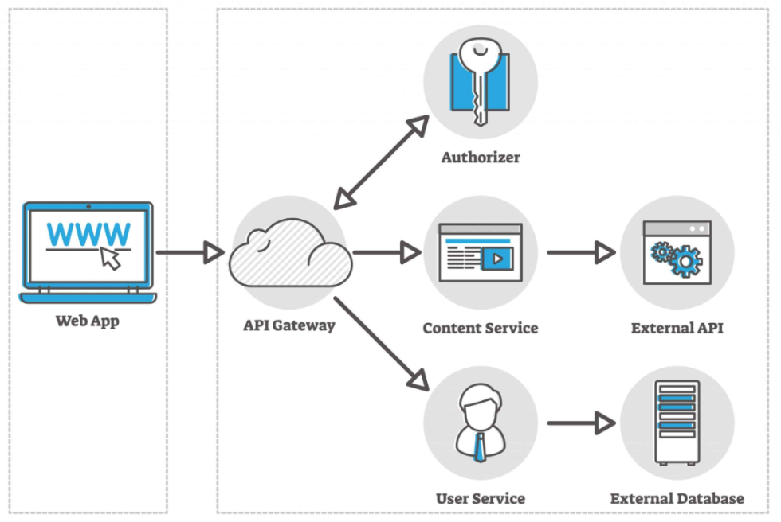
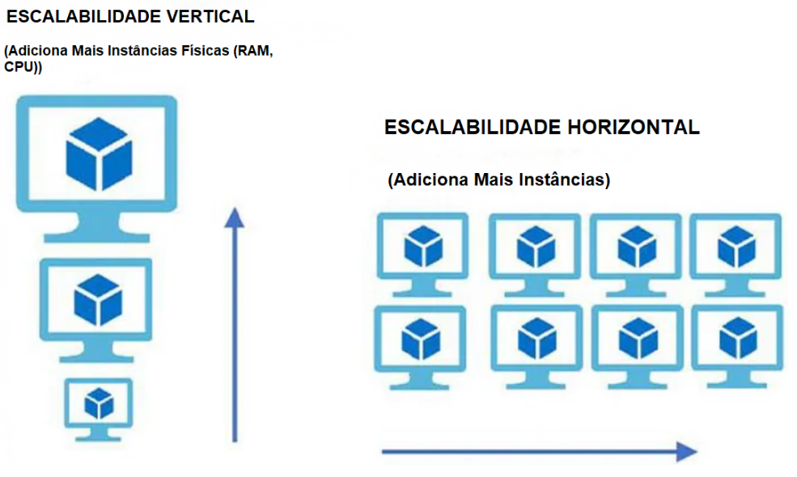

# Arquitetura de Microsserviços

## Sumário Interativo

* [Arquitetura de Microsserviços](#arquitetura-de-microsserviços)

  * [1. Onde o código roda: Client-Side × Server-Side](#1-onde-o-código-roda-client-side--server-side)

    * [1.2 Client-Side](#12-client-side)
    * [1.3 Server-Side](#13-server-side)
  * [2. Como agrupar o sistema: Monolito × Microsserviços](#2-como-agrupar-o-sistema-monolito--microsserviços)

    * [2.1 Arquitetura Monolítica](#21-arquitetura-monolítica)
    * [2.2 Arquitetura de Microsserviços](#22-arquitetura-de-microsserviços)
  * [3. Padrões internos em Microsserviços](#3-padrões-internos-em-microsserviços)
  * [4. Conclusão rápida](#4-conclusão-rápida)

* [Microsserviços: padrões práticos](#microsserviços-padrões-práticos)

  * [1. Strangler Pattern – migração incremental](#1-strangler-pattern--migração-incremental)
  * [2. Sidecar Pattern – capacidades sem alterar o serviço](#2-sidecar-pattern--capacidades-sem-alterar-o-serviço)
  * [3. API Gateway – entrada única](#3-api-gateway--entrada-única)

* [Arquitetura Serverless](#arquitetura-serverless)

  * [Visão rápida](#visão-rápida)
  * [Componentes essenciais](#componentes-essenciais)
  * [Vantagens](#vantagens)
  * [Desvantagens](#desvantagens)
  * [Casos de uso](#casos-de-uso)

* [Escalabilidade](#escalabilidade)

  * [Vertical (scale-up)](#vertical-scale-up)
  * [Horizontal (scale-out)](#horizontal-scale-out)

---

## 1. Onde o código roda: Client-Side × Server-Side

### 1.1 Visão geral

Em qualquer aplicação web, dividimos responsabilidades entre o **cliente** (navegador) e o **servidor** (back-end). Essa separação dita onde a lógica é executada, como os dados trafegam e quais tecnologias entram em cena.

### 1.2 Client-Side

Responsável por **interface e interatividade**.

* **Tecnologias comuns:** HTML (estrutura), CSS (estilo) e JavaScript (dinâmica).
* **Fluxo simplificado**

  1. O navegador pede recursos ao servidor.
  2. Recebe HTML, CSS e JS.
  3. Renderiza a página e executa scripts.
  4. Mostra a interface pronta ao usuário.

### 1.3 Server-Side

Responsável por **lógica de negócios, acesso a dados e segurança**.

* **Tecnologias comuns:** Node.js, Python, Java, Ruby on Rails, PHP.
* **Fluxo simplificado**

  1. Recebe a requisição do cliente.
  2. Processa regras, consulta bancos de dados, faz cálculos.
  3. Devolve dados ou páginas já prontas para exibição.

---

## 2. Como agrupar o sistema: Monolito × Microsserviços

### 2.1 Arquitetura Monolítica

A aplicação inteira é compilada, implantada e escalada **como um único bloco**.

Fonte: https://medium.com/totvsdevelopers/seguran%C3%A7a-das-apis-como-proteger-seu-ecossistema-de-microsservi%C3%A7os-12bb793d162c

* **Vantagens**

  * Começo rápido: um único projeto.
  * Comunicação interna direta (memória compartilhada).
* **Desvantagens**

  * Escalabilidade “tudo ou nada”: para suportar carga, replica-se o sistema inteiro.
  * Manutenção arriscada: mudança em um módulo pode quebrar tudo.
  * Pouca liberdade tecnológica: atualizar a stack implica refatorar o monolito inteiro.

### 2.2 Arquitetura de Microsserviços

A aplicação é quebrada em **serviços menores e autônomos**, cada um focado em uma funcionalidade e comunicando-se por APIs.

Fonte: https://medium.com/totvsdevelopers/seguran%C3%A7a-das-apis-como-proteger-seu-ecossistema-de-microsservi%C3%A7os-12bb793d162c

* **Vantagens**

  * Escala seletiva: cada serviço cresce conforme a sua demanda.
  * Atualizações isoladas: altera-se um serviço sem parar o resto.
  * Stack flexível: cada serviço usa a tecnologia (Linguagem de Programação e Frameworks) mais adequada.
  * Resiliência: falha em um serviço não derruba o sistema todo.

* **Desvantagens**

  * Configuração inicial mais trabalhosa devido a orquestração (Configuração de loadBalancer por exemplo), deployment e monitoramento.
  * Comunicação distribuída sujeita a latência e falhas.
  * Consistência de dados mais complexa (transações cruzando serviços).

## 3. Padrões internos em Microsserviços

| Papel do serviço        | Função principal                | Exemplo rápido                                                 |
| ----------------------- | ------------------------------- | -------------------------------------------------------------- |
| **Data Service**        | Isola acesso ao banco (CRUD)    | Serviço “Usuários” que oferece *getUser*, *updateProfile*      |
| **Business Service**    | Contém a regra de negócio       | Serviço “Pedidos” cria pedido, verifica estoque, calcula total |
| **Translation Service** | Converte formatos ou protocolos | Adapta dados de um sistema legado para JSON/REST               |
| **Edge Service**        | Porta de entrada dos clientes   | Gateway que autentica, aplica rate-limit e agrega dados        |

### Como interagem

1. **Edge Service** recebe a requisição, autentica e roteia.
2. Encaminha ao **Business Service** relevante.
3. O Business consulta ou atualiza dados através do **Data Service**.
4. Se necessário, **Translation Service** adapta formatos antes de responder.

Essa divisão mantém cada responsabilidade clara, facilita testes e permite evoluir partes específicas sem impactar o todo.

## 4. Conclusão rápida

* **Arquitetura** determina qualidade do software a longo prazo.
* **Client-/Server-side** define *onde* o código executa.
* **Monolito** é simples de começar, mas rígido na evolução.
* **Microsserviços** dão flexibilidade e resiliência, ao preço de mais complexidade inicial.
* **Tipificação de serviços** (Data, Business, Translation, Edge) ajuda a manter ordem em ecossistemas distribuídos.

Com esses fundamentos, você já consegue avaliar qual abordagem se alinha melhor às necessidades de um projeto e planejar a evolução de forma consciente e estruturada.

---

# Microsserviços: padrões práticos

## 1. Strangler Pattern – migração incremental

O **Strangler Pattern** permite substituir um sistema legado por microsserviços sem paradas bruscas. A ideia é envolver o código antigo com serviços novos até que ele desapareça, tal qual uma trepadeira sufoca a árvore.

**Como funciona**

1. **Isolar funcionalidades** — separe módulos do legado que possam nascer como serviços independentes.
2. **Reescrever aos poucos** — cada módulo vira um microsserviço, mas continua integrado ao resto.
3. **Redirecionar chamadas** — quando o serviço novo assume a função, o tráfego sai do legado e aponta para ele.
4. **Aposentar o código antigo** — módulos totalmente cobertos pelos microsserviços são desativados.

**Por que usar**

* Zero downtime durante a migração.
* Redução de risco: caso o novo serviço falhe, basta voltar o tráfego para o legado.
* Permite testar tecnologias e padrões modernos em pequena escala antes de expandir.

## 2. Sidecar Pattern – adicionando capacidades sem alterar o serviço

O **Sidecar Pattern** executa um contêiner (ou processo) “acoplado” ao micro­serviço principal, fornecendo funções transversais — segurança, logs, cache — sem tocar no código de negócio.

Fonte: https://anshusharma98204.medium.com/mastering-microservices-in-nestjs-powerful-design-patterns-for-flexibility-resilience-and-b4f261a2d54f

**Mecânica**

* **Implantação conjunta** — serviço e sidecar sobem e descem juntos, cada um com seu executável.
* **Comunicação local** — troca de dados via localhost ou pipes, sem saltos de rede externos.
* **Escala sincronizada** — aumentou a instância do serviço? O sidecar cresce na mesma proporção.

**Casos clássicos**

* **Segurança** — TLS, OAuth, verificação de tokens.
* **Observabilidade** — coleta de métricas e logs.
* **Proxy** — balancear ou rotear tráfego interno.

**Vantagens-chave**

* Desacoplamento total da lógica de negócio.
* Reuso: o mesmo sidecar serve dezenas de serviços.
* Atualizações rápidas: troca o sidecar, não o serviço.

## 3. API Gateway – entrada única para o ecossistema

O **API Gateway** é o front door dos microsserviços: recebe todas as requisições externas, decide a rota, aplica políticas de segurança e devolve uma resposta unificada.

Fonte: https://medium.com/@sahintalha1/high-level-system-architecture-of-booking-com-06c199003d94

**Responsabilidades típicas**

* **Roteamento** — mapear URL → microserviço.
* **Autenticação/Autorização** — validar JWT, checar permissões.
* **Agregação** — juntar respostas de vários serviços em uma só payload.
* **Rate limiting** e **caching** para proteger recursos.
* **Balanceamento de carga** entre instâncias.
* **Monitoramento e logs** centralizados.
* **Transformação de protocolo** (HTTP ↔ gRPC, por exemplo).

**Fluxo resumido**

1. Cliente chama o Gateway.
2. Gateway valida credenciais e regra de acesso.
3. Encaminha à(s) instância(s) correta(s).
4. Recebe respostas, agrega ou transforma se preciso.
5. Devolve a resposta final ao cliente.

**Ferramentas populares**

Kong, Nginx, AWS API Gateway, Netflix Zuul, Traefik.

**Prós**

* Simplifica o lado do cliente com um único endpoint.
* Centraliza segurança, métricas e políticas globais.
* Facilita a escalabilidade independente dos serviços internos.

**Contras**

* Ponto único de falha (mitigável com redundância).
* Latência extra.
* Mais complexidade operacional.

---

# Arquitetura Serverless

A arquitetura **serverless** delega todo o gerenciamento de servidores ao provedor de nuvem. O desenvolvedor escreve apenas **funções**; o provedor cuida de provisionar, escalar e manter os recursos.

Fonte: https://www.istockphoto.com/br/vetor/conceito-de-vetor-do-servi%C3%A7o-vpn-gm859921052-142166607

## Visão rápida (começo simples)

* **Escalabilidade automática**: cresce ou encolhe com a demanda.
* **Modelo por evento**: cada função roda quando algo acontece (HTTP, fila, IoT, cron).
* **Pagamento sob demanda**: cobra só pelos milissegundos de execução e memória usada.
* **Zero infraestrutura visível**: nada de patch, backup ou monitoramento de VM.

## Componentes essenciais (passando ao nível intermediário)

| Peça                      | Papel                                | Exemplos                           |
| ------------------------- | ------------------------------------ | ---------------------------------- |
| **FaaS**                  | Executar código sob evento           | AWS Lambda, Google Cloud Functions |
| **Banco serverless**      | Persistir dados escalando sozinho    | DynamoDB, Firestore                |
| **API Gateway**           | Entrada única, segurança, rate-limit | Kong, AWS API Gateway              |
| **Barramento de eventos** | Encadear funções em tempo real       | Kafka, EventBridge                 |

Esses blocos se conectam via eventos: um Gateway dispara a função, que grava no banco ou publica novo evento, encadeando outras funções.

## Vantagens (desenvolvedor ganha velocidade)

* **Custos operacionais mínimos**
* **Foco na lógica de negócio** — sem “dev-ops” para subir VM.
* **Alta disponibilidade e escala nativa**
* **Implantação rápida** — pequenos arquivos ZIP ou containers.

## Desvantagens (pontos a vigiar)

* **Cold start**: primeira invocação é lenta depois de inatividade.
* **Vendor lock-in**: APIs específicas dificultam migração.
* **Observabilidade limitada**: difícil depurar linha a linha.
* **Execuções longas podem ficar caras**.

## Casos de uso (quando brilha)

Micro­serviços leves, back-ends móveis, ingesta de IoT, processamento em lotes curtos, pipelines de dados e mídia sob demanda.

---

# Escalabilidade 

Escalabilidade mede quão bem o sistema absorve **mais carga** sem perder desempenho.

## Vertical (scale-up)

Adicionar **CPU/RAM** na mesma máquina.

* **Prós**: simples, nenhum ajuste de software distribuído.
* **Contras**: limite físico; não resolve picos massivos; downtime para upgrade.

## Horizontal (scale-out)

Adicionar **novas instâncias** e dividir o tráfego.

* **Prós**: praticamente ilimitado; ideal para microsserviços e serverless.
* **Cuidados**: balancear requisições, replicar estado, garantir consistência.

Fonte: https://medium.com/design-microservices-architecture-with-patterns/scalability-vertical-scaling-horizontal-scaling-adb52ff679f

> **Regra prática**: use vertical para ganhos rápidos ou legados; planeje horizontal desde o início para apps modernas e elásticas.

---

