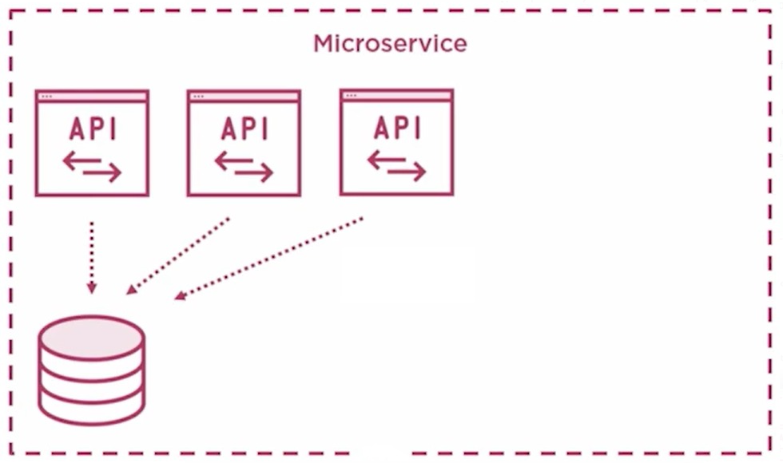
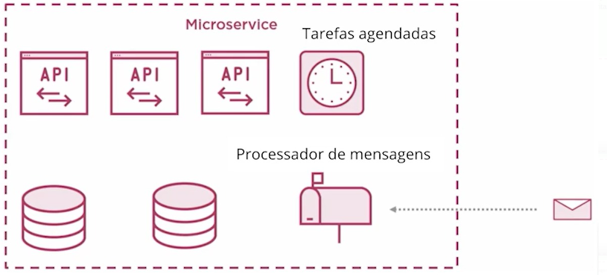

# Arquitetura de Microsserviços

## Sumário Interativo

* [Arquitetura de Microsserviços](#arquitetura-de-microsserviços)

  * [1. Onde o código roda: Client-Side × Server-Side](#1-onde-o-código-roda-client-side--server-side)

    * [1.2 Client-Side](#12-client-side)
    * [1.3 Server-Side](#13-server-side)
  * [2. Como agrupar o sistema: Monolito × Microsserviços](#2-como-agrupar-o-sistema-monolito--microsserviços)

    * [2.1 Arquitetura Monolítica](#21-arquitetura-monolítica)
    * [2.2 Arquitetura de Microsserviços](#22-arquitetura-de-microsserviços)
  * [3. Padrões internos em Microsserviços](#3-padrões-internos-em-microsserviços)
  * [4. Conclusão rápida](#4-conclusão-rápida)

* [Microsserviços: padrões práticos](#microsserviços-padrões-práticos)

  * [1. Strangler Pattern – migração incremental](#1-strangler-pattern--migração-incremental)
  * [2. Sidecar Pattern – capacidades sem alterar o serviço](#2-sidecar-pattern--capacidades-sem-alterar-o-serviço)
  * [3. API Gateway – entrada única](#3-api-gateway--entrada-única)

* [Arquitetura Serverless](#arquitetura-serverless)

  * [Visão rápida](#visão-rápida)
  * [Componentes essenciais](#componentes-essenciais)
  * [Vantagens](#vantagens)
  * [Desvantagens](#desvantagens)
  * [Casos de uso](#casos-de-uso)

* [Escalabilidade](#escalabilidade)

  * [Vertical (scale-up)](#vertical-scale-up)
  * [Horizontal (scale-out)](#horizontal-scale-out)

---

## 1. Onde o código roda: Client-Side × Server-Side

### 1.1 Visão geral

Em qualquer aplicação web, dividimos responsabilidades entre o **cliente** (navegador) e o **servidor** (back-end). Essa separação dita onde a lógica é executada, como os dados trafegam e quais tecnologias entram em cena.

### 1.2 Client-Side

Responsável por **interface e interatividade**.

* **Tecnologias comuns:** HTML (estrutura), CSS (estilo) e JavaScript (dinâmica).
* **Fluxo simplificado**

  1. O navegador pede recursos ao servidor.
  2. Recebe HTML, CSS e JS.
  3. Renderiza a página e executa scripts.
  4. Mostra a interface pronta ao usuário.

### 1.3 Server-Side

Responsável por **lógica de negócios, acesso a dados e segurança**.

* **Tecnologias comuns:** Node.js, Python, Java, Ruby on Rails, PHP.
* **Fluxo simplificado**

  1. Recebe a requisição do cliente.
  2. Processa regras, consulta bancos de dados, faz cálculos.
  3. Devolve dados ou páginas já prontas para exibição.

---

## 2. Como agrupar o sistema: Monolito × Microsserviços

### 2.1 Arquitetura Monolítica

A aplicação inteira é compilada, implantada e escalada **como um único bloco**.

Fonte: https://medium.com/totvsdevelopers/seguran%C3%A7a-das-apis-como-proteger-seu-ecossistema-de-microsservi%C3%A7os-12bb793d162c

* **Vantagens**

  * Começo rápido: um único projeto.
  * Comunicação interna direta (memória compartilhada).
* **Desvantagens**

  * Escalabilidade “tudo ou nada”: para suportar carga, replica-se o sistema inteiro.
  * Manutenção arriscada: mudança em um módulo pode quebrar tudo.
  * Pouca liberdade tecnológica: atualizar a stack implica refatorar o monolito inteiro.

### 2.2 Arquitetura de Microsserviços

A aplicação é quebrada em **serviços menores e autônomos**, cada um focado em uma funcionalidade e comunicando-se por APIs.

Fonte: https://medium.com/totvsdevelopers/seguran%C3%A7a-das-apis-como-proteger-seu-ecossistema-de-microsservi%C3%A7os-12bb793d162c

* **Vantagens**

  * Escala seletiva: cada serviço cresce conforme a sua demanda.
  * Atualizações isoladas: altera-se um serviço sem parar o resto.
  * Stack flexível: cada serviço usa a tecnologia (Linguagem de Programação e Frameworks) mais adequada.
  * Resiliência: falha em um serviço não derruba o sistema todo.

* **Desvantagens**

  * Configuração inicial mais trabalhosa devido a orquestração (Configuração de loadBalancer por exemplo), deployment e monitoramento.
  * Comunicação distribuída sujeita a latência e falhas.
  * Consistência de dados mais complexa (transações cruzando serviços).

### Exemplo

Em um sistema de vendas online, cada parte da loja (catálogo, pedidos, pagamento) é uma aplicação independente, um microsserviço. Cada um tem sua responsabilidade bem definida e seu próprio banco de dados. Se um serviço falha, os outros continuam funcionando, oferecendo flexibilidade e permitindo que os usuários continuem navegando e comprando, mesmo que algumas funcionalidades estejam temporariamente indisponíveis

## 3. Tipos de Microsserviços e seus padrões

| Papel do serviço        | Função principal                | Exemplo rápido                                                 |
| ----------------------- | ------------------------------- | -------------------------------------------------------------- |
| **Data Service**        | Isola acesso ao banco (CRUD)    | Serviço “Usuários” que oferece *getUser*, *updateProfile*      |
| **Business Service**    | Contém a regra de negócio       | Serviço “Pedidos” cria pedido, verifica estoque, calcula total |
| **Translation Service** | Converte formatos ou protocolos | Adapta dados de um sistema legado para JSON/REST               |
| **Edge Service**        | Porta de entrada dos clientes   | Gateway que autentica, aplica rate-limit e agrega dados        |

### Como interagem

1. **Edge Service** recebe a requisição, autentica e roteia.
2. Encaminha ao **Business Service** relevante.
3. O Business consulta ou atualiza dados através do **Data Service**.
4. Se necessário, **Translation Service** adapta formatos antes de responder.

Essa divisão mantém cada responsabilidade clara, facilita testes e permite evoluir partes específicas sem impactar o todo.

---

# Separação de Serviços em Microsserviços

## Monolito por Padrão

A abordagem "Monolito por padrão" de Martin Fowler sugere que, ao iniciar um projeto, é mais sensato começar com uma arquitetura monolítica. Isso permite que a equipe compreenda o domínio do problema, implemente as regras de negócio e construa uma base sólida. Somente quando partes específicas da aplicação se tornam complexas ou exigem maior escalabilidade, elas devem ser separadas em microsserviços, evoluindo gradualmente para uma arquitetura mais distribuída e flexível.

## Introdução à Separação de Serviços

Em microsserviços, é crucial saber como dividir uma aplicação grande em partes menores e independentes. Nesta aula, vamos focar em como identificar e separar os chamados "serviços de domínio".

### O que são Serviços de Domínio?

- São serviços que cuidam de uma parte específica do seu negócio (o "domínio").
- Eles garantem que as regras do negócio sejam seguidas.
- **Exemplo**: Um serviço de domínio para "Estudantes" na Alura cuidaria de matrículas, informações e regras específicas para estudantes.

### Domain-driven Design (DDD): O Guia para Encontrar Domínios

- DDD é uma forma de pensar que ajuda a entender bem o seu negócio.
- Com DDD, fica mais fácil identificar os domínios e separá-los em serviços.

### Mão na Massa: Modelando o Domínio

- **Pense no Domínio, Não na Persistência**: Imagine que você está criando um serviço para estudantes. Comece pensando nas regras e ações importantes (matrícula, atualização de dados, etc.), sem se preocupar onde os dados serão guardados.
- **Conheça o Negócio**: Entenda profundamente como as coisas funcionam no seu negócio. Quais são as regras para matricular um estudante? O que pode ser alterado depois da matrícula?
- **Decida as Ações**: Quais ações o serviço vai permitir? Matricular, atualizar dados, consultar informações?

### Construindo o Serviço

- **Contrato Primeiro**: Defina como as ações serão expostas (matrícula, atualização, etc.).
- **Implementação Depois**: Escreva o código que faz as ações funcionarem.
- **Escolha os Verbos HTTP**: Use `PUT` para atualizar tudo e `PATCH` para atualizar partes.

### REST e RPC: Amigos ou Inimigos?

- **REST**: Representa recursos (ex: dados de um estudante).
- **RPC**: Chama ações (ex: "matricular estudante").
- **Eles podem coexistir**: Você pode usar os dois para expor seu serviço.

### REST ou RPC? Eis a Questão:

- **REST**: Libera todos os dados do recurso.
- **RPC**: Permite expor apenas operações específicas.
- Pense bem no que você quer que seu serviço faça e escolha a melhor opção.

### Conclusão

Separar serviços de domínio é essencial para criar microsserviços bem definidos e fáceis de manter. Use o DDD para entender seu negócio, modele o domínio com cuidado e escolha a melhor forma de expor seu serviço (REST, RPC ou ambos).

---

## Serviços de Negócio

Imagine que você está montando uma banda. Cada músico (microsserviço) é especialista em um instrumento (domínio). O serviço de negócio é o maestro que coordena todos esses músicos para criar uma sinfonia (processo de negócio) completa e harmoniosa.

### O Que São Serviços de Negócio?

- **União de Talentos**: Juntam vários serviços de domínio (os especialistas em dados) para realizar tarefas complexas.
- **Visão Estratégica**: Enxergam o "quadro geral" do negócio, coordenando ações entre diferentes áreas.
- **Encapsulamento**: Escondem a complexidade dos processos, oferecendo uma interface simples para o cliente.

### Por Que Usar Serviços de Negócio?

- **Simplificação**: Facilitam a criação de processos complexos, como "matricular um aluno", que envolve várias áreas (cadastro, financeiro, etc.).
- **Organização**: Mantêm o código limpo e fácil de entender, separando responsabilidades.
- **Flexibilidade**: Permitem mudar partes do processo sem afetar o todo.

### Como Criar um Serviço de Negócio?

1. **Identifique o Processo**: Descubra qual tarefa complexa você precisa realizar (ex: "aprovar um pedido").
2. **Reúna os Domínios**: Liste quais áreas (serviços de domínio) são necessárias para completar a tarefa (ex: "estoque", "pagamento", "entrega").
3. **Defina a Orquestração**: Crie um "fluxo de trabalho" que coordene os serviços de domínio, definindo quem faz o quê e quando.
4. **Crie a API**: Desenvolva uma interface simples para o cliente usar o serviço de negócio, escondendo a complexidade interna.

### Exemplo Prático: Matrícula de Aluno

- **Processo**: "Matricular Aluno"
- **Domínios**:
  - Serviço de Estudantes (cadastro)
  - Serviço Financeiro (pagamento)
  - Serviço de Gamificação (recompensas)
- **Orquestração**:
  1. Recebe dados do aluno
  2. Valida dados no Serviço de Estudantes
  3. Cria registro financeiro no Serviço Financeiro
  4. Ativa recompensas no Serviço de Gamificação
  5. Envia confirmação ao aluno
- **API**: Um endpoint simples para receber os dados do aluno e iniciar o processo de matrícula.

### Em Resumo

Serviços de negócio são como maestros que orquestram microsserviços para realizar tarefas complexas. Eles simplificam o desenvolvimento, organizam o código e tornam sua aplicação mais flexível.

# Agregação de Processos em Microsserviços

## O que é um Agregador de Processos?

Imagine que você tem várias pecinhas de Lego (serviços de domínio) que juntas formam pequenos brinquedos (serviços de negócio). Agora, imagine que você quer construir um castelo enorme (um processo complexo). Para isso, você precisa de um "super Lego" que junta vários brinquedos menores. Esse "super Lego" é o **agregador de processos**!

### Em termos técnicos:

- **Serviço de Domínio**: Uma pecinha básica que faz uma tarefa específica.
- **Serviço de Negócio**: Um conjunto de pecinhas que realizam um processo completo.
- **Agregador de Processos**: Um serviço que junta vários serviços de negócio para realizar um processo ainda maior e mais complexo.

## Por que usar um Agregador de Processos?

Quando temos processos muito complexos que dependem de vários outros processos, o **agregador de processos** entra em ação para organizar tudo.

### Exemplo Prático: Renovação de Matrícula na Alura

Pense na renovação de matrícula de um estudante na Alura. Esse processo envolve várias etapas:

- **Matrícula**: Verificar cadastro, inserir ou atualizar dados, realizar pagamento.
- **Análise de Dados**: Coletar dados do estudante, gerar relatórios e métricas do ano anterior.

O **agregador de processos** coordena esses dois processos complexos (matrícula e análise de dados) para realizar a renovação completa.

## Como Funciona o Agregador de Processos?

1. **Recebe a Requisição**: O agregador recebe o pedido de renovação de matrícula com o ID do estudante.
2. **Chama os Serviços**: Ele chama os serviços de matrícula e análise de dados.
3. **Processa as Respostas**: Ele recebe as respostas de cada serviço e as processa. Por exemplo, remove mensagens desnecessárias e formata a resposta final.
4. **Entrega a Resposta**: Ele entrega uma resposta unificada e relevante para o usuário.

## O Novo Modelo de Domínio

Ao criar um agregador, você está essencialmente definindo um **novo modelo para o sistema**, como se fosse um subdomínio.  
No exemplo da renovação de matrícula, criamos um domínio específico para esse processo, com sua própria API (por exemplo, `api.alura.com.br/renovacao-de-matriculas`).

## Em Resumo

- O **agregador de processos** é um serviço de alto nível que coordena múltiplos serviços de negócio.
- Ele é usado para **processos complexos** que envolvem várias etapas.
- Ele **processa as respostas** dos serviços para entregar uma resposta unificada e relevante.
- Ele **cria um novo modelo de domínio** para representar o processo agregado.

---

# Microsserviços: padrões práticos

## 1. Strangler Pattern – migração incremental

O **Strangler Pattern** permite substituir um sistema legado por microsserviços sem paradas bruscas. A ideia é envolver o código antigo com serviços novos até que ele desapareça, tal qual uma trepadeira sufoca a árvore.

**Como funciona**

1. **Isolar funcionalidades** — separe módulos do legado que possam nascer como serviços independentes.
2. **Reescrever aos poucos** — cada módulo vira um microsserviço, mas continua integrado ao resto.
3. **Redirecionar chamadas** — quando o serviço novo assume a função, o tráfego sai do legado e aponta para ele.
4. **Aposentar o código antigo** — módulos totalmente cobertos pelos microsserviços são desativados.

**Por que usar**

* Zero downtime durante a migração.
* Redução de risco: caso o novo serviço falhe, basta voltar o tráfego para o legado.
* Permite testar tecnologias e padrões modernos em pequena escala antes de expandir.

## 2. Sidecar Pattern – adicionando capacidades sem alterar o serviço

O **Sidecar Pattern** executa um contêiner (ou processo) “acoplado” ao micro­serviço principal, fornecendo funções transversais — segurança, logs, cache — sem tocar no código de negócio.

Fonte: https://anshusharma98204.medium.com/mastering-microservices-in-nestjs-powerful-design-patterns-for-flexibility-resilience-and-b4f261a2d54f

**Mecânica**

* **Implantação conjunta** — serviço e sidecar sobem e descem juntos, cada um com seu executável.
* **Comunicação local** — troca de dados via localhost ou pipes, sem saltos de rede externos.
* **Escala sincronizada** — aumentou a instância do serviço? O sidecar cresce na mesma proporção.

**Casos clássicos**

* **Segurança** — TLS, OAuth, verificação de tokens.
* **Observabilidade** — coleta de métricas e logs.
* **Proxy** — balancear ou rotear tráfego interno.

**Vantagens-chave**

* Desacoplamento total da lógica de negócio.
* Reuso: o mesmo sidecar serve dezenas de serviços.
* Atualizações rápidas: troca o sidecar, não o serviço.

## 3. API Gateway – entrada única para o ecossistema

O **API Gateway** é o front door dos microsserviços: recebe todas as requisições externas, decide a rota, aplica políticas de segurança e devolve uma resposta unificada.

Fonte: https://medium.com/@sahintalha1/high-level-system-architecture-of-booking-com-06c199003d94

**Responsabilidades típicas**

* **Roteamento** — mapear URL → microserviço.
* **Autenticação/Autorização** — validar JWT, checar permissões.
* **Agregação** — juntar respostas de vários serviços em uma só payload.
* **Rate limiting** e **caching** para proteger recursos.
* **Balanceamento de carga** entre instâncias.
* **Monitoramento e logs** centralizados.
* **Transformação de protocolo** (HTTP ↔ gRPC, por exemplo).

**Fluxo resumido**

1. Cliente chama o Gateway.
2. Gateway valida credenciais e regra de acesso.
3. Encaminha à(s) instância(s) correta(s).
4. Recebe respostas, agrega ou transforma se preciso.
5. Devolve a resposta final ao cliente.

**Ferramentas populares**

Kong, Nginx, AWS API Gateway, Netflix Zuul, Traefik.

**Prós**

* Simplifica o lado do cliente com um único endpoint.
* Centraliza segurança, métricas e políticas globais.
* Facilita a escalabilidade independente dos serviços internos.

**Contras**

* Ponto único de falha (mitigável com redundância).
* Latência extra.
* Mais complexidade operacional.

---

[🔝 Voltar ao topo](#sumário-interativo)

---

 
 
 

---

# Banco de Dados em Microsserviços

## Introdução

Em microsserviços, a forma como lidamos com os dados é crucial. A decisão entre ter um banco de dados exclusivo para cada serviço ou compartilhar um banco de dados entre vários serviços pode impactar a **escalabilidade**, a **independência** e a **manutenção** do sistema.

---

## 1. Single Service Database (Banco de Dados de Serviço Único)

### O que é:
Cada microsserviço tem seu **próprio banco de dados**.

### Por que usar:
- **Escalabilidade**: Permite ajustar os recursos do banco de dados de acordo com a necessidade de cada serviço.
- **Independência**: Cada serviço opera de forma isolada, evitando gargalos e facilitando a manutenção.

### Exemplo:
Imagine uma loja online com microsserviços para gerenciar:
- **Produtos**
- **Clientes**
- **Pedidos**

Cada serviço tem seu **próprio banco de dados**:
- O serviço de produtos, que recebe muitas requisições, pode ter um banco robusto.
- O serviço de clientes, com menos tráfego, pode usar um banco mais simples.

---

## 2. Shared Service Database (Banco de Dados de Serviço Compartilhado)

### O que é:
Vários microsserviços **compartilham o mesmo banco de dados**.

### Quando usar:
- Exigências contratuais.
- Necessidade de centralizar os dados.

### Como usar:
- Trate o banco de dados compartilhado como se fossem bancos separados em termos de **acesso e operação**.
- Cada serviço deve interagir com o banco de forma **independente**.

### Exemplo:
Por questões contratuais, todos os dados da loja online precisam estar em **um único banco**.  
Mesmo assim, os serviços de produtos, clientes e pedidos devem acessar esse banco:
- Como se fossem separados
- Com suas próprias regras e permissões

---

## Resumo

| Abordagem               | Vantagens                              | Quando Usar                           |
|-------------------------|----------------------------------------|----------------------------------------|
| **Single Service DB**   | Escalabilidade, independência          | Ideal para microsserviços             |
| **Shared Service DB**   | Centralização de dados (quando necessário) | Quando há restrições ou exigências externas |

---

# Padrões de Codificação

Padrões são como "receitas" que seguimos ao escrever código, garantindo que ele seja **organizado**, **fácil de entender** e **manter**.

---

## CQRS (Command Query Responsibility Segregation)

### O que é:
Um padrão que **separa modelos para escrita e leitura de dados**:

- **Escrita**: Inserção e atualização de dados
- **Leitura**: Consulta e exibição de informações

### Metáfora:
Imagine que você tem duas "salas":
- Uma sala só para **escrever**
- Outra sala só para **ler**

Cada sala é **otimizada** para sua função.

### Exemplo:
Em um sistema com:
- **Muitos acessos (leituras)**
- **Poucas alterações (escritas)**

Pode-se usar:
- Um banco **rápido** para leitura
- Um banco separado para escrita
- Ambos são **sincronizados** posteriormente

---

## Vantagens do CQRS

- **Otimização**: Cada modelo pode ser ajustado para desempenho ideal
- **Flexibilidade**: Possibilidade de combinar dados de múltiplas fontes na leitura
- **Organização**: Código mais limpo e com responsabilidades separadas

> ⚠️ **Atenção**: CQRS aumenta a **complexidade** do sistema. Avalie se realmente há necessidade antes de adotá-lo.

---

## Na Prática

- **Modelo de Escrita**: Classe que representa como os dados serão inseridos/atualizados
- **Modelo de Leitura**: Classe que representa como os dados serão lidos/exibidos

Essa separação permite:
- Gerar novos dados
- Combinar informações de diferentes lugares
- Organizar melhor a estrutura do sistema

---

[🔝 Voltar ao topo](#sumário-interativo)

---

 
 
 

---

# Componentes de um Microsserviço

UM microserviço é é responsavel por gereniar seus propiors dados, será que um microswrviço pe um uncoo processo/aplicação rodando em um unico servidor?

## Código da Aplicação (API)

- É a **"cara" do microsserviço**, a parte que se comunica com o mundo exterior.
- Pode ter **várias instâncias rodando simultaneamente** para suportar grande volume de acessos (**load balancing**).

## Banco de Dados

- Onde o microsserviço **guarda seus dados**.
- Pode ter **replicação**, ou seja, várias cópias dos dados, para garantir **segurança** e **rapidez**.

## Tarefas Agendadas

- **Processos automáticos**, executados de tempos em tempos sem interação externa.
- Exemplo: otimizar imagens durante a madrugada, enviar e-mails periódicos, fazer backups.

## Processador de Mensagens

- Monitora eventos e **reage automaticamente** quando algo acontece.
- Exemplo: ao receber um novo pedido, o processador envia uma mensagem ao serviço de entrega.

---

## Por que Tantos Componentes?

### Escalabilidade
- Se a **API ficar sobrecarregada**, basta **adicionar mais servidores** só para ela.

### Otimização
- Cada componente pode ser **alocado em um servidor ideal** para sua função:
  - API: mais CPU
  - Banco de dados: mais armazenamento
  - Tarefas agendadas: menos prioridade

### Resiliência
- Se um banco de dados principal falhar, **a réplica assume automaticamente**, mantendo o sistema estável.

---

## Exemplo Prático: Loja Online (E-commerce)

### Microsserviço de "Pedidos"

- **API**: Recebe os pedidos feitos pelo site.
- **Banco de Dados**: Armazena os detalhes dos pedidos.
- **Processador de Mensagens**: Notifica o microsserviço de "Entrega" assim que um pedido é registrado.

---

## Microsserviços vs. Aplicações Tradicionais

| Característica           | Aplicação Tradicional       | Microsserviços                  |
|--------------------------|-----------------------------|----------------------------------|
| Estrutura                | Tudo em um só sistema       | Módulos independentes           |
| Escalabilidade           | Limitada                    | Por componente                  |
| Manutenção               | Pode afetar todo o sistema  | Afeta apenas o serviço isolado |
| Tecnologias              | Geralmente unificadas       | Podem variar por serviço        |

---

## Importante

Implementar **microsserviços** exige conhecimento em múltiplas áreas:

- **APIs**
- **Bancos de dados**
- **Mensageria e filas**
- **Orquestração e infraestrutura**
- **Sistemas operacionais**
- **Segurança e monitoramento**

Eles trazem **grande flexibilidade** e **robustez**, mas também exigem **boa arquitetura** e **gestão técnica cuidadosa**.

---

[🔝 Voltar ao topo](#sumário-interativo)

---

 
 
 

---

---

# Arquitetura Serverless

A arquitetura **serverless** delega todo o gerenciamento de servidores ao provedor de nuvem. O desenvolvedor escreve apenas **funções**; o provedor cuida de provisionar, escalar e manter os recursos.

Fonte: https://www.istockphoto.com/br/vetor/conceito-de-vetor-do-servi%C3%A7o-vpn-gm859921052-142166607

## Visão rápida (começo simples)

* **Escalabilidade automática**: cresce ou encolhe com a demanda.
* **Modelo por evento**: cada função roda quando algo acontece (HTTP, fila, IoT, cron).
* **Pagamento sob demanda**: cobra só pelos milissegundos de execução e memória usada.
* **Zero infraestrutura visível**: nada de patch, backup ou monitoramento de VM.

## Componentes essenciais (passando ao nível intermediário)

| Peça                      | Papel                                | Exemplos                           |
| ------------------------- | ------------------------------------ | ---------------------------------- |
| **FaaS**                  | Executar código sob evento           | AWS Lambda, Google Cloud Functions |
| **Banco serverless**      | Persistir dados escalando sozinho    | DynamoDB, Firestore                |
| **API Gateway**           | Entrada única, segurança, rate-limit | Kong, AWS API Gateway              |
| **Barramento de eventos** | Encadear funções em tempo real       | Kafka, EventBridge                 |

Esses blocos se conectam via eventos: um Gateway dispara a função, que grava no banco ou publica novo evento, encadeando outras funções.

## Vantagens (desenvolvedor ganha velocidade)

* **Custos operacionais mínimos**
* **Foco na lógica de negócio** — sem “dev-ops” para subir VM.
* **Alta disponibilidade e escala nativa**
* **Implantação rápida** — pequenos arquivos ZIP ou containers.

## Desvantagens (pontos a vigiar)

* **Cold start**: primeira invocação é lenta depois de inatividade.
* **Vendor lock-in**: APIs específicas dificultam migração.
* **Observabilidade limitada**: difícil depurar linha a linha.
* **Execuções longas podem ficar caras**.

## Casos de uso (quando brilha)

Micro­serviços leves, back-ends móveis, ingesta de IoT, processamento em lotes curtos, pipelines de dados e mídia sob demanda.

---

# Escalabilidade 

Escalabilidade mede quão bem o sistema absorve **mais carga** sem perder desempenho.

## Vertical (scale-up)

Adicionar **CPU/RAM** na mesma máquina.

* **Prós**: simples, nenhum ajuste de software distribuído.
* **Contras**: limite físico; não resolve picos massivos; downtime para upgrade.

## Horizontal (scale-out)

Adicionar **novas instâncias** e dividir o tráfego.

* **Prós**: praticamente ilimitado; ideal para microsserviços e serverless.
* **Cuidados**: balancear requisições, replicar estado, garantir consistência.

Fonte: https://medium.com/design-microservices-architecture-with-patterns/scalability-vertical-scaling-horizontal-scaling-adb52ff679f

> **Regra prática**: use vertical para ganhos rápidos ou legados; planeje horizontal desde o início para apps modernas e elásticas.

---

