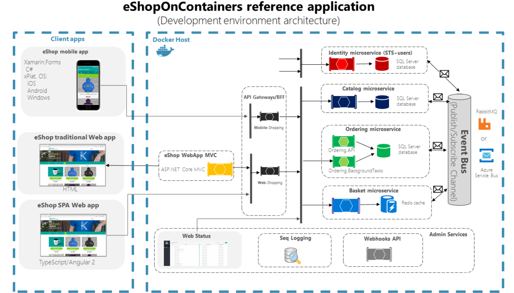

# Arquitetura de Microsserviços

## Sumário Interativo

* [Arquitetura de Microsserviços](#arquitetura-de-microsserviços)

  * [1. Onde o código roda: Client-Side × Server-Side](#1-onde-o-código-roda-client-side--server-side)

    * [1.2 Client-Side](#12-client-side)
    * [1.3 Server-Side](#13-server-side)
  * [2. Como agrupar o sistema: Monolito × Microsserviços](#2-como-agrupar-o-sistema-monolito--microsserviços)

    * [2.1 Arquitetura Monolítica](#21-arquitetura-monolítica)
    * [2.2 Arquitetura de Microsserviços](#22-arquitetura-de-microsserviços)
  * [3. Padrões internos em Microsserviços](#3-padrões-internos-em-microsserviços)
  * [4. Conclusão rápida](#4-conclusão-rápida)

* [Microsserviços: padrões práticos](#microsserviços-padrões-práticos)

  * [1. Strangler Pattern – migração incremental](#1-strangler-pattern--migração-incremental)
  * [2. Sidecar Pattern – capacidades sem alterar o serviço](#2-sidecar-pattern--capacidades-sem-alterar-o-serviço)
  * [3. API Gateway – entrada única](#3-api-gateway--entrada-única)

* [Arquitetura Serverless](#arquitetura-serverless)

  * [Visão rápida](#visão-rápida)
  * [Componentes essenciais](#componentes-essenciais)
  * [Vantagens](#vantagens)
  * [Desvantagens](#desvantagens)
  * [Casos de uso](#casos-de-uso)

* [Escalabilidade](#escalabilidade)

  * [Vertical (scale-up)](#vertical-scale-up)
  * [Horizontal (scale-out)](#horizontal-scale-out)


---

## 1. Onde o código roda: Client-Side × Server-Side

### 1.1 Visão geral

Em qualquer aplicação web, dividimos responsabilidades entre o **cliente** (navegador) e o **servidor** (back-end). Essa separação dita onde a lógica é executada, como os dados trafegam e quais tecnologias entram em cena.

### 1.2 Client-Side

Responsável por **interface e interatividade**.

* **Tecnologias comuns:** HTML (estrutura), CSS (estilo) e JavaScript (dinâmica).
* **Fluxo simplificado**

  1. O navegador pede recursos ao servidor.
  2. Recebe HTML, CSS e JS.
  3. Renderiza a página e executa scripts.
  4. Mostra a interface pronta ao usuário.

### 1.3 Server-Side

Responsável por **lógica de negócios, acesso a dados e segurança**.

* **Tecnologias comuns:** Node.js, Python, Java, Ruby on Rails, PHP.
* **Fluxo simplificado**

  1. Recebe a requisição do cliente.
  2. Processa regras, consulta bancos de dados, faz cálculos.
  3. Devolve dados ou páginas já prontas para exibição.

---

## 2. Como agrupar o sistema: Monolito × Microsserviços

### 2.1 Arquitetura Monolítica

A aplicação inteira é compilada, implantada e escalada **como um único bloco**.


Fonte: https://medium.com/totvsdevelopers/seguran%C3%A7a-das-apis-como-proteger-seu-ecossistema-de-microsservi%C3%A7os-12bb793d162c

* **Vantagens**

  * Começo rápido: um único projeto.
  * Comunicação interna direta (memória compartilhada).
* **Desvantagens**

  * Escalabilidade “tudo ou nada”: para suportar carga, replica-se o sistema inteiro.
  * Manutenção arriscada: mudança em um módulo pode quebrar tudo.
  * Pouca liberdade tecnológica: atualizar a stack implica refatorar o monolito inteiro.


### 2.2 Arquitetura de Microsserviços

A aplicação é quebrada em **serviços menores e autônomos**, cada um focado em uma funcionalidade e comunicando-se por APIs.


Fonte: https://medium.com/totvsdevelopers/seguran%C3%A7a-das-apis-como-proteger-seu-ecossistema-de-microsservi%C3%A7os-12bb793d162c

* **Vantagens**

  * Escala seletiva: cada serviço cresce conforme a sua demanda.
  * Atualizações isoladas: altera-se um serviço sem parar o resto.
  * Stack flexível: cada serviço usa a tecnologia (Linguagem de Programação e Frameworks) mais adequada.
  * Resiliência: falha em um serviço não derruba o sistema todo.

* **Desvantagens**

  * Configuração inicial mais trabalhosa devido a orquestração (Configuração de loadBalancer por exemplo), deployment e monitoramento.
  * Comunicação distribuída sujeita a latência e falhas.
  * Consistência de dados mais complexa (transações cruzando serviços).

### Exemplo

Em um sistema de vendas online, cada parte da loja (catálogo, pedidos, pagamento) é uma aplicação independente, um microsserviço. Cada um tem sua responsabilidade bem definida e seu próprio banco de dados. Se um serviço falha, os outros continuam funcionando, oferecendo flexibilidade e permitindo que os usuários continuem navegando e comprando, mesmo que algumas funcionalidades estejam temporariamente indisponíveis


## 3. Tipos de Microsserviços e seus padrões

| Papel do serviço        | Função principal                | Exemplo rápido                                                 |
| ----------------------- | ------------------------------- | -------------------------------------------------------------- |
| **Data Service**        | Isola acesso ao banco (CRUD)    | Serviço “Usuários” que oferece *getUser*, *updateProfile*      |
| **Business Service**    | Contém a regra de negócio       | Serviço “Pedidos” cria pedido, verifica estoque, calcula total |
| **Translation Service** | Converte formatos ou protocolos | Adapta dados de um sistema legado para JSON/REST               |
| **Edge Service**        | Porta de entrada dos clientes   | Gateway que autentica, aplica rate-limit e agrega dados        |

### Como interagem

1. **Edge Service** recebe a requisição, autentica e roteia.
2. Encaminha ao **Business Service** relevante.
3. O Business consulta ou atualiza dados através do **Data Service**.
4. Se necessário, **Translation Service** adapta formatos antes de responder.

Essa divisão mantém cada responsabilidade clara, facilita testes e permite evoluir partes específicas sem impactar o todo.

---

# Separação de Serviços em Microsserviços

## Monolito por Padrão

A abordagem "Monolito por padrão" de Martin Fowler sugere que, ao iniciar um projeto, é mais sensato começar com uma arquitetura monolítica. Isso permite que a equipe compreenda o domínio do problema, implemente as regras de negócio e construa uma base sólida. Somente quando partes específicas da aplicação se tornam complexas ou exigem maior escalabilidade, elas devem ser separadas em microsserviços, evoluindo gradualmente para uma arquitetura mais distribuída e flexível.

## Introdução à Separação de Serviços

Em microsserviços, é crucial saber como dividir uma aplicação grande em partes menores e independentes. Nesta aula, vamos focar em como identificar e separar os chamados "serviços de domínio".

### O que são Serviços de Domínio?

- São serviços que cuidam de uma parte específica do seu negócio (o "domínio").
- Eles garantem que as regras do negócio sejam seguidas.
- **Exemplo**: Um serviço de domínio para "Estudantes" na Alura cuidaria de matrículas, informações e regras específicas para estudantes.

### Domain-driven Design (DDD): O Guia para Encontrar Domínios

- DDD é uma forma de pensar que ajuda a entender bem o seu negócio.
- Com DDD, fica mais fácil identificar os domínios e separá-los em serviços.

### Mão na Massa: Modelando o Domínio

- **Pense no Domínio, Não na Persistência**: Imagine que você está criando um serviço para estudantes. Comece pensando nas regras e ações importantes (matrícula, atualização de dados, etc.), sem se preocupar onde os dados serão guardados.
- **Conheça o Negócio**: Entenda profundamente como as coisas funcionam no seu negócio. Quais são as regras para matricular um estudante? O que pode ser alterado depois da matrícula?
- **Decida as Ações**: Quais ações o serviço vai permitir? Matricular, atualizar dados, consultar informações?

### Construindo o Serviço

- **Contrato Primeiro**: Defina como as ações serão expostas (matrícula, atualização, etc.).
- **Implementação Depois**: Escreva o código que faz as ações funcionarem.
- **Escolha os Verbos HTTP**: Use `PUT` para atualizar tudo e `PATCH` para atualizar partes.

### REST e RPC: Amigos ou Inimigos?

- **REST**: Representa recursos (ex: dados de um estudante).
- **RPC**: Chama ações (ex: "matricular estudante").
- **Eles podem coexistir**: Você pode usar os dois para expor seu serviço.

### REST ou RPC? Eis a Questão:

- **REST**: Libera todos os dados do recurso.
- **RPC**: Permite expor apenas operações específicas.
- Pense bem no que você quer que seu serviço faça e escolha a melhor opção.

### Conclusão

Separar serviços de domínio é essencial para criar microsserviços bem definidos e fáceis de manter. Use o DDD para entender seu negócio, modele o domínio com cuidado e escolha a melhor forma de expor seu serviço (REST, RPC ou ambos).

---

## Serviços de Negócio

Imagine que você está montando uma banda. Cada músico (microsserviço) é especialista em um instrumento (domínio). O serviço de negócio é o maestro que coordena todos esses músicos para criar uma sinfonia (processo de negócio) completa e harmoniosa.

### O Que São Serviços de Negócio?

- **União de Talentos**: Juntam vários serviços de domínio (os especialistas em dados) para realizar tarefas complexas.
- **Visão Estratégica**: Enxergam o "quadro geral" do negócio, coordenando ações entre diferentes áreas.
- **Encapsulamento**: Escondem a complexidade dos processos, oferecendo uma interface simples para o cliente.

### Por Que Usar Serviços de Negócio?

- **Simplificação**: Facilitam a criação de processos complexos, como "matricular um aluno", que envolve várias áreas (cadastro, financeiro, etc.).
- **Organização**: Mantêm o código limpo e fácil de entender, separando responsabilidades.
- **Flexibilidade**: Permitem mudar partes do processo sem afetar o todo.

### Como Criar um Serviço de Negócio?

1. **Identifique o Processo**: Descubra qual tarefa complexa você precisa realizar (ex: "aprovar um pedido").
2. **Reúna os Domínios**: Liste quais áreas (serviços de domínio) são necessárias para completar a tarefa (ex: "estoque", "pagamento", "entrega").
3. **Defina a Orquestração**: Crie um "fluxo de trabalho" que coordene os serviços de domínio, definindo quem faz o quê e quando.
4. **Crie a API**: Desenvolva uma interface simples para o cliente usar o serviço de negócio, escondendo a complexidade interna.

### Exemplo Prático: Matrícula de Aluno

- **Processo**: "Matricular Aluno"
- **Domínios**:
  - Serviço de Estudantes (cadastro)
  - Serviço Financeiro (pagamento)
  - Serviço de Gamificação (recompensas)
- **Orquestração**:
  1. Recebe dados do aluno
  2. Valida dados no Serviço de Estudantes
  3. Cria registro financeiro no Serviço Financeiro
  4. Ativa recompensas no Serviço de Gamificação
  5. Envia confirmação ao aluno
- **API**: Um endpoint simples para receber os dados do aluno e iniciar o processo de matrícula.

### Em Resumo

Serviços de negócio são como maestros que orquestram microsserviços para realizar tarefas complexas. Eles simplificam o desenvolvimento, organizam o código e tornam sua aplicação mais flexível.

# Agregação de Processos em Microsserviços

## O que é um Agregador de Processos?

Imagine que você tem várias pecinhas de Lego (serviços de domínio) que juntas formam pequenos brinquedos (serviços de negócio). Agora, imagine que você quer construir um castelo enorme (um processo complexo). Para isso, você precisa de um "super Lego" que junta vários brinquedos menores. Esse "super Lego" é o **agregador de processos**!

### Em termos técnicos:

- **Serviço de Domínio**: Uma pecinha básica que faz uma tarefa específica.
- **Serviço de Negócio**: Um conjunto de pecinhas que realizam um processo completo.
- **Agregador de Processos**: Um serviço que junta vários serviços de negócio para realizar um processo ainda maior e mais complexo.

## Por que usar um Agregador de Processos?

Quando temos processos muito complexos que dependem de vários outros processos, o **agregador de processos** entra em ação para organizar tudo.

### Exemplo Prático: Renovação de Matrícula na Alura

Pense na renovação de matrícula de um estudante na Alura. Esse processo envolve várias etapas:

- **Matrícula**: Verificar cadastro, inserir ou atualizar dados, realizar pagamento.
- **Análise de Dados**: Coletar dados do estudante, gerar relatórios e métricas do ano anterior.

O **agregador de processos** coordena esses dois processos complexos (matrícula e análise de dados) para realizar a renovação completa.

## Como Funciona o Agregador de Processos?

1. **Recebe a Requisição**: O agregador recebe o pedido de renovação de matrícula com o ID do estudante.
2. **Chama os Serviços**: Ele chama os serviços de matrícula e análise de dados.
3. **Processa as Respostas**: Ele recebe as respostas de cada serviço e as processa. Por exemplo, remove mensagens desnecessárias e formata a resposta final.
4. **Entrega a Resposta**: Ele entrega uma resposta unificada e relevante para o usuário.

## O Novo Modelo de Domínio

Ao criar um agregador, você está essencialmente definindo um **novo modelo para o sistema**, como se fosse um subdomínio.  
No exemplo da renovação de matrícula, criamos um domínio específico para esse processo, com sua própria API (por exemplo, `api.alura.com.br/renovacao-de-matriculas`).

## Em Resumo

- O **agregador de processos** é um serviço de alto nível que coordena múltiplos serviços de negócio.
- Ele é usado para **processos complexos** que envolvem várias etapas.
- Ele **processa as respostas** dos serviços para entregar uma resposta unificada e relevante.
- Ele **cria um novo modelo de domínio** para representar o processo agregado.


---

# Microsserviços: padrões práticos

## 1. Strangler Pattern – migração incremental

O **Strangler Pattern** permite substituir um sistema legado por microsserviços sem paradas bruscas. A ideia é envolver o código antigo com serviços novos até que ele desapareça, tal qual uma trepadeira sufoca a árvore.

**Como funciona**

1. **Isolar funcionalidades** — separe módulos do legado que possam nascer como serviços independentes.
2. **Reescrever aos poucos** — cada módulo vira um microsserviço, mas continua integrado ao resto.
3. **Redirecionar chamadas** — quando o serviço novo assume a função, o tráfego sai do legado e aponta para ele.
4. **Aposentar o código antigo** — módulos totalmente cobertos pelos microsserviços são desativados.

**Por que usar**

* Zero downtime durante a migração.
* Redução de risco: caso o novo serviço falhe, basta voltar o tráfego para o legado.
* Permite testar tecnologias e padrões modernos em pequena escala antes de expandir.

## 2. Sidecar Pattern – adicionando capacidades sem alterar o serviço

O **Sidecar Pattern** executa um contêiner (ou processo) “acoplado” ao micro­serviço principal, fornecendo funções transversais — segurança, logs, cache — sem tocar no código de negócio.


Fonte: https://anshusharma98204.medium.com/mastering-microservices-in-nestjs-powerful-design-patterns-for-flexibility-resilience-and-b4f261a2d54f

**Mecânica**

* **Implantação conjunta** — serviço e sidecar sobem e descem juntos, cada um com seu executável.
* **Comunicação local** — troca de dados via localhost ou pipes, sem saltos de rede externos.
* **Escala sincronizada** — aumentou a instância do serviço? O sidecar cresce na mesma proporção.

**Casos clássicos**

* **Segurança** — TLS, OAuth, verificação de tokens.
* **Observabilidade** — coleta de métricas e logs.
* **Proxy** — balancear ou rotear tráfego interno.

**Vantagens-chave**

* Desacoplamento total da lógica de negócio.
* Reuso: o mesmo sidecar serve dezenas de serviços.
* Atualizações rápidas: troca o sidecar, não o serviço.

## 3. API Gateway – entrada única para o ecossistema

O **API Gateway** é o front door dos microsserviços: recebe todas as requisições externas, decide a rota, aplica políticas de segurança e devolve uma resposta unificada.


Fonte: https://medium.com/@sahintalha1/high-level-system-architecture-of-booking-com-06c199003d94


**Responsabilidades típicas**

* **Roteamento** — mapear URL → microserviço.
* **Autenticação/Autorização** — validar JWT, checar permissões.
* **Agregação** — juntar respostas de vários serviços em uma só payload.
* **Rate limiting** e **caching** para proteger recursos.
* **Balanceamento de carga** entre instâncias.
* **Monitoramento e logs** centralizados.
* **Transformação de protocolo** (HTTP ↔ gRPC, por exemplo).

**Fluxo resumido**

1. Cliente chama o Gateway.
2. Gateway valida credenciais e regra de acesso.
3. Encaminha à(s) instância(s) correta(s).
4. Recebe respostas, agrega ou transforma se preciso.
5. Devolve a resposta final ao cliente.

**Ferramentas populares**

Kong, Nginx, AWS API Gateway, Netflix Zuul, Traefik.

**Prós**

* Simplifica o lado do cliente com um único endpoint.
* Centraliza segurança, métricas e políticas globais.
* Facilita a escalabilidade independente dos serviços internos.

**Contras**

* Ponto único de falha (mitigável com redundância).
* Latência extra.
* Mais complexidade operacional.

---

[🔝 Voltar ao topo](#sumário-interativo)

---

<br>
<br>
<br>

---

# Banco de Dados em Microsserviços

## Introdução

Em microsserviços, a forma como lidamos com os dados é crucial. A decisão entre ter um banco de dados exclusivo para cada serviço ou compartilhar um banco de dados entre vários serviços pode impactar a **escalabilidade**, a **independência** e a **manutenção** do sistema.

---

## 1. Single Service Database (Banco de Dados de Serviço Único)

### O que é:
Cada microsserviço tem seu **próprio banco de dados**.

### Por que usar:
- **Escalabilidade**: Permite ajustar os recursos do banco de dados de acordo com a necessidade de cada serviço.
- **Independência**: Cada serviço opera de forma isolada, evitando gargalos e facilitando a manutenção.

### Exemplo:
Imagine uma loja online com microsserviços para gerenciar:
- **Produtos**
- **Clientes**
- **Pedidos**

Cada serviço tem seu **próprio banco de dados**:
- O serviço de produtos, que recebe muitas requisições, pode ter um banco robusto.
- O serviço de clientes, com menos tráfego, pode usar um banco mais simples.

---

## 2. Shared Service Database (Banco de Dados de Serviço Compartilhado)

### O que é:
Vários microsserviços **compartilham o mesmo banco de dados**.

### Quando usar:
- Exigências contratuais.
- Necessidade de centralizar os dados.

### Como usar:
- Trate o banco de dados compartilhado como se fossem bancos separados em termos de **acesso e operação**.
- Cada serviço deve interagir com o banco de forma **independente**.

### Exemplo:
Por questões contratuais, todos os dados da loja online precisam estar em **um único banco**.  
Mesmo assim, os serviços de produtos, clientes e pedidos devem acessar esse banco:
- Como se fossem separados
- Com suas próprias regras e permissões

---

## Resumo

| Abordagem               | Vantagens                              | Quando Usar                           |
|-------------------------|----------------------------------------|----------------------------------------|
| **Single Service DB**   | Escalabilidade, independência          | Ideal para microsserviços             |
| **Shared Service DB**   | Centralização de dados (quando necessário) | Quando há restrições ou exigências externas |

---

# Padrões de Codificação

Padrões são como "receitas" que seguimos ao escrever código, garantindo que ele seja **organizado**, **fácil de entender** e **manter**.

---

## CQRS (Command Query Responsibility Segregation)

### O que é:
Um padrão que **separa modelos para escrita e leitura de dados**:

- **Escrita**: Inserção e atualização de dados
- **Leitura**: Consulta e exibição de informações

### Metáfora:
Imagine que você tem duas "salas":
- Uma sala só para **escrever**
- Outra sala só para **ler**

Cada sala é **otimizada** para sua função.

### Exemplo:
Em um sistema com:
- **Muitos acessos (leituras)**
- **Poucas alterações (escritas)**

Pode-se usar:
- Um banco **rápido** para leitura
- Um banco separado para escrita
- Ambos são **sincronizados** posteriormente

---

## Vantagens do CQRS

- **Otimização**: Cada modelo pode ser ajustado para desempenho ideal
- **Flexibilidade**: Possibilidade de combinar dados de múltiplas fontes na leitura
- **Organização**: Código mais limpo e com responsabilidades separadas

> ⚠️ **Atenção**: CQRS aumenta a **complexidade** do sistema. Avalie se realmente há necessidade antes de adotá-lo.

---

## Na Prática

- **Modelo de Escrita**: Classe que representa como os dados serão inseridos/atualizados
- **Modelo de Leitura**: Classe que representa como os dados serão lidos/exibidos

Essa separação permite:
- Gerar novos dados
- Combinar informações de diferentes lugares
- Organizar melhor a estrutura do sistema


---

[🔝 Voltar ao topo](#sumário-interativo)

---

<br>
<br>
<br>

---

# Arquitetando Microsserviços

## Componentes de um Microsserviço

Um microsserviço é responsável por gerenciar seus próprios dados, será que um microsserviço é um único processo/aplicação rodando em um único servidor?

Não, um microsserviço não é necessariamente um único processo rodando em um único servidor. Ele é uma unidade lógica de negócio que pode ser composta por múltiplos componentes da API, banco de dados, tarefas agendadas e processadores de mensagens, distribuídos em diferentes servidores ou containers. Essa arquitetura permite escalabilidade, resiliência e independência entre os serviços.


## Código da Aplicação (API)

- É a **"cara" do microsserviço**, a parte que se comunica com o mundo exterior.
- Pode ter **várias instâncias rodando simultaneamente** para suportar grande volume de acessos (**load balancing**).

## Banco de Dados

- Onde o microsserviço **guarda seus dados**.
- Pode ter **replicação**, ou seja, várias cópias dos dados, para garantir **segurança** e **rapidez**.


## Tarefas Agendadas

- **Processos automáticos**, executados de tempos em tempos sem interação externa.
- Exemplo: otimizar imagens durante a madrugada, enviar e-mails periódicos, fazer backups.

## Processador de Mensagens

- Monitora eventos e **reage automaticamente** quando algo acontece.
- Exemplo: ao receber um novo pedido, o processador envia uma mensagem ao serviço de entrega.


---

## Por que Tantos Componentes?

### Escalabilidade
- Se a **API ficar sobrecarregada**, basta **adicionar mais servidores** só para ela.

### Otimização
- Cada componente pode ser **alocado em um servidor ideal** para sua função:
  - API: mais CPU
  - Banco de dados: mais armazenamento
  - Tarefas agendadas: menos prioridade

### Resiliência
- Se um banco de dados principal falhar, **a réplica assume automaticamente**, mantendo o sistema estável.

---

## Exemplo Prático: Loja Online (E-commerce)



## Visão geral da arquitetura

O diagrama mostra a referência **eShopOnContainers**, um e-commerce demo composto por diversos microsserviços **empacotados como contêineres Docker** que rodam em um único host durante o desenvolvimento.
Toda a comunicação é feita por **HTTP** (síncrona) ou por um **Event Bus** (RabbitMQ ou Azure Service Bus) para mensagens assíncronas.

## 1 – Camada de clientes

| Cliente             | Tecnologia             | Como se conecta                         |
| ------------------- | ---------------------- | --------------------------------------- |
| **Mobile app**      | Xamarin.Forms (C#)     | Chama o *API Gateway* “Mobile-Shopping” |
| **Web tradicional** | ASP.NET Core MVC       | Chama o *API Gateway* “Web-Shopping”    |
| **SPA Web**         | Angular 2 + TypeScript | Também passa pelo *API Gateway*         |

Esses Back-ends-for-Frontend (BFF) alojam lógica específica da experiência de cada cliente e encaminham as requisições para os microsserviços adequados.

## 2 – API Gateways / BFF

Dois contêineres (Mobile-Shopping e Web-Shopping) atuam como **gateways**:

* Autenticam a requisição junto ao serviço **Identity**
* Concentram lógica de roteamento, *caching* e composição de respostas
* Simplificam o domínio exposto aos diversos apps

## 3 – Microsserviços de domínio

| Serviço                      | Responsabilidade principal                                          | Persistência  |
| ---------------------------- | ------------------------------------------------------------------- | ------------- |
| **Identity**                 | Autenticação, autorização, gestão de usuários (STS)                 | SQL Server    |
| **Catalog**                  | Listagem de produtos, preços, estoque estático                      | SQL Server    |
| **Basket**                   | Carrinho de compras por usuário                                     | Redis (cache) |
| **Ordering.API**             | Recebe requisição de criação de pedido                              | SQL Server    |
| **Ordering.BackgroundTasks** | Processa pedidos em segundo plano (pagamento, estoque, notificação) | SQL Server    |

Cada serviço sobe em seu próprio contêiner, publica/consome **eventos** e expõe APIs REST independentes.

### Separação de responsabilidades

* **Ordering** possui dois contêineres distintos:
  *API* (recebe o *checkout*) e **BackgroundTasks** (trabalhos demorados), garantindo que o endpoint de criação de pedidos fique leve.

## 4 – Event Bus (Publish/Subscribe)

* Canal assíncrono onde os microsserviços trocam **Integration Events**.
* Implementado por **RabbitMQ** (desenvolvimento local) ou **Azure Service Bus** (produção).
* Evita acoplamento direto: cada serviço apenas publica eventos ou assina aqueles de que precisa.

Exemplos de eventos:

* `OrderStartedIntegrationEvent` (Ordering → Catalog / Basket)
* `ProductPriceChangedIntegrationEvent` (Catalog → Basket)

## 5 – Serviços transversais

* **Seq Logging** Centraliza logs estruturados; cada contêiner escreve nele.
* **Web Status** Painel de saúde dos microsserviços via *Health-checks*.
* **Webhooks API** Mecanismo para que sistemas externos recebam eventos.
* **Admin Services** Contêineres auxiliares (migrações, seed de dados etc.).

## 6 – Fluxo de uso passo a passo

1. **Login**
   App → API Gateway → Identity → Token JWT.

2. **Navegação no catálogo**
   App → API Gateway → Catalog → Retorna lista de produtos.

3. **Adicionar ao carrinho**
   App → API Gateway → Basket (Redis) grava item.

4. **Checkout**
   App → API Gateway → Ordering.API cria o pedido, gera `OrderStartedIntegrationEvent`.

5. **Processamento assíncrono**
   Ordering.BackgroundTasks consome o evento, confirma pagamento, reserva estoque, publica `OrderStatusChangedIntegrationEvent`.

6. **Atualização em tempo real**
   Basket ou apps inscritos recebem o evento e atualizam interface.

7. **Observabilidade**
   Todos os contêineres enviam logs ao Seq; *Web Status* exibe *health*; métricas podem ser coletadas por Prometheus/Grafana.

## 7 – Benefícios da abordagem

* **Escalabilidade independente** (ex.: escalar apenas Basket em época de promoções).
* **Isolamento de falhas** — um defeito no Catalog não derruba Ordering.
* **Evolução autônoma** — cada equipe pode alterar tecnologia interna mantendo o contrato da API.
* **Desenvolvimento mais simples** — contêineres permitem subir tudo com `docker-compose up`.

## 8 – Resumo

O **eShopOnContainers** demonstra um e-commerce moderno onde:

* Aplicações cliente consomem APIs via Gateways/BFF
* Cada contexto de negócio roda em microsserviço próprio com base de dados independente
* Um **Event Bus** garante comunicação desacoplada e consistência eventual
* Logs, *health-checks* e webhooks oferecem observabilidade e integração externa
* Tudo pode ser orquestrado localmente em um único Docker host ou escalado na nuvem com Kubernetes/Service Fabric.

Essa arquitetura evidencia práticas essenciais para microsserviços: **BFF, banco por serviço, mensageria, contêineres, automação de infraestrutura** e observabilidade centralizada.


---


## Contratos em Microsserviços

## O que são Contratos de Microsserviços?

- **Exposição de API**: Quando um microsserviço expõe uma API, ele está **assinando um contrato**.
- **Compromisso**: O microsserviço se compromete a fornecer funcionalidades de uma forma **específica e estável**.
- **Responsabilidade**: Manter a API funcionando, **mesmo que o código interno mude** (linguagem, banco, etc.).


## Mantendo a API Atualizada sem Quebrar o Contrato

Como **evoluir a API** sem **quebrar** a compatibilidade com os clientes já existentes?

### Técnicas:

#### ✅ Transparência de Atualizações Técnicas
- Atualizações internas **não devem afetar a API** externa.
- **Exemplo**: Atualizar o Node.js no back-end sem mudar os endpoints ou formatos de resposta.

#### ✅ Modificações Aditivas
- **Adicionar**, nunca **modificar ou remover** diretamente.
- Criar **novos endpoints** em vez de alterar os existentes.
- Adicionar **campos opcionais**.

**Exemplos:**
- Inicial: `POST /pedidos` (cria um pedido)
- Novo endpoint: `GET /pedidos/{id}/status` (consulta o status)
- Novo campo: `"desconto"` no JSON, mas opcional

#### ✅ Versionamento de APIs
- Criar novas versões da API:
  - `/v1/pedidos` (versão antiga)
  - `/v2/pedidos` (nova versão com mudanças estruturais)
- O cliente **escolhe quando migrar**.

---

## Versionamento de APIs na Prática

### Como funciona:
- Ao invés de `/pedidos`, usar `/v1/pedidos`
- Quando necessário mudar o contrato: `/v2/pedidos`

### Vantagens:
- **Flexibilidade para o cliente**
- Permite **mudanças grandes** sem quebrar serviços existentes

### Desvantagens:
- Mais trabalho: Manter **múltiplas versões**
- **Manutenção duplicada**

---

## Desafios na Comunicação e Boas Práticas

Modificar microsserviço **e cliente** ao mesmo tempo → cliente em produção quebra.

### Boas Práticas:

- Equipes **dedicadas** por microsserviço
- **Solicitações formais** entre equipes para novas funcionalidades

**Exemplo**:
Se o **catálogo** precisa de uma nova funcionalidade do **carrinho**, deve fazer uma **solicitação oficial** para a equipe responsável.

---

## Independência dos Microsserviços

### Objetivo:
Microsserviços devem ser **independentes entre si**.

### Significa:

- Poder fazer **deploys individuais**
- Mudar **linguagens**, **bancos**, ou **infraestrutura**
- **Sem afetar outros serviços**

🔔 Mas: **Os contratos devem ser mantidos!**

---
---
---

## Host em Microsserviços

O **host** é o ambiente, físico ou virtual, onde os microsserviços **residem**.  
Inclui:

- Servidores de aplicação
- Bancos de dados
- Sistemas de mensageria
- Agendadores de tarefas

🔧 Cuidar do host exige **conhecimento sólido** em infraestrutura e sistemas operacionais como **Linux** (mais comum) ou **Windows Server**.


## O que Significa "Cuidar do Host"?

- **Organização**: Garantir que cada componente tenha um local definido e consiga se comunicar com os demais.
- **Facilidade de Desenvolvimento**: Configuração rápida e simples para novos membros da equipe.
- **Implantação Simplificada**: Facilidade no processo de colocar o sistema em produção.


## Opções para Gerenciar o Host

### 1. Máquinas Virtuais (VMs)

**Como funciona**: Cada microsserviço roda em sua própria máquina virtual.

**Vantagens**:
- Isolamento total entre serviços
- Automação do provisionamento com ferramentas como **Vagrant** e **Puppet**

**Desvantagens**:
- Alto consumo de recursos (CPU, RAM)
- Menos eficiente para muitos microsserviços

**Cenário ideal**: Projetos pequenos, monolitos ou ambientes com poucos microsserviços.

**Exemplo**:
Ambiente de desenvolvimento com 3 microsserviços:
- Autenticação
- Catálogo
- Carrinho de compras  

→ Requer 3 VMs separadas, com alto consumo de recursos.


### 2. Sistemas em Cloud (AWS, Azure, GCP)

**Como funciona**: Utilização de serviços de nuvem para provisionar e gerenciar a infraestrutura.

**Vantagens**:
- Alta escalabilidade
- Serviços especializados (DNS, balanceamento, cache, mensageria)
- Alta disponibilidade

**Desvantagens**:
- Custo elevado, especialmente em ambientes de desenvolvimento
- Curva de aprendizado para configurar e gerenciar recursos

**Cenário ideal**: Ambientes de produção **robustos e escaláveis**

**Exemplo**:
- **EC2**: Hospedagem dos microsserviços
- **RDS**: Banco de dados
- **SQS**: Filas de mensagens

---

### 3. Contêineres (Docker)

**Como funciona**: Cada microsserviço e suas dependências são empacotados em um contêiner isolado.

**Vantagens**:
- Leveza e agilidade no consumo de recursos
- Portabilidade entre ambientes
- Facilidade de provisionamento com **Docker Compose** ou **Kubernetes**

**Desvantagens**:
- Necessidade de aprender orquestração de contêineres (**Kubernetes**, **Swarm**)

**Cenário ideal**: Ambientes de **desenvolvimento** e **produção** com múltiplos microsserviços.

**Exemplo**:
Contêineres Docker para:
- Autenticação
- Catálogo
- Carrinho  

→ Gerenciados com `docker-compose.yml`

---

## Por que Contêineres são Ideais para Microsserviços?

- **Ambientes de Desenvolvimento**: Rápida configuração e consistência.
- **Escalabilidade**: Facilidade para escalar usando orquestradores.
- **Portabilidade**: Funciona em qualquer ambiente.
- **Eficiência**: Menor consumo de recursos comparado a VMs.


---

---

[🔝 Voltar ao topo](#sumário-interativo)

---

<br>
<br>
<br>

---

# Comunicação em Microsserviços

Em uma arquitetura de microsserviços, a troca de mensagens entre serviços pode ocorrer de forma **síncrona** ou **assíncrona**. A escolha entre essas abordagens impacta diretamente a **performance**, a **resiliência** e a **experiência do usuário**.

---

## 1. Comunicação Síncrona

### O que é
Na comunicação síncrona, um serviço **faz uma requisição** a outro e **espera a resposta** antes de continuar seu processamento. Esse padrão é direto e acontece em **tempo real**.

### Exemplo Prático: Fórum da Alura
1. Você publica uma dúvida e clica em **“Enviar”**.  
2. O front-end envia uma requisição HTTP ao servidor da Alura.  
3. O servidor consulta o banco de dados para **armazenar** a pergunta.  
4. O banco de dados responde que a operação foi bem-sucedida.  
5. O servidor retorna ao seu navegador a confirmação de que a dúvida foi postada.  

Tudo ocorre em sequência: o usuário só recebe a confirmação quando **tudo** estiver concluído.

### Cenário Típico em E-commerce
- O microsserviço de **Catálogo** quer adicionar um produto ao carrinho.  
- Ele faz uma **requisição HTTP** ao microsserviço de **Carrinho**.  
- O Carrinho verifica se o item existe e está disponível.  
- Em seguida, grava o item no banco do carrinho e retorna **sucesso**.  
- Por fim, o Catálogo informa à aplicação que o produto foi adicionado.

### Como implementar
- **APIs RESTful (HTTP/HTTPS)**:  
  - Ponto de partida mais comum, compatível com qualquer linguagem.  
  - Exemplo: `POST /carrinho/{clienteId}/itens`.
- **gRPC (HTTP/2 + Protobuf)**:  
  - Comunicação binária de alta performance.  
  - Ideal para serviços internos que exigem baixa latência.
- **Protocolos personalizados (sockets TCP/UDP)**:  
  - Usado em casos muito específicos, quando se precisa de grande controle sobre o transporte.

### Prós e Contras

| Vantagens                          | Desvantagens                                      |
|------------------------------------|---------------------------------------------------|
| Simplicidade de implementação      | **Acoplamento forte**: serviço A depende de B      |
| Debug e rastreamento em tempo real | **Ponto único de falha**: se B cair, A também cai |
|                                       | **Latência**: cada chamada acrescenta tempo        |

Em operações críticas que não toleram atrasos, a comunicação síncrona é **necessária**, mas deve ser usada com cautela para não comprometer a escalabilidade.

---

## 2. Comunicação Assíncrona

### O que é
Na comunicação assíncrona, um serviço **envia uma mensagem** e **não espera** pela resposta imediata. Em vez disso, ele continua seu processamento e trata o resultado **depois**, via callbacks, eventos ou filas.

### Exemplo Prático: Processo de Compra
1. O cliente finaliza o **checkout** e recebe a mensagem **“Seu pedido está em processamento”**.  
2. Internamente, o microsserviço de **Ordering** publica um evento `OrderCreated`.  
3. Vários consumidores (serviços de pagamento, estoque e notificação) recebem esse evento e atuam em **paralelo**:  
   - **Pagamento**: valida cartão e captura o valor.  
   - **Estoque**: reserva os itens solicitados.  
   - **Notificação**: agenda envio de e-mail ou SMS ao cliente.  
4. Cada serviço, ao concluir sua tarefa, publica um novo evento (por exemplo, `PaymentProcessed`, `StockReserved`).  
5. O cliente só é alertado quando **todas** as etapas críticas forem concluídas.

### Técnicas Comuns
- **Mensageria (RabbitMQ, Kafka, Azure Service Bus)**  
  → Filas e tópicos para publicar/assinar eventos.  
- **Background Tasks / Workers**  
  → Executam jobs agendados ou disparados por mensagens.  
- **CQRS**  
  → Separa modelos de **comando** (escrita) e **consulta** (leitura), devolvendo um `202 Accepted` para comandos e processando o fluxo em segundo plano.

### Vantagens e Desvantagens

| Vantagens                                    | Desvantagens                             |
|----------------------------------------------|------------------------------------------|
| **Desacoplamento**: serviços não bloqueiam uns aos outros | **Complexidade**: mais componentes para gerenciar |
| **Resiliência**: falhas isoladas não derrubam toda cadeia  | Monitoramento e rastreabilidade mais difíceis   |
| **Escalabilidade** fácil, pois cada consumidor pode escalar separadamente | Latência de processamento eventual         |

---

## 3. Quando Usar Cada Abordagem?

1. **Comunicação Síncrona**  
   - Operações que demandam **resposta imediata** (login, consulta direta, validação simples).  
   - Fluxos curtos, impactam pouco a performance global.  
2. **Comunicação Assíncrona**  
   - Processos de **múltiplas etapas** ou **de longa duração** (processamento de pedidos, relatórios, envios de e-mail).  
   - Operações que toleram **eventual consistency** (consistência eventual).  

---

## 4. Exemplo de Fluxo Híbrido

Imagine um serviço de **cancelamento de pedidos**:
1. O cliente solicita o cancelamento via API (**síncrono**).  
2. O serviço de **Ordering** valida regras e devolve `200 OK`.  
3. Internamente, publica `OrderCancellationRequested` (**assíncrono**).  
4. Serviços de pagamento, estoque e notificação consomem esse evento e realizam suas rotinas.  
5. Ao final, o cliente é notificado via Webhook ou e-mail.

---

## 5. Resumo

- **Síncrono**: requisição → espera resposta → continua.  
- **Assíncrono**: requisição → retorna rápido → processa em background.  
- A combinação das duas técnicas permite criar sistemas **eficientes**, **escaláveis** e **resilientes**.

---
---


## Lidando com Falhas em Microsserviços

Falhas acontecem. Em microsserviços, isso é ainda mais comum porque tudo depende de comunicação entre diferentes partes, geralmente por rede, que pode cair a qualquer momento. Por isso, precisamos preparar o sistema para ser resiliente e sobreviver a problemas sem afetar o usuário final.


### Falhas na Comunicação Síncrona

### Problema
Quando um serviço depende do outro e algo falha, tudo para.  
Exemplo: Se o microsserviço de carrinho está fora do ar, não é possível adicionar produtos e a compra é bloqueada.

### Soluções

#### Circuit Breaker (Disjuntor)
- Um proxy (como o Nginx) fica entre os serviços.
- Se muitos erros acontecem, o circuito "abre" e bloqueia novas tentativas por um tempo.
- Depois, testa se o serviço voltou e reativa se estiver ok.
- **Exemplo:** Se o carrinho falha, o proxy para de enviar requisições para não sobrecarregar ainda mais.

#### Cache
- Armazena respostas já processadas para reduzir o número de acessos ao serviço original.
- Se o serviço cair, o cache ainda consegue entregar dados antigos.
- **Exemplo:** O catálogo pode mostrar produtos salvos em cache, mesmo se o serviço principal estiver fora do ar.
- **Atenção:** Não funciona para dados que mudam toda hora, como carrinho de compras de cada usuário.

---

### Falhas na Comunicação Assíncrona

Aqui, a mensagem é enviada para uma fila, e o serviço que deveria processá-la pode estar indisponível.

### Soluções

#### Retry (Tentativa de novo)
- Se a entrega da mensagem falhar, tenta de novo depois de alguns segundos.
- Útil quando o serviço está temporariamente fora.

#### Retry com Back-off
- A cada nova falha, aumenta o tempo de espera entre as tentativas.
- Evita sobrecarregar o sistema com tentativas repetidas.

#### Dead Letter Queue (Fila de mensagens mortas)
- Se a mensagem falhar muitas vezes, é enviada para uma fila separada.
- Permite analisar depois o que deu errado sem travar o sistema principal.

**Dica:** Ferramentas de mensageria como RabbitMQ e Kafka já oferecem essas funções prontas.

---

## Service Discovery (Descoberta de Serviços)

Em sistemas com vários microsserviços, não faz sentido usar IPs fixos para cada serviço. Eles mudam toda hora. Precisamos de um jeito para os serviços encontrarem uns aos outros automaticamente.


## Solução 1: DNS Interno

- Configure um servidor DNS dentro da rede.
- Dê nomes para os serviços, como `catalogo.local` ou `carrinho.local`.
- Assim, qualquer serviço pode acessar outro pelo nome, não pelo IP.

**Exemplo:**  
Na sua rede doméstica, você pode acessar um serviço em outro computador pelo nome em vez do IP, se configurar o DNS do roteador.

---

## Solução 2: Service Registry

Ferramentas especializadas (Consul, etcd, Eureka) cuidam disso:

- Serviços se registram quando sobem.
- Outros serviços consultam o registro para saber onde encontrar quem precisam.
- Oferecem recursos de health-check (verificam se está no ar), balanceamento e failover automático.

**Exemplo:**  
O Nginx pode funcionar como balanceador, recebendo tráfego em um único endereço e distribuindo entre instâncias do microsserviço que estiverem disponíveis.

---

## Kubernetes e Docker Compose

Orquestradores modernos já cuidam de service discovery automaticamente.

- **Kubernetes:** Cada serviço recebe um nome DNS automático, pronto para uso.
- **Docker Compose:** Containers se comunicam entre si usando o nome do serviço definido no arquivo `docker-compose.yml`.

```yaml
version: "3.9"
services:
  servico-a:
    image: servico-a-image
    ports:
      - "8080:8080"
  servico-b:
    image: servico-b-image
    depends_on:
      - servico-a
    environment:
      - SERVICO_A_URL=http://servico-a:8080
```

No exemplo acima, `servico-b` consegue acessar `servico-a` usando `http://servico-a:8080`.

---

## Conclusão

* Falhas vão acontecer — seu sistema precisa estar preparado.
* Use circuit breaker, cache e retry para garantir que as falhas não afetem o usuário final.
* Para facilitar a comunicação entre microsserviços, use DNS interno ou um service registry.
* Ferramentas modernas como Docker Compose e Kubernetes já facilitam esse trabalho.


---

[🔝 Voltar ao topo](#sumário-interativo)

---

<br>
<br>
<br>

---


# Microsserviços na Prática – Entendendo a Arquitetura

Este diagrama mostra uma aplicação dividida em três microsserviços principais (Marketing, Financeiro e Acadêmico), um **API Gateway** e um **front-end** em Angular. Todas as mensagens assíncronas passam por um **RabbitMQ**.


## 1. Front-end (Angular)

- **Tecnologia:** Angular (pode ser React, Vue, etc.)  
- **Função:**  
  - Coletar informações do usuário (formulário de matrícula, dados de pagamento, etc.)  
  - Exibir feedback e telas dinâmicas.
- **Comunicação:**  
  - Envia requisições HTTP ao **API Gateway**.  
  - Recebe respostas formatadas para a interface.

---

## 2. API Gateway (Nginx)

- **Função principal:**  
  - **Roteamento**: Encaminha cada requisição para o microsserviço correto (Marketing, Financeiro ou Acadêmico).  
  - **Segurança e padronização**: Pode implementar autenticação, logs e limites de taxa (rate-limit).  
- **Como ajuda:**  
  - Você nunca chama diretamente o IP de um microsserviço. Basta chamar `https://api.suaapp.com/marketing` ou `/financeiro`, e o Gateway redireciona.

---

## 3. Microsserviço de Marketing

- **Stack:** Node.js + TypeScript + Express  
- **Componentes:**  
  1. **API Marketing** – recebe dados do lead (nome, e-mail).  
  2. **Consumidor de Filas** – processa leads pendentes e dispara campanhas.  
- **Banco de Dados:** MongoDB (document-oriented)  
- **Fluxo prático:**  
  1. Usuário preenche formulário de interesse → `POST /marketing/leads`.  
  2. API grava lead no MongoDB e retorna `201 Created`.  
  3. Se o lead não completar matrícula, o consumidor lê da fila e envia e-mails de lembrete.

---

## 4. Microsserviço Financeiro

- **Stack:** PHP + Swoole (servidor assíncrono)  
- **Componentes:**  
  1. **API Financeira** – recebe dados de pagamento (cartão, valor).  
  2. **Tarefas de Background** – validam fraude, interfacing com gateway de pagamento.  
- **Banco de Dados:** SQLite (para desenvolvimento; poderia ser MySQL, PostgreSQL, etc.)  
- **Fluxo prático:**  
  1. Front-end envia `POST /financeiro/pagamento` com os dados do cartão.  
  2. API grava transação inicial e retorna `202 Accepted`.  
  3. Tarefa de background processa pagamento:  
     - Verifica fraude  
     - Confirma a cobrança  
     - Publica evento **`PagamentoProcessado`** no RabbitMQ

---

## 5. RabbitMQ (Mensageria)

- **Função:** Barramento de mensageria **publish/subscribe**  
- **Por que usar:**  
  - **Desacoplamento**: O serviço emissor não depende de quem irá consumir.  
  - **Resiliência**: Se um consumidor estiver fora do ar, a mensagem fica na fila até ser processada.  
  - **Escalabilidade**: Vários consumidores podem ler a mesma fila em paralelo.

---

## 6. Microsserviço Acadêmico

- **Stack:** PHP (ou outra linguagem de backend)  
- **Componentes:**  
  1. **API Acadêmica** – fornece rotas para detalhes de aluno e cursos.  
  2. **Consumidor de Filas** – escuta eventos de pagamento e cria aluno.  
- **Banco de Dados:** PostgreSQL (relacional)  
- **Fluxo prático:**  
  1. **Evento** `PagamentoProcessado` chega do RabbitMQ.  
  2. Consumidor lê a mensagem, cria um registro de **Aluno** no PostgreSQL.  
  3. Gera senha, envia e-mail de boas-vindas.  
  4. API Acadêmica disponibiliza rota `GET /academico/alunos/{id}` para consulta.

---

## 7. Conectando Tudo

1. **Usuário interage** no Angular → chama o **API Gateway**.  
2. Gateway **autentica** e **rotea** para o microsserviço certo.  
3. Microsserviço (**sync**): Marketing e Financeiro respondem direto ao Gateway.  
4. Microsserviço Financeiro **publica** evento no RabbitMQ.  
5. Microsserviço Acadêmico **consome** esse evento e executa tarefas em **background**.  

---

## 8. Benefícios Desta Arquitetura

- **Independência:** Cada equipe pode escolher sua stack e banco.  
- **Escalabilidade:** Só escalo o serviço com maior demanda (ex.: Marketing em promoções).  
- **Resiliência:** Falha no Financeiro não derruba o Marketing; mensagens ficam na fila.  
- **Evolução:** Posso atualizar um microsserviço sem parar todo o sistema.

---

> **Resumo final:**  
> Um **API Gateway** centraliza chamadas, cada microsserviço é responsável por um domínio de negócio e o **RabbitMQ** garante comunicação assíncrona confiável. Juntos, eles formam uma aplicação modular, escalável e resistente a falhas.


---


---


---


---


---

# Arquitetura Serverless

A arquitetura **serverless** delega todo o gerenciamento de servidores ao provedor de nuvem. O desenvolvedor escreve apenas **funções**; o provedor cuida de provisionar, escalar e manter os recursos.


Fonte: https://www.istockphoto.com/br/vetor/conceito-de-vetor-do-servi%C3%A7o-vpn-gm859921052-142166607

## Visão rápida (começo simples)

* **Escalabilidade automática**: cresce ou encolhe com a demanda.
* **Modelo por evento**: cada função roda quando algo acontece (HTTP, fila, IoT, cron).
* **Pagamento sob demanda**: cobra só pelos milissegundos de execução e memória usada.
* **Zero infraestrutura visível**: nada de patch, backup ou monitoramento de VM.

## Componentes essenciais (passando ao nível intermediário)

| Peça                      | Papel                                | Exemplos                           |
| ------------------------- | ------------------------------------ | ---------------------------------- |
| **FaaS**                  | Executar código sob evento           | AWS Lambda, Google Cloud Functions |
| **Banco serverless**      | Persistir dados escalando sozinho    | DynamoDB, Firestore                |
| **API Gateway**           | Entrada única, segurança, rate-limit | Kong, AWS API Gateway              |
| **Barramento de eventos** | Encadear funções em tempo real       | Kafka, EventBridge                 |

Esses blocos se conectam via eventos: um Gateway dispara a função, que grava no banco ou publica novo evento, encadeando outras funções.

## Vantagens (desenvolvedor ganha velocidade)

* **Custos operacionais mínimos**
* **Foco na lógica de negócio** — sem “dev-ops” para subir VM.
* **Alta disponibilidade e escala nativa**
* **Implantação rápida** — pequenos arquivos ZIP ou containers.

## Desvantagens (pontos a vigiar)

* **Cold start**: primeira invocação é lenta depois de inatividade.
* **Vendor lock-in**: APIs específicas dificultam migração.
* **Observabilidade limitada**: difícil depurar linha a linha.
* **Execuções longas podem ficar caras**.

## Casos de uso (quando brilha)

Micro­serviços leves, back-ends móveis, ingesta de IoT, processamento em lotes curtos, pipelines de dados e mídia sob demanda.

---

# Escalabilidade 

Escalabilidade mede quão bem o sistema absorve **mais carga** sem perder desempenho.

## Vertical (scale-up)

Adicionar **CPU/RAM** na mesma máquina.

* **Prós**: simples, nenhum ajuste de software distribuído.
* **Contras**: limite físico; não resolve picos massivos; downtime para upgrade.

## Horizontal (scale-out)

Adicionar **novas instâncias** e dividir o tráfego.

* **Prós**: praticamente ilimitado; ideal para microsserviços e serverless.
* **Cuidados**: balancear requisições, replicar estado, garantir consistência.


Fonte: https://medium.com/design-microservices-architecture-with-patterns/scalability-vertical-scaling-horizontal-scaling-adb52ff679f

> **Regra prática**: use vertical para ganhos rápidos ou legados; planeje horizontal desde o início para apps modernas e elásticas.

---


