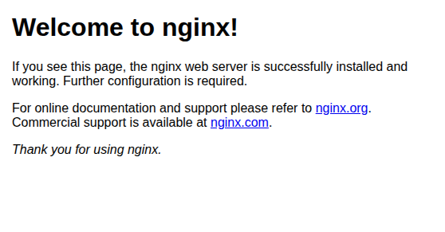
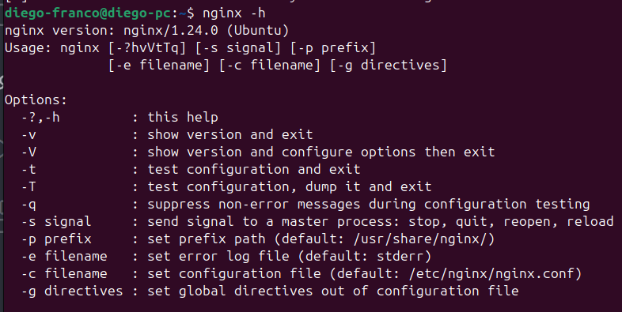
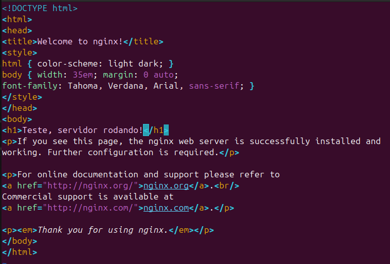

# NGINX 

## O que é o NGINX?

* É um **servidor web**.
* Serve para **receber requisições** (HTTP) e **responder** com arquivos ou **encaminhar** para uma aplicação (PHP, Java, etc).
* Funciona na **arquitetura cliente-servidor**: cliente (navegador) faz um pedido → servidor (NGINX) responde.

## Função do NGINX

* **Ouve uma porta** (normalmente a **porta 80** no HTTP).
* Quando chega uma requisição:

  * Se for um **arquivo estático** (imagem, CSS, HTML), ele **devolve diretamente**.
  * Se for algo dinâmico (por exemplo, uma rota de aplicação), ele **repassa para um servidor de aplicação** (como Tomcat, PHP-FPM, etc).

## Diferença entre NGINX e Apache

* **Apache**: cria um novo processo para cada requisição → mais pesado.
* **NGINX**: usa **programação assíncrona**:

  * Cria **um processo principal** (patrão).
  * Cria **processos trabalhadores (workers)** — normalmente um para cada núcleo da CPU.
  * Cada worker trata **várias requisições ao mesmo tempo** (Multiplexing I/O).

## Por que o NGINX é rápido?

* Ele **não espera** terminar uma requisição para pegar outra.
* Enquanto espera a resposta de uma, **já trabalha em outra**.
* Resultado: **alta performance** e **uso eficiente de recursos**.

---

# Instalando o NGINX 

### 1. Verificar se o NGINX está instalado

Abra o terminal e digite:

```bash
nginx -v
```

* Se aparecer a versão do NGINX, ele **já está instalado**.
* Se aparecer "comando não encontrado", **não está instalado**.

### 2. Instalar o NGINX

Atualize a lista de pacotes:

```bash
sudo apt update
```

Instale o NGINX:

```bash
sudo apt install nginx
```

### 3. Verificar se o serviço do NGINX está rodando

Após a instalação, o NGINX geralmente já inicia automaticamente. Para confirmar:

```bash
sudo systemctl status nginx
```

* Se aparecer "active (running)", o NGINX está funcionando.

**Se não estiver ativo**, inicie com:

```bash
sudo systemctl start nginx
```

**Se quiser que o NGINX sempre inicie automaticamente com o sistema:**

```bash
sudo systemctl enable nginx
```

### 4. Testar no navegador

Abra o navegador e digite:

```
http://localhost
```

* Se aparecer a **página padrão do NGINX**, tudo está certo!


---

# Como o NGINX e o Computador Sabem o que é "localhost"?

## O que é "localhost"?

* **"localhost"** é um **nome** usado para se referir **à própria máquina** onde você está.
* Quando você acessa `http://localhost`, na verdade está acessando seu próprio computador.

## Como o computador entende isso?

* Todo sistema operacional tem um **arquivo de hosts**.
* Esse arquivo **faz a ligação** entre **nomes** (como "localhost") e **endereços IP**.

## Onde fica o arquivo de hosts?

* **Linux**: `/etc/hosts`
* **MacOS**: `/private/etc/hosts`
* **Windows**: `C:\Windows\System32\Drivers\Etc\hosts`

## O que tem nesse arquivo?

* Dentro desse arquivo, existe uma linha como esta:

  ```
  127.0.0.1    localhost
  ```

* Isso significa: **sempre que alguém tentar acessar "localhost", o sistema vai redirecionar para o IP 127.0.0.1** (que é o IP da própria máquina).

## Conclusão

* Quando você digita `http://localhost` no navegador:

  * O sistema olha no arquivo de hosts.
  * Vê que "localhost" aponta para `127.0.0.1`.
  * Manda a requisição para `127.0.0.1`, onde o NGINX está rodando e responde com a página HTML padrão.


---

# Configuração Inicial do NGINX

## Como obter informações sobre o NGINX

* No terminal, rodamos:

```bash
nginx -h
```

* Esse comando mostra:

  * A **versão** instalada.
  * **Opções de uso** disponíveis.
  * **Caminhos importantes**: onde estão as configurações, logs, e arquivos HTML.



### Atenção:

* Cada sistema pode ter caminhos diferentes.

---

# Analisando o Arquivo Principal de Configuração: `nginx.conf`

## Estrutura do `nginx.conf`

Usamos o comando a baixo para editar o arquivo principal de configuração do NGINX.

```bash
vim /etc/nginx/nginx.conf
```

* Linhas que começam com `#` são **comentários** (não são executadas).
* Principais pontos do arquivo:

  * **worker\_processes**:

    * Define quantos processos trabalhadores o NGINX vai criar.
    * `1` significa um processo só. Se configurado como `auto`, ele cria um worker por núcleo de CPU.

  * **worker\_connections**:

    * Número máximo de **conexões simultâneas** por worker.
    * No Linux, tudo é tratado como arquivo: conexões, sockets, pastas etc.

---

## Configurações de Servidor HTTP no NGINX

* **listen**:

  * Define qual **porta** o servidor vai ouvir (exemplo: `8080`).
* **server\_name**:

  * Define qual **nome de servidor** será aceito (exemplo: `localhost`).

> Em servidores reais, configuramos aqui o **nome de domínio** (ex.: `meusite.com`).

* **location /**:

  * Define o que fazer quando o navegador pedir `/` (raiz).
  * Indica que deve buscar o arquivo padrão `index.html` ou `index.htm` em uma **pasta HTML** definida no caminho padrão.


**Resumo Visual:**

```
nginx.conf
│
├── worker_processes
├── worker_connections
├── http {
│    ├── server {
│         ├── listen (porta)
│         ├── server_name (nome)
│         ├── location / (busca index.html)
│    }
│ }
```

## Testando a página padrão

1. Localize a pasta HTML (no exemplo: `/usr/local/Cellar/nginx/html/`).
2. Edite o arquivo `index.html`.
3. Faça alterações, salve e atualize o navegador para ver as mudanças.



---

# Boas práticas de configuração

* **Evitar editar diretamente** o `nginx.conf` principal para criar novos servidores.
* Para novos sites ou servidores:

  * Usar a pasta `servers` (ou `sites-available`/`sites-enabled` em distribuições Linux).
  * Criar **arquivos de configuração separados** para cada servidor (chamados de "virtual hosts").


---
Claro! Aqui está o conteúdo da **apostila** corrigido conforme o **seu ambiente real**, onde o NGINX usa as pastas **`sites-available/`** e **`sites-enabled/`**, e não `servers/`.
Organizei tudo no mesmo estilo claro e didático que estamos seguindo:

---

# Configurando um Novo Servidor no NGINX do Zero

## Onde criar a nova configuração

* Em distribuições como Ubuntu, o NGINX usa duas pastas principais:

  * `/etc/nginx/sites-available/`: onde **criamos** arquivos de configuração.
  * `/etc/nginx/sites-enabled/`: onde **ativamos** os sites usando **links simbólicos**.

* O arquivo principal `nginx.conf` **inclui** os arquivos ativos de `sites-enabled`.

---

# Passos para configurar seu próprio servidor


**1. Instale o NGINX**

```bash
sudo apt update
sudo apt install nginx
```

**2. Crie um diretório para o seu site**

Por padrão, os arquivos ficam em `/var/www/html`, mas você pode criar outro diretório se quiser, por exemplo:

```bash
sudo mkdir -p /var/www/meusite
sudo chown -R $USER:$USER /var/www/meusite
```

**3. Crie sua página HTML**

```bash
nano /var/www/meusite/index.html
```

Exemplo de conteúdo:

```html
<!DOCTYPE html>
<html>
<head>
    <title>Meu Site NGINX</title>
</head>
<body>
    <h1>Servidor Web com NGINX no Ubuntu</h1>
    <p>Funcionando!</p>
</body>
</html>
```

Salve e feche o arquivo (Ctrl+O, Enter, depois Ctrl+X).

**4. Crie um arquivo de configuração para o seu site**

```bash
sudo nano /etc/nginx/sites-available/meusite
```

Cole o seguinte conteúdo (ajuste `server_name` se quiser usar um domínio):

```nginx
server {
    listen 80;
    server_name localhost;

    root /var/www/meusite;
    index index.html;

    location / {
        try_files $uri $uri/ =404;
    }
}
```

Salve e feche.

**5. Ative a configuração do site**

Crie um link simbólico em `sites-enabled`:

```bash
sudo ln -s /etc/nginx/sites-available/meusite /etc/nginx/sites-enabled/
```

**6. Remova a configuração padrão se não precisar**

```bash
sudo rm /etc/nginx/sites-enabled/default
```

(Se não existir, ignore o erro.)

**7. Teste a configuração**

```bash
sudo nginx -t
```

Se mostrar "syntax is ok", prossiga.

**8. Reinicie o NGINX**

```bash
sudo systemctl restart nginx
```

**9. Acesse seu site**

Abra o navegador e acesse `http://localhost` ou o IP da máquina.

### Verifique se o NGINX está rodando

```bash
sudo systemctl status nginx
```

Se aparecer "inactive" ou "failed", inicie o serviço:

```bash
sudo systemctl start nginx
```
---

