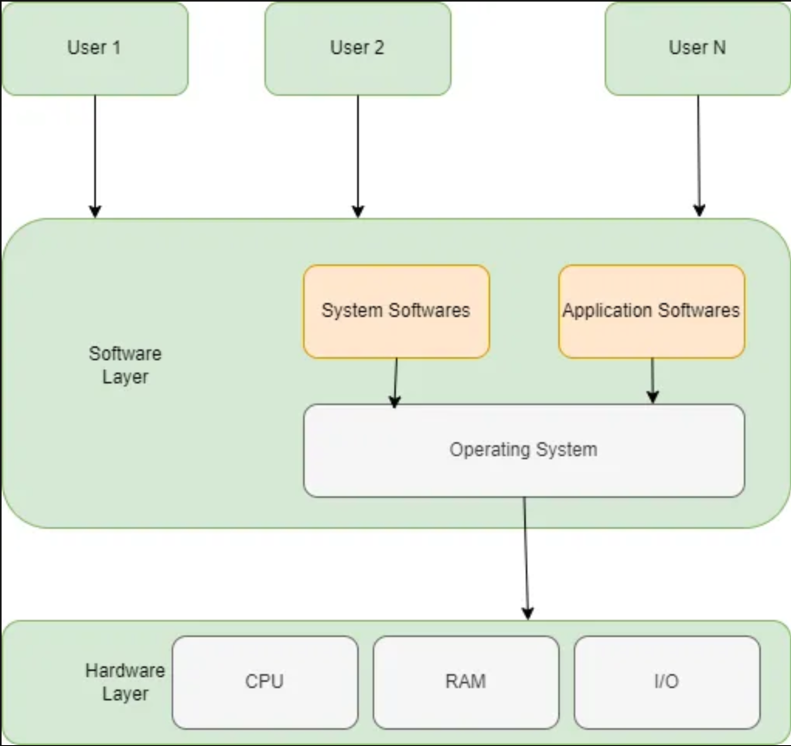

# Sistemas Operacionais

Um Sistema Operacional (SO) é um software essencial que gerencia os recursos de hardware e software de um computador, oferecendo uma plataforma para a execução de aplicativos. Ele funciona como um intermediário entre o hardware e o software, permitindo que os usuários interajam com o sistema de forma eficiente e segura.

Os sistemas operacionais desempenham funções cruciais, como gerenciamento de memória, processos, dispositivos, arquivos e redes, além de garantir segurança e desempenho. Exemplos incluem **Windows**, **Linux** e **macOS** em desktops, e **iOS** e **Android** em dispositivos móveis. Em servidores, são comuns distribuições Linux como **Ubuntu Server** ou **Red Hat Enterprise Linux**.

---

## Evolução dos Sistemas Operacionais

| Geração | Período | Principais Características |
|---------|---------|----------------------------|
| **0ª** | Antes de 1951 | Não havia sistemas operacionais. Programação direta em linguagem de máquina. Computadores baseados em tubos de vácuo. |
| **1ª** | 1951–1956 | Primeiros computadores comerciais (UNIVAC I, IBM 701). Surgimento de sistemas mono-programados e linguagens como FORTRAN. |
| **2ª** | 1956–1964 | Transistores substituem tubos de vácuo. Introdução do GMOS (batch processing) e sistemas de **time-sharing** como o CTSS. |
| **3ª** | 1964–1979 | Uso de circuitos integrados. Suporte a multiprogramação e processamento paralelo. Popularização de minicomputadores (DEC PDP-1). |
| **4ª** | 1979–Presente | Computadores pessoais e workstations. Surgimento de sistemas modernos (Windows, Linux, macOS). Tecnologia VLSI permite chips mais potentes. |

---

## Arquitetura de um Sistema Operacional

- **Kernel:** Núcleo que gerencia memória, processos e dispositivos.  
- **Shell:** Interface de interação do usuário (linha de comando ou GUI).  
- **Drivers:** Controladores que permitem a comunicação entre hardware e software.  
- **Sistemas de Arquivos:** Estruturas para organizar e armazenar dados.

  

*Fonte: <https://medium.com/@Kannan91/in-this-series-of-narratives-my-intention-is-to-explore-the-fundamental-components-of-operating-37659c19aefc>*

---

## Funções de um Sistema Operacional

### Gerenciamento de Memória
- Rastreamento da memória principal.
- Alocação e desalocação de memória para processos.
- Suporte à multiprogramação.

### Gerenciamento de Processos
- Escalonamento de CPU.
- Controle de estado dos processos.
- Interrupção e retomada de processos.

### Gerenciamento de Dispositivos
- Comunicação via drivers.
- Alocação de dispositivos.
- Uso eficiente de hardware.

### Gerenciamento de Arquivos
- Estruturação em diretórios.
- Acesso eficiente e seguro a arquivos.

### Gerenciamento de Rede
- Coordenação de conexões locais e remotas.
- Suporte a protocolos de comunicação.

### Segurança
- Proteção contra acessos não autorizados.
- Monitoramento de atividades.

### Controle de Desempenho
- Monitoramento de recursos.
- Otimização de tarefas.

### Detecção de Erros
- Identificação de falhas de hardware e software.
- Geração de logs para depuração.

---

# Windows

O **Windows** é uma série de sistemas operacionais desenvolvida pela Microsoft, amplamente utilizada em ambientes pessoais, empresariais e servidores. Oferece uma interface gráfica (GUI) com ícones, janelas e menus.

## Comandos Mais Utilizados no Terminal do Windows

### 1. Comandos de Rede
- `ipconfig` – Exibe configurações de rede.  
- `ipconfig /all` – Informações detalhadas (MAC, DNS).  
- `ipconfig /release` – Libera IP atual.  
- `ipconfig /renew` – Renova IP.  
- `ipconfig /flushdns` – Limpa cache DNS.  
- `ipconfig /displaydns` – Exibe cache DNS.  
- `nslookup <domínio>` – Consulta DNS.  
- `ping <destino>` – Testa conectividade.  
- `ping -t <destino>` – Ping contínuo.  
- `tracert <destino>` – Rota de pacotes.  
- `tracert -d <destino>` – Rota sem DNS.  
- `netstat` – Conexões ativas.  
- `netstat -af` – Conexões e portas em escuta.  
- `netstat -o` – Inclui PID.  
- `netstat -e -t 5` – Estatísticas atualizadas.  
- `route print` – Tabela de roteamento.  
- `route add` / `route delete` – Adiciona ou remove rotas.

### 2. Diagnóstico do Sistema
- `cls` – Limpa tela.  
- `getmac /v` – Endereços MAC.  
- `powercfg /energy` – Relatório de energia.  
- `powercfg /batteryreport` – Saúde da bateria.

### 3. Gerenciamento de Arquivos
- `clip` – Copia saída para área de transferência.  
  - Ex.: `ipconfig | clip`  
- `assoc` – Exibe ou modifica associações de extensões.  
  - Ex.: `assoc .txt=txtfile`

### 4. Diagnóstico e Reparo
- `chkdsk /f` – Corrige erros no disco.  
- `chkdsk /r` – Recupera setores defeituosos.  
- `sfc /scannow` – Repara arquivos do sistema.  
- **DISM**:  
  - `/CheckHealth`, `/ScanHealth`, `/RestoreHealth`

### 5. Processos
- `tasklist` – Lista processos.  
- `taskkill /PID <pid> /F` – Encerra processo.

### 6. Firewall e Rede
- `netsh wlan show wlanreport` – Relatório Wi-Fi.  
- `netsh interface show interface` – Interfaces de rede.  
- `netsh interface ip show address` – IPs ativos.  
- `netsh interface ip show dnsservers` – DNS configurados.  
- `netsh advfirewall set allprofiles state off|on` – Desativa/ativa firewall.

### 7. Rotas
- `route print`, `route add`, `route delete`

### 8. Reinício e Desligamento
- `shutdown /r /fw /f /t 0` – Reinicia e abre firmware.

---

# Unix

Criado em 1969 nos laboratórios Bell da AT&T, projetado para ser simples, portátil e multitarefa. É proprietário e requer licenças pagas. Variantes como **AIX**, **Solaris** e **HP-UX** são usadas em ambientes corporativos críticos. Apesar de poderoso, Unix não é totalmente portátil entre versões e perdeu popularidade com o avanço do open source.

## FreeBSD

Sistema derivado do BSD da Universidade da Califórnia, Berkeley. É **open source** com licença BSD mais permissiva que GPL. Conhecido por robustez, segurança e desempenho; usado em servidores, sistemas embarcados e redes. Empresas como Netflix e Sony utilizam FreeBSD em servidores de alto desempenho.

---

# Linux

Criado em 1991 por Linus Torvalds como um kernel inspirado no Unix, combinado com ferramentas GNU. É **gratuito e open source** sob a licença GPL, permitindo modificações e redistribuição.

- **Portabilidade:** Roda de IoT a supercomputadores.  
- **Distribuições:** Ubuntu, CentOS, Red Hat, entre outras.  

## Importância do Linux para DevOps

1. **Projeto Open Source**  
   - Código aberto promove colaboração e inovação.  
   - Licença GPL garante que versões modificadas permaneçam abertas.

2. **Kernel, não SO completo**  
   - Kernel gerencia hardware.  
   - Distribuições combinam kernel + ferramentas (Ubuntu, Fedora, CentOS).

3. **Versatilidade**  
   - Base de grande parte da infraestrutura da internet e serviços de nuvem.

4. **Modularidade**  
   - Permite adicionar módulos (drivers) conforme necessidade, mantendo um sistema flexível.
