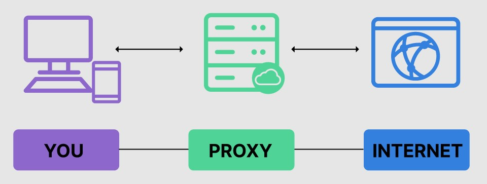
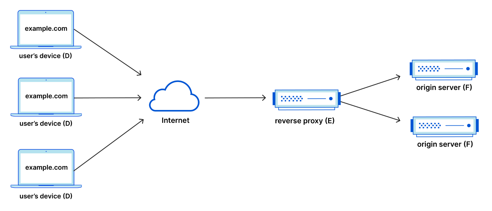
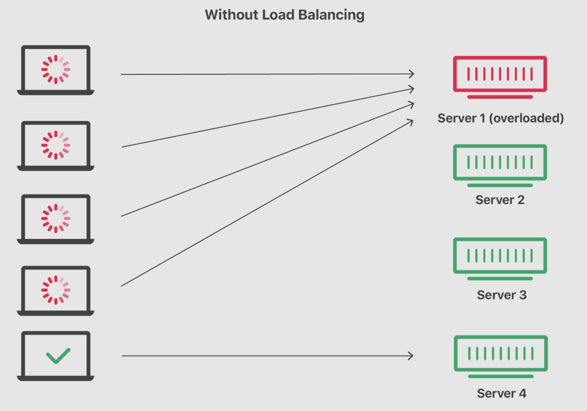
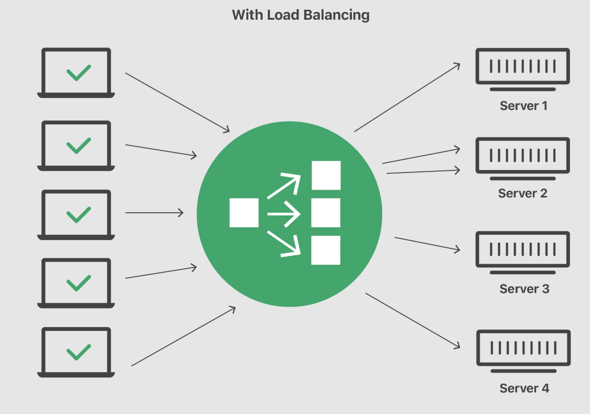

**Proxy de Encaminhamento**

Um **proxy de encaminhamento** (em inglês, **forward proxy**) é um tipo de servidor intermediário que atua entre usuários finais (clientes) e a internet. O principal objetivo desse tipo de proxy é encaminhar solicitações feitas pelos usuários a servidores externos, como sites, aplicativos web ou outros recursos na internet.

### Como Funciona o Proxy de Encaminhamento

Quando um usuário deseja acessar um site, ao invés de se conectar diretamente ao servidor desse site, ele envia sua solicitação para o **proxy de encaminhamento**. O proxy então repassa essa solicitação ao destino desejado. Quando o servidor responde, o proxy recebe essa resposta e a entrega ao usuário.

Esse processo ocorre de forma transparente para o servidor de destino, que “enxerga” apenas o proxy, e não o usuário original.

#### Esquema Simplificado:



Fonte: https://www.fortinet.com/resources/cyberglossary/proxy-server

### Finalidades do Proxy de Encaminhamento

* **Privacidade**: O servidor externo vê apenas o endereço IP do proxy, não do usuário, ajudando a ocultar a identidade do cliente.
* **Controle de acesso**: Empresas e organizações podem usar proxies para restringir o acesso a determinados sites ou serviços na internet, bloqueando conteúdos indesejados.
* **Cache de conteúdo**: Proxies podem armazenar páginas e arquivos acessados com frequência, agilizando o carregamento para vários usuários.
* **Segurança**: O proxy pode filtrar tráfego, bloquear ameaças e impedir que softwares maliciosos atinjam os dispositivos dos usuários.
* **Monitoramento**: Permite registrar e analisar o tráfego dos usuários, importante para auditoria e conformidade.

### Exemplo Prático

Em uma empresa, todos os computadores estão configurados para acessar a internet somente por meio de um proxy de encaminhamento. Quando um colaborador tenta acessar um site, o pedido passa pelo proxy, que pode bloquear páginas proibidas (como redes sociais) ou liberar o acesso se estiver de acordo com as políticas internas.


### Resumindo

O **proxy de encaminhamento** é um servidor intermediário voltado para proteger, filtrar e controlar o acesso dos clientes à internet, tornando a navegação mais segura, eficiente e conforme as políticas da organização. Ele é um dos principais componentes de segurança e gerenciamento de redes modernas.

---

# Proxy Reverso

O **proxy reverso** (em inglês, **reverse proxy**) é um servidor intermediário que recebe solicitações vindas da internet (clientes externos) e as encaminha a servidores específicos dentro de uma rede interna. Ele atua como um ponto central para acessar múltiplos servidores ou serviços internos, protegendo a infraestrutura e otimizando a comunicação.

## Como Funciona o Proxy Reverso?

Diferentemente do **proxy de encaminhamento** (forward proxy), que atua em nome dos clientes (usuários internos), o **proxy reverso** representa os servidores internos, recebendo solicitações externas e encaminhando-as ao servidor correto.

Em outras palavras, os clientes na internet não interagem diretamente com o servidor interno, mas sim com o proxy reverso, que faz a mediação das requisições.

### Esquema simplificado:



Fonte: https://www.cloudflare.com/en-gb/learning/cdn/glossary/reverse-proxy/

## Principais Benefícios

1. **Segurança**

   * O proxy reverso oculta os endereços IP e detalhes técnicos dos servidores internos, dificultando ataques diretos.
   * Pode implementar filtros e bloqueios contra ataques como DDoS e tentativas de intrusão.

2. **Balanceamento de carga (load balancing)**

   * Distribui as solicitações recebidas entre diversos servidores internos, otimizando o desempenho e garantindo alta disponibilidade.

3. **Cache de conteúdo**

   * Armazena respostas frequentes para requisições comuns, reduzindo a latência e aumentando a velocidade de resposta aos usuários.

4. **Criptografia SSL/TLS**

   * Pode gerenciar certificados SSL/TLS centralmente, oferecendo segurança adicional ao realizar conexões criptografadas diretamente com o proxy.

5. **Compressão e otimização de conteúdo**

   * O proxy reverso pode comprimir conteúdo, diminuindo o volume de dados transmitidos e melhorando o desempenho da aplicação.

## Exemplos Práticos

### Exemplo com Nginx

O Nginx é uma ferramenta amplamente utilizada como proxy reverso devido à sua simplicidade, eficiência e escalabilidade.

Considere o exemplo abaixo onde o Nginx atua como proxy reverso encaminhando requisições para dois servidores internos diferentes:

```
client externo ──┐
                 ├─▶ proxy reverso (Nginx) ───▶ servidor interno 1 (app)
client externo ──┘                           └─▶ servidor interno 2 (API)
```

### Configuração básica no Nginx:

```nginx
server {
    listen 80;
    server_name exemplo.com;

    location /app {
        proxy_pass http://192.168.1.10:3000;
    }

    location /api {
        proxy_pass http://192.168.1.11:4000;
    }
}
```

Neste exemplo:

* As requisições feitas para `exemplo.com/app` são encaminhadas ao servidor interno com IP `192.168.1.10`, na porta `3000`.
* Requisições feitas para `exemplo.com/api` vão para `192.168.1.11` na porta `4000`.

---

# Load Balancer (Balanceador de Carga)

O **Load Balancer**, ou **balanceador de carga**, distribui o tráfego de rede ou de aplicações de forma equilibrada entre múltiplos servidores ou serviços. 

O objetivo é **otimizar o desempenho**, **evitar sobrecarga** em um único servidor e **garantir a continuidade do serviço** mesmo em caso de falha em um dos destinos.


## O que é Load Balancing?

**Load balancing** significa **distribuir automaticamente as requisições dos usuários** (como acessos a sites, APIs ou sistemas) entre diversos servidores disponíveis. Essa técnica ajuda a manter o sistema responsivo e confiável, mesmo sob grande volume de tráfego ou quando algum servidor falha.





---

## Como Funciona?

O **load balancer** fica na frente de um conjunto de servidores e decide **para qual servidor** cada requisição será enviada com base em algoritmos específicos, como:

* **Round Robin**: distribui as requisições em ordem sequencial entre os servidores.
* **Least Connections**: direciona a requisição para o servidor com menos conexões ativas.
* **IP Hash**: usa o IP do cliente para determinar qual servidor receberá a requisição, útil para manter sessões persistentes.

---

## Esquema Simplificado

```
Clientes
   │
   ▼
Load Balancer
 ┌────┬────┬────┐
 ▼    ▼    ▼
S1   S2   S3  (Servidores)
```

O cliente não sabe quantos servidores existem nem com qual está se comunicando. Toda a lógica de distribuição fica sob responsabilidade do balanceador.

---

## Tipos de Load Balancing

1. **Baseado em Camada 4 (L4)**
   Atua na camada de transporte (TCP/UDP), roteando o tráfego com base em informações como IP e porta. É mais rápido, mas menos inteligente quanto ao conteúdo das requisições.

2. **Baseado em Camada 7 (L7)**
   Atua na camada de aplicação (HTTP/HTTPS), permitindo decisões baseadas em conteúdo da requisição, como URL, cookies ou cabeçalhos. É ideal para aplicações web.

---

## Benefícios do Load Balancing

* **Alta disponibilidade**: se um servidor falha, o tráfego é redirecionado para os demais.
* **Escalabilidade**: permite adicionar ou remover servidores sem afetar os usuários.
* **Desempenho otimizado**: evita sobrecarga concentrada em um único servidor.
* **Melhoria na experiência do usuário**: reduz latência e evita quedas.

---

## Exemplo com NGINX (Load Balancing e Proxy Reverso)

O NGINX pode atuar como **proxy reverso com balanceamento de carga**. Exemplo de configuração simples:

```nginx
http {
    upstream servicos {
        server localhost:8001;
        server localhost:8002;
    }

    server {
        listen 8000;
        location / {
            proxy_pass http://servicos;
        }
    }
}
```

O exemplo a cima usa o algoritmo **Round Robin**, o NGINX distribui requisições entre os dois servidores configurados, funcionando como **load balancer** e **proxy reverso** ao mesmo tempo.

---

## Resumindo

O **load balancer** é um componente crítico para garantir que sistemas web modernos sejam resilientes, rápidos e escaláveis. Ele distribui as requisições entre servidores de maneira eficiente, evitando sobrecargas e mantendo a disponibilidade dos serviços. Quando combinado com outras ferramentas, como API Gateways e proxies reversos, ele forma a base de infraestruturas robustas e modernas.

---